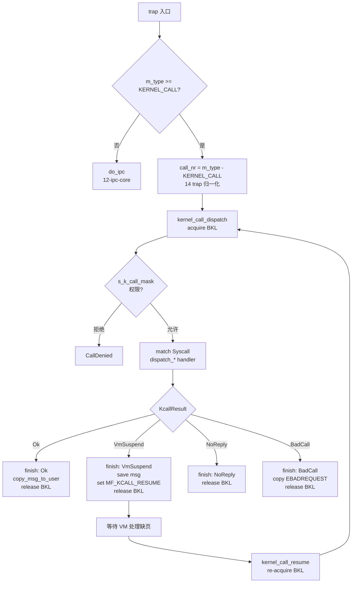

# 13-syscall-dispatch: 系统调用分派

> **分类**: Kernel 系统调用分派（与 12-ipc-core 共享 sys_call 入口）
> **源码**: `minix3/minix/kernel/system.c:52-163, 612-637`
> **Rust 实现**: `os/kernel/src/syscall.rs`
> **前置**: 06（struct proc 字段）、08（system_init 调用顺序）、10（switch_to_user 入口）、11（RTS 标志）、12（do_ipc 入口与 delivermsg 延迟拷贝）
> **下游**: 14（trap 入口与 KERNEL_CALL 归一化）、15-21（各 dispatch_* handler）、22（priv 结构与 s_k_call_mask）
> **说明**: 内核如何将用户态系统调用请求路由到对应 handler、如何处理 VMSUSPEND 挂起-恢复、如何与 IPC 共享入口但分离语义

---

## 1. 概述

### 1.1 目标读者与本章不讲什么

**目标读者**：已理解 12-ipc-core 的 IPC 六原语、`switch_to_user` 延迟拷贝机制、`RTS_SENDING/RECEIVING` 状态机的读者。

**本章不讲什么**：
- 各 `dispatch_*` handler 的内部实现（见 15-21 各文档）
- `s_k_call_mask` 位图的构建与权限分配策略（见 22-privilege）
- trap 入口汇编与 `KERNEL_CALL=0x600` 归一化的具体实现（见 14-exception-interrupt）
- BKL 自旋锁本身的实现（见 16-smp）

本章回答：**CPU 进入内核后，如何区分 IPC 与系统调用？系统调用的 handler 如何被路由？handler 需要访问用户空间触发缺页时如何挂起与恢复？**

### 1.2 系统调用 vs IPC：独立 trap 入口的两种语义

用户态执行 `int 0x80`/`syscall`/`svc`/`ecall` 触发 trap（详见 14）。**三架构通过独立 trap 入口将 IPC 与系统调用分离**，避免 `m_type` 数值范围冲突（IPC 1-16 vs SYS 0x600+）：

| 维度 | IPC（do_ipc） | 系统调用（kernel_call） |
|------|--------------|----------------------|
| **本质** | 进程间消息中转，内核不参与语义 | 进程请求内核执行特权操作 |
| **x86-64 入口** | IDT vector 33（`IPC_VECTOR`，DPL=3 trap gate） | IDT vector 32（`KERN_CALL_VECTOR`）+ SYSCALL MSR |
| **aarch64 入口** | SVC vector（运行时读 `r3 == IPCVEC_INTR` 分流） | SVC vector（运行时读 `r3 == KERVEC_INTR` 分流） |
| **riscv64 入口** | ecall vector（运行时读 `a7 < 17` 分流到 IPC） | ecall vector（运行时读 `a7 >= 0x600` 分流到 kernel_call） |
| **入口配置** | `TrapEntryArch::configure_ipc_entry` | `TrapEntryArch::configure_syscall` |
| **路由函数** | `dispatch_ipc_entry(caller, msg, ...)` | `kernel_call_dispatch(caller, msg, ...)` |
| **权限位图** | `s_ipc_to` / `s_ipc_from` 掩码 | `s_k_call_mask` 位图（详见 22） |
| **是否阻塞** | 可能阻塞（SEND/RECEIVE 不匹配时） | **不阻塞**——handler 同步执行返回结果 |
| **handler 返回** | 投递结果通过 `p_delivermsg` 延迟拷贝 | handler 返回 `KcallResult`，由 `kernel_call_finish` 投递 |
| **状态机** | 设置 `RTS_SENDING`/`RTS_RECEIVING` | 设置 `MF_KCALL_RESUME`（仅 VMSUSPEND 路径） |

**关键差异**：IPC handler 本身**就是内核**——内核构造一条消息转发给目标进程；系统调用 handler 是**内核服务**——内核直接完成操作（fork/exec/vmctl 等）。两者入口分离、语义正交，互不调用对方 handler。

**为什么用独立 trap vector 而非 `m_type` 数值范围区分**：
- **x86-64**：硬件 IDT 提供独立 vector，CPU 直接分发到 `ipc_entry_softint_orig`，无需软件检查 `m_type`——零开销分流。C: protect.c:147 `{ ipc_entry_softint_orig, IPC_VECTOR_ORIG, USER_PRIVILEGE }`
- **aarch64/riscv64**：硬件只有单一同步异常向量（SVC/ecall），但通过寄存器值（`r3`/`a7`）软件分流，与 C `earm/mpx.S:181-184` 行为对齐
- **架构演进**：Rust 通过 `TrapEntryArch::configure_ipc_entry` trait 方法抽象此差异——x86-64 写 IDT gate 33，aarch64/riscv64 是 no-op（依赖软件分流）。OS 代码无 `#[cfg(target_arch)]`

### 1.3 入口路径与 KERNEL_CALL 归一化

```
【系统调用路径】
用户态: sys_call(SYS_VMCTL, ...)
  → trap (int 0x80 / syscall / svc / ecall)
  → 14 trap 入口（汇编保存上下文）
  → x86-64: IDT vector 32（KERN_CALL_VECTOR）
    aarch64: SVC vector + r3 == KERVEC_INTR
    riscv64: ecall vector + a7 >= 0x600
  → KERNEL_CALL 归一化：call_nr = m_type - KERNEL_CALL（0x600）→ 0..57 索引
  → kernel_call_dispatch(caller, msg, ...)
    → acquire BKL
    → Syscall::try_from(call_nr)
    → s_k_call_mask 权限检查
    → match syscall { ... dispatch_* handler ... }
    → return KcallResult
  → kernel_call_finish(caller, msg, result)
    → VmSuspend: 保存 msg + set MF_KCALL_RESUME + release BKL
    → Ok/NoReply/BadCall/CallDenied: copy_msg_to_user + release BKL

【IPC 路径】（独立 trap vector，绕过 kernel_call_dispatch_inner）
用户态: send / receive / sendrec / notify / sendnb / senda
  → trap
  → x86-64: IDT vector 33（IPC_VECTOR，由 configure_ipc_entry 设置）
    aarch64: SVC vector + r3 == IPCVEC_INTR
    riscv64: ecall vector + a7 < 17（IPC call_nr 范围 1..=16）
  → dispatch_ipc_entry(caller, msg, priv_table, proc_table)
    → IpcCall::from_raw(msg.m_type)
    → acquire BKL（mem::forget guard，由 kernel_call_finish 释放）
    → dispatch_ipc(proc_table, caller_idx, msg, priv_table, ipc_call)  ← 12-ipc-core
    → （若 sender 带 MF_SIG_DELAY 且消息被取走 → sig_delay_done，见 19-syscall-signal.md §4.8）
    → return KcallResult（Delivered/Blocked/Error 映射见 §4.8）
```

**KERNEL_CALL 边界声明**：C 在 `kernel_call_dispatch` 内执行 `call_nr = msg->m_type - KERNEL_CALL`（system.c:103）。Rust 将 `msg.m_type` 视为**已归一化**的 0..57 索引传入 `Syscall::try_from`，归一化责任**上移到 14 trap 入口**——这样 dispatch 签名保持纯索引输入，无需关心 ABI 偏移。这是**架构演进**：将"消息字段归一化"与"分派路由"分离，符合单一职责。

**IPC call_nr 边界声明**：IPC 路径中 `msg.m_type` 直接是 IPC call number（SEND=1, RECEIVE=2, ..., SENDA=16），**不经 KERNEL_CALL 偏移**。`dispatch_ipc_entry` 通过 `IpcCall::from_raw(msg.m_type)` 解码，无效值返回 `EBADCALL`。这避免了 IPC 与 SYS_* call number 共用 0..16 范围的冲突（SYS_FORK=0, SYS_EXEC=1, ...）。

### 1.4 VMSUSPEND 挂起-恢复协议

某些 handler（如 `sys_vircopy`、`sys_umap`）需要访问调用方用户空间内存。如果该内存未映射或触发缺页，内核无法立即处理（VM 是独立进程），handler 返回 `VMSUSPEND(-996)`，触发挂起-恢复协议：

```
kernel_call_dispatch() → handler → return VmSuspend
  ↓
kernel_call_finish() VmSuspend 分支:
  1. 保存请求消息: caller.p_vm_suspend.saved_msg = Some(*msg)
  2. 设置标志: caller.p_misc_flags |= MF_KCALL_RESUME
  3. **release BKL** — 让其他 CPU 能进入内核
  4. 进程保持 RTS_VMREQUEST 等待 VM 回复
  ↓
VM 处理缺页（映射页面），向内核回复
  ↓
switch_to_user() 检测到 MF_KCALL_RESUME:
  → kernel_call_resume(caller):
    1. **re-acquire BKL**
    2. dispatch 重新执行（**MF_KCALL_RESUME 仍 set**——handlers 可感知 retry）
    3. dispatch 返回后 **clear MF_KCALL_RESUME**（C system.c:635）
    4. kernel_call_finish 处理结果
```

**关键不变量**（C system.c:616-619 注释）：挂起期间 `RTS_SLOT_FREE` 必须未设置（进程未死亡）、`RTS_VMREQUEST` 必须设置（进程在等 VM）、`saved_msg.m_source == caller.p_endpoint`（消息来源一致）。

**为什么 MF_KCALL_RESUME 要在 dispatch **之后**清除**？某些 handler 在 retry 时走不同路径（如 `do_vircopy` 第二次尝试时已知上次失败的地址范围）。若 dispatch 前清除，handlers 无法区分"首次调用"与"retry"——这是 P0 语义 bug（见 §6.1 已修复）。

### 1.5 BKL（Big Kernel Lock）持有区间

> 架构范围：x86-64 / aarch64 / riscv64 共性（SMP 通用机制，详见 16-smp）

SMP 环境下，`kernel_call_dispatch` + `kernel_call_finish` 必须在 BKL 临界区内执行——共享的进程表、priv 表、时钟状态等不能被多个 CPU 同时修改。

**C 的 BKL 策略**：在汇编 trap 入口（`mpx.S:kernel_call_entry_common`）acquire BKL，在 `switch_to_user()` release BKL。dispatch 与 finish 全程在 BKL 内。

**Rust 的 BKL 策略**（R-03/R-05 落地后）：`BklGuard` 是 **RAII**（Drop 时释放），但 dispatch 路径用 `core::mem::forget(bkl_guard)` 阻止 Drop——BKL 必须保持到 `kernel_call_finish()` 显式释放。`bkl_guard.section()` 派生 `BklSection` witness，作为编译期 BKL 持有证明传给全局访问器（如 `irq_manager_with`）：

| 阶段 | 函数 | BKL 操作 | 行号 |
|------|------|---------|------|
| 入口 | `kernel_call_dispatch` | acquire（guard 持有 + forget）| `syscall.rs:399` |
| 持有 | dispatch_inner + match + handler | 保持（`bkl_section` witness 传入 inner）| `syscall.rs:425-540` |
| VmSuspend 释放 | `kernel_call_finish` VmSuspend 分支 | `bkl_unlock()` | `syscall.rs:2580` |
| 正常释放 | `kernel_call_finish` 非 VmSuspend 末尾 | `bkl_unlock()`（Ok/NoReply/BadCall/CallDenied 统一路径）| `syscall.rs:2605` |
| Resume 重新获取 | `kernel_call_resume` → `kernel_call_dispatch` | re-acquire（新 guard）| `syscall.rs:399`（经 dispatch） |

**为什么 VmSuspend 路径要释放 BKL**？挂起期间进程等待 VM（独立进程、独立 CPU 调度），若不释放 BKL，其他 CPU 无法进入内核处理 VM 的回复——死锁。

**RAII + forget 模式说明**：`kernel_call_dispatch` 入口 `let bkl_guard = bkl_lock()`，结束 `mem::forget(bkl_guard)`——guard 的 Drop 被抑制，BKL 的 release 责任转移到 `kernel_call_finish`（2 处 `bkl_unlock`，对应 C 的 `switch_to_user` 释放语义）。VMSUSPEND 路径释放后，`kernel_call_resume` 重新 dispatch 时 acquire 新 guard。R-05 将 guard 从纯 marker 升级为 RAII + `section()` witness，消除"手动 release 易遗漏"（原模式 28 风险）。

### 1.6 核心流程图



---

## 2. C 源码分析

### 2.1 相关定义

| 常量 | 值 | 位置 | 含义 |
|------|---|------|------|
| `KERNEL_CALL` | 0x600 | `com.h:205` | 系统调用 m_type 基址（用于 `m_type - KERNEL_CALL` 归一化） |
| `NR_SYS_CALLS` | 58 | `com.h:270` | 系统调用总数 |
| `VMSUSPEND` | -996 | `kernel/vm.h:6` | handler 返回值，请求挂起让 VM 处理缺页 |
| `EDONTREPLY` | 203（用户态）/ -203（内核 `_SYSTEM` 下 `_SIGN` 为负）| `sys/sys/errno.h:199` | handler 返回值，不回复调用方 |
| `EBADREQUEST` | 212 | `sys/sys/errno.h:208` | 无效 syscall 号 |
| `ECALLDENIED` | 210 | `sys/sys/errno.h:206` | `s_k_call_mask` 权限拒绝 |
| `MF_KCALL_RESUME` | 0x008 | `proc.h:237` | 标记挂起中的 kernel call，retry 时 handlers 可感知 |
| `VMSTYPE_KERNELCALL` | 1 | `proc.h:99` | 标记 `p_vmrequest.type` 为内核调用挂起 |

### 2.2 核心数据结构

```c
// system.c:52 — 函数指针数组
static int (*call_vec[NR_SYS_CALLS])(struct proc * caller, message *m_ptr);

// system.c:54-57 — map() 宏：注册时运行时 assert 越界
#define map(call_nr, handler) \
  { int call_index = call_nr-KERNEL_CALL; \
    assert(call_index >= 0 && call_index < NR_SYS_CALLS); \
    call_vec[call_index] = (handler); }
```

`call_vec` 是 C 的分派机制：运行时通过函数指针间接调用。`map()` 宏在 `system_init()` 中注册每个 `(SYS_*, do_*)` 映射，并通过 `assert()` 在初始化阶段捕获越界。

### 2.3 完整 syscall 列表（58 项）

下表对应 `system.c:193-268` 的 `map()` 注册序列与 `com.h:207-262` 的常量定义：

| # | 常量 | C Handler | 分类 | 架构范围 |
|---|------|-----------|------|---------|
| 0 | SYS_FORK | do_fork | 进程管理 | 三架构 |
| 1 | SYS_EXEC | do_exec | 进程管理 | 三架构 |
| 2 | SYS_CLEAR | do_clear | 进程管理 | 三架构 |
| 3 | SYS_SCHEDULE | do_schedule | 调度 | 三架构 |
| 4 | SYS_PRIVCTL | do_privctl | 特权 | 三架构 |
| 5 | SYS_TRACE | do_trace | 调试 | 三架构 |
| 6 | SYS_KILL | do_kill | 信号 | 三架构 |
| 7 | SYS_GETKSIG | do_getksig | 信号 | 三架构 |
| 8 | SYS_ENDKSIG | do_endksig | 信号 | 三架构 |
| 9 | SYS_SIGSEND | do_sigsend | 信号 | 三架构 |
| 10 | SYS_SIGRETURN | do_sigreturn | 信号 | 三架构 |
| 13 | SYS_MEMSET | do_memset | 内存 | 三架构 |
| 14 | SYS_UMAP | do_umap | 内存 | 三架构 |
| 15 | SYS_VIRCOPY | do_vircopy | 内存 | 三架构 |
| 16 | SYS_PHYSCOPY | do_copy | 内存 | 三架构 |
| 17 | SYS_UMAP_REMOTE | do_umap_remote | 内存 | 三架构 |
| 18 | SYS_VUMAP | do_vumap | 内存 | 三架构 |
| 19 | SYS_IRQCTL | do_irqctl | 设备 | 三架构 |
| 21 | SYS_DEVIO | do_devio | 设备 | **x86-64 特有** |
| 22 | SYS_SDEVIO | do_sdevio | 设备 | **x86-64 特有** |
| 23 | SYS_VDEVIO | do_vdevio | 设备 | **x86-64 特有** |
| 24 | SYS_SETALARM | do_setalarm | 时钟 | 三架构 |
| 25 | SYS_TIMES | do_times | 时钟 | 三架构 |
| 26 | SYS_GETINFO | do_getinfo | 信息 | 三架构 |
| 27 | SYS_ABORT | do_abort | 系统 | 三架构 |
| 28 | SYS_IOPENABLE | do_iopenable | 设备 | **x86-64 特有** |
| 31 | SYS_SAFECOPYFROM | do_safecopy_from | 内存 | 三架构 |
| 32 | SYS_SAFECOPYTO | do_safecopy_to | 内存 | 三架构 |
| 33 | SYS_VSAFECOPY | do_vsafecopy | 内存 | 三架构 |
| 34 | SYS_SETGRANT | do_setgrant | 内存 | 三架构 |
| 35 | SYS_READBIOS | do_readbios | 设备 | **x86-64 特有** |
| 36 | SYS_SPROF | do_sprofile | 调试 | 三架构 |
| 39 | SYS_STIME | do_stime | 时钟 | 三架构 |
| 40 | SYS_SETTIME | do_settime | 时钟 | 三架构 |
| 43 | SYS_VMCTL | do_vmctl | VM | 三架构 |
| 44 | SYS_DIAGCTL | do_diagctl | 诊断 | 三架构 |
| 45 | SYS_VTIMER | do_vtimer | 时钟 | 三架构 |
| 46 | SYS_RUNCTL | do_runctl | 进程管理 | 三架构 |
| 50 | SYS_GETMCONTEXT | do_getmcontext | 上下文 | 三架构 |
| 51 | SYS_SETMCONTEXT | do_setmcontext | 上下文 | 三架构 |
| 52 | SYS_UPDATE | do_update | 进程管理 | 三架构 |
| 53 | SYS_EXIT | do_exit | 进程管理 | 三架构 |
| 54 | SYS_SCHEDCTL | do_schedctl | 调度 | 三架构 |
| 55 | SYS_STATECTL | do_statectl | 进程管理 | 三架构 |
| 56 | SYS_SAFEMEMSET | do_safememset | 内存 | 三架构 |
| 57 | SYS_PADCONF | do_padconf | 设备 | **ARM 特有** |

**编号空缺**（11-12, 20, 29-30, 37-38, 41-42, 47-49）：历史保留编号，C 不注册 handler，访问时返回 `EBADREQUEST`。

### 2.4 关键函数分析

#### 2.4.1 kernel_call_dispatch（system.c:95-128）

```c
static int kernel_call_dispatch(struct proc * caller, message *msg)
{
  int result = OK;
  int call_nr = msg->m_type - KERNEL_CALL;   // 归一化

  if (call_nr < 0 || call_nr >= NR_SYS_CALLS) {
    result = EBADREQUEST;                     // 越界
  }
  else if (!GET_BIT(priv(caller)->s_k_call_mask, call_nr)) {
    result = ECALLDENIED;                      // 权限拒绝
  } else {
    if (call_vec[call_nr])
      result = (*call_vec[call_nr])(caller, msg);   // 间接调用
    else {
      result = EBADREQUEST;                    // 空槽位
    }
  }
  return result;
}
```

**语义**：三段式分派——边界检查 → 权限检查 → 间接调用 handler。返回 `int`，调用方根据值判断 OK/VMSUSPEND/EDONTREPLY/EBADREQUEST/ECALLDENIED。

#### 2.4.2 kernel_call_finish（system.c:59-90）

```c
static void kernel_call_finish(struct proc * caller, message *msg, int result)
{
  if(result == VMSUSPEND) {
    assert(RTS_ISSET(caller, RTS_VMREQUEST));
    assert(caller->p_vmrequest.type == VMSTYPE_KERNELCALL);
    caller->p_vmrequest.saved.reqmsg = *msg;           // 保存请求消息
    caller->p_misc_flags |= MF_KCALL_RESUME;           // 标记挂起
  } else {
    caller->p_vmrequest.saved.reqmsg.m_source = NONE;  // 清除保存
    if (result != EDONTREPLY) {
      msg->m_source = SYSTEM;
      msg->m_type = result;
      if (copy_msg_to_user(msg, (message *)caller->p_delivermsg_vir)) {
        cause_sig(proc_nr(caller), SIGSEGV);           // 用户空间不可写
      }
    }
  }
}
```

**语义**：分两条路径——VmSuspend 保存上下文待 resume；其他路径构造回复消息并 `copy_msg_to_user` 投递到用户空间。`copy_msg_to_user` 失败时通过 `cause_sig` 发送 SIGSEGV。

#### 2.4.3 kernel_call（system.c:136-163）

```c
void kernel_call(message *m_user, struct proc * caller)
{
  int result = OK;
  message msg;

  caller->p_delivermsg_vir = (vir_bytes) m_user;       // 记录用户空间目标地址
  if (copy_msg_from_user(m_user, &msg) == 0) {         // TOCTOU 防护
    msg.m_source = caller->p_endpoint;                 // 标记来源
    result = kernel_call_dispatch(caller, &msg);
  } else {
    cause_sig(proc_nr(caller), SIGSEGV);                // 用户空间不可读
    return;
  }

  kbill_kcall = caller;                                // 内核计费
  kernel_call_finish(caller, &msg, result);
}
```

**TOCTOU 防护**：`copy_msg_from_user` 先将用户空间消息复制到内核栈，dispatch 与 finish 全程操作内核栈副本。防止用户在 dispatch 检查参数后、finish 使用参数前修改用户空间消息。

**kbill_kcall**：内核计费用全局指针，标记当前正在处理 kernel call 的进程。Rust 已实现（`KBILL_KCALL`，见 §6.4）。

#### 2.4.4 kernel_call_resume（system.c:612-637）

```c
void kernel_call_resume(struct proc *caller)
{
  int result;

  assert(!RTS_ISSET(caller, RTS_SLOT_FREE));           // 不变量 1
  assert(!RTS_ISSET(caller, RTS_VMREQUEST));           // 不变量 2
  assert(caller->p_vmrequest.saved.reqmsg.m_source == caller->p_endpoint);  // 3

  /* re-execute the kernel call, with MF_KCALL_RESUME still set so
   * the call knows this is a retry.
   */
  result = kernel_call_dispatch(caller, &caller->p_vmrequest.saved.reqmsg);

  /* we are resuming the kernel call so we have to remove this flag so it
   * can be set again
   */
  caller->p_misc_flags &= ~MF_KCALL_RESUME;            // **dispatch 后**才清除
  kernel_call_finish(caller, &caller->p_vmrequest.saved.reqmsg, result);
}
```

**关键时序**：dispatch **先**执行，此时 `MF_KCALL_RESUME` 仍 set，handlers 可通过 `is_set(MF_KCALL_RESUME)` 区分 retry；dispatch **后**才清除标志——允许 handler 在 retry 路径中走不同分支（如 `do_vircopy` 已知上次失败的地址范围）。

**Rust 必须对齐此时序**（见 §6.1 已修复的 P0 bug）。

#### 2.4.5 system_init（system.c:168-269）

```c
void system_init(void)
{
  // 1. 初始化 IRQ 钩子数组（标记所有钩子为可用）
  // 2. 初始化所有特权结构的闹钟定时器
  // 3. 清空调用向量表：call_vec[i] = NULL
  // 4. 通过 map() 宏映射所有已知的内核调用号到处理函数
  // 5. 条件编译：
  //    #if defined(__i386__) → map DEVIO/SDEVIO/VDEVIO/IOPENABLE/READBIOS
  //    #if defined(__arm__)  → map PADCONF
}
```

Rust 等价物：`enum Syscall` 的 `#[repr(u16)]` 值即"注册"，无需 `system_init`。`const _: () = { assert!(...) }` 在编译期完成 `map()` 宏的越界检查。

### 2.5 设计要点

**TOCTOU 防护的代价**：`kernel_call` 的两次消息复制（进+出）是安全性必要开销——C 不在 dispatch 路径内直接读取用户空间消息。

**call_vec 函数指针的取舍**：C 选择函数指针数组以获得 (1) O(1) 分派；(2) 可扩展性（新调用只加一行 map）；(3) 条件编译友好。代价是运行时间接调用 + 无类型安全 + 函数指针风险。Rust 的 `enum + match` 是更优的替代（见 §3 D1）。

**EDONTREPLY 使用场景**：用于不需立即回复的内核调用。典型 `sys_exit()`——退出的系统进程不期待回复。`kernel_call_finish()` 不写回返回值，调用方保持阻塞（最终被 wait 系统调用唤醒）。

**VMSUSPEND 透明性**：某些内核调用（如 `sys_vircopy`）需要访问调用方地址空间，但目标页面可能不在物理内存。VMSUSPEND 确保页缺失对调用方透明——调用方不知道内核调用被暂停过。

---

## 3. Rust 设计决策

### 3.1 决策总览

| 决策 | C 方案 | Rust 方案 | 理由 |
|------|--------|----------|------|
| **D1** | `call_vec[]` 函数指针数组 + `map()` 宏 | `enum Syscall` + `match` | 编译期穷尽；无间接调用；无函数指针 |
| **D2** | `map()` 宏运行时 `assert` | `const _: () = { assert!(...) }` | 编译期验证无运行时开销 |
| **D3** | `int` 返回值 + 魔术数（-996/EDONTREPLY/212/210） | `enum KcallResult` | 类型安全，消除魔术数 |
| **D4** | `call_nr < 0 \|\| >= NR_SYS_CALLS` 运行时检查 | `Syscall::try_from(u16)` | 无效值编译期排除 |
| **D5** | `GET_BIT(priv(caller)->s_k_call_mask, call_nr)` | `kcall_filter_check` 运行时位图 | 与 C 一致，进程权限动态配置 |
| **D6** | `#[cfg(target_arch)]` 条件注册 handler | `ArchSyscall` trait 默认方法返回 `BadCall`，各架构 ZST impl 覆盖支持的方法，`CurrentArchSyscall` 类型别名单一 cfg 选择 | 避免 `#[cfg(target_arch)]` 行为选择散落在分派 match 中（模式 14）；trait 默认方法集中架构差异 |
| **D7** | `copy_msg_to_user` 内联 | 自由函数 `copy_msg_to_user` 复用 12 delivermsg | 与 12 一致；无过度抽象 |
| **D8** | C 在汇编 trap 入口 acquire BKL | `kernel_call_dispatch` 入口 acquire（`BklGuard` RAII + `mem::forget`）；`finish` 统一 release（r2 重构后仅 2 处 `bkl_unlock`）| Rust 无汇编层 BKL wrapper；RAII guard 的 Drop 被 `mem::forget` 抑制，release 责任显式转移给 `finish`（R-05）；`bkl_guard.section()` 派生 `BklSection` witness 编译期证明 BKL 持有（R-03）|
| **D9** | `kernel_call_dispatch` 内 `m_type - KERNEL_CALL` | 14 trap 入口归一化，dispatch 接收纯 0..57 索引 | 单一职责——归一化与路由分离 |
| **D10** | `kernel_call_resume` 在 dispatch **后**清 `MF_KCALL_RESUME` | **对齐 C**（r2 补全 4 个不变量断言） | handlers retry 时仍能感知标志；不变量违反立即 panic |

### 3.2 D7：copy_msg_to_user 复用 12 delivermsg 机制

**说明**：早期文档提出 `trait MessageCopier` 抽象用户空间访问，但实际代码用自由函数 `copy_msg_to_user`，直接设 `caller.p_delivermsg = *msg` + `set(MF_DELIVERMSG)`。

**为什么不引入 trait**？根据模式 25（不必要的 trait 抽象）：
- **多态必要性**：仅 1 个实现——所有架构都用相同 `p_delivermsg + MF_DELIVERMSG` 机制
- **trait bound**：从未被用作泛型约束
- **机制 vs 策略分离**：用户空间消息投递是机制（12 已定义），不是策略

**最终选择**：自由函数复用 12-ipc-core §1.3 的延迟拷贝设计。`copy_msg_to_user` 实现于 syscall.rs:2543-2546：

```rust
fn copy_msg_to_user(caller: &mut KProcess, msg: &Message) {
    caller.p_delivermsg = *msg;
    caller.p_misc_flags.set(MiscFlagsBits::DELIVERMSG);
}
```

**跨文档引用**：投递机制详见 [12-ipc-core §1.3 消息投递的延迟拷贝设计](12-ipc-core.md)——消息不直接写入用户空间，而是存入 `p_delivermsg`，`switch_to_user()` 时 `delivermsg()` 完成实际拷贝。`copy_msg_to_user` 与 IPC 的 `mini_receive` 共享同一条 `delivermsg` 路径。

### 3.3 D9：KERNEL_CALL 归一化边界声明

C 在 `kernel_call_dispatch` 内做 `call_nr = msg->m_type - KERNEL_CALL`（system.c:103）。Rust `kernel_call_dispatch` **不**做归一化——`Syscall::try_from(msg.m_type as u16)` 假设 `m_type` 已是 0..57 索引。

**归一化责任上移到 14 trap 入口**：这是架构演进（**ARCH 标记**），将 ABI 偏移与分派路由分离：
- dispatch 签名保持纯索引输入，可独立测试
- 14 trap 入口负责 ABI 兼容（包括 `KERNEL_CALL=0x600` 偏移）
- 未来若 `KERNEL_CALL` 改值，只改 14 一处

**限制**：当前 14 文档未明确写出归一化步骤（待 14 r2 补充）。

### 3.4 D6：运行时 BadCall 替代 #[cfg] 行为选择

C 用 `#if defined(__i386__)` 条件注册 x86 特有 syscall。Rust 将所有 syscall 编入 `enum Syscall`（包括 `Devio`、`Padconf` 等），架构不支持时通过 `ArchSyscall` trait 的默认方法返回 `BadCall`，各架构以 ZST 实现 trait 并覆盖支持的方法，`CurrentArchSyscall` 类型别名通过单一 `#[cfg(target_arch)]` 选择实现。

**为什么不直接 `#[cfg(target_arch)]` 排除变体**？这会让 `enum Syscall` 在不同架构上有不同变体集——`match` 的穷尽检查失效，且违反硬件抽象原则（模式 14：行为选择泄漏到编译期）。

**实现**（syscall.rs:245-366）：

```rust
pub trait ArchSyscall {
    fn dispatch_devio(caller: &mut KProcess, msg: &mut Message, priv_table: &PrivTable) -> KcallResult {
        KcallResult::BadCall
    }
    // ... dispatch_sdevio/vdevio/iopenable/readbios/padconf 同理默认 BadCall
}

pub struct X86_64Syscall;
impl ArchSyscall for X86_64Syscall {
    fn dispatch_devio(caller: &mut KProcess, msg: &mut Message, priv_table: &PrivTable) -> KcallResult {
        let port_io = minix_plat::CurrentPortIo::new();
        crate::syscall_device::dispatch_devio(caller, msg, &port_io, priv_table)
    }
    // ... 覆盖 sdevio/vdevio/iopenable/readbios
}

#[cfg(target_arch = "x86_64")]
pub type CurrentArchSyscall = X86_64Syscall;
```

trait 默认方法在此处提供**实现**（BadCall），各架构 ZST impl 覆盖支持的方法——所有架构上 `CurrentArchSyscall::dispatch_devio` 都是合法的 dispatch 路径，只是返回值不同。x86_64 实现位于 `X86_64Syscall` impl（syscall.rs:298-350），委托 `syscall_device::dispatch_*`。

---

## 4. 实现

### 4.1 Syscall 枚举与 TryFrom

syscall.rs:65-119：

```rust
#[derive(Debug, Clone, Copy, PartialEq, Eq)]
#[repr(u16)]
pub enum Syscall {
    Fork = 0,
    Exec = 1,
    /* ... 58 个变体，空缺号在 TryFrom 中返回 Err ... */
    Padconf = 57,
}

impl TryFrom<u16> for Syscall {
    type Error = ();
    fn try_from(value: u16) -> Result<Self, Self::Error> {
        match value {
            0 => Ok(Syscall::Fork),
            /* ... 43 个有效编号 → 对应变体 ... */
            57 => Ok(Syscall::Padconf),
            _ => Err(()),  // 空缺号（11/12/20/29/30/...）→ Err
        }
    }
}
```

**设计要点**：
- `#[repr(u16)]` 保证 ABI 与 C 编号一致
- 空缺号通过 `TryFrom` 返回 `Err`，dispatch 转为 `BadCall`
- 编译期 const assert 验证范围（syscall.rs:180-190）：

```rust
const _: () = {
    assert!(Syscall::Fork as u16 == 0);
    assert!(Syscall::Padconf as u16 == 57);
    assert!((Syscall::Padconf as u16) < (NR_SYS_CALLS as u16));
};
```

### 4.2 KcallResult 枚举

syscall.rs:198-211：

```rust
#[derive(Debug, Clone, Copy, PartialEq, Eq)]
pub enum KcallResult {
    Ok(i32),        // result >= 0 或 result == OK
    VmSuspend,      // VMSUSPEND = -996
    NoReply,        // EDONTREPLY
    BadCall,        // EBADREQUEST (212) — 无效 syscall 号
    CallDenied,     // ECALLDENIED (210) — s_k_call_mask 权限拒绝
}

impl KcallResult {
    /// Returns the errno to reply with, or `None` if no reply should be sent.
    /// Used by `kernel_call_finish` to unify the non-VmSuspend paths.
    fn reply_code(&self) -> Option<i32> {
        match self {
            KcallResult::Ok(ret) => Some(*ret),
            KcallResult::BadCall => Some(EBADREQUEST),
            KcallResult::CallDenied => Some(ECALLDENIED),
            KcallResult::NoReply | KcallResult::VmSuspend => None,
        }
    }
}
```

**anti-translate**：C 用 `int` 返回 + 4 个魔术数区分；Rust 用 `enum` 类型化，编译器强制 `match` 穷尽处理所有分支。`Ok(i32)` 保留错误码（如 `EINVAL` 等仍需传递），其余变体消除魔术数。

**卓越性设计（r2）**：`reply_code()` helper 将"哪个变体需要回复 + 对应 errno"的映射封装在 `KcallResult` 自身，让 `kernel_call_finish` 的非 VmSuspend 路径统一为单一代码块（见 §4.5）。这是"行为归属类型"原则——errno 映射是 `KcallResult` 的固有属性，不应散布在调用方 match 分支中。

### 4.3 kernel_call_dispatch

syscall.rs:399-424：

```rust
pub fn kernel_call_dispatch(
    caller: &mut KProcess,
    msg: &mut Message,
    priv_table: &mut PrivTable,
    proc_table: &mut crate::proc_table::ProcessTable,
    clock_state: &mut ClockState,
) -> KcallResult {
    // Acquire BKL — C: BKL_LOCK() in mpx.S kernel_call_entry_common
    // R-03: Keep the guard alive and derive a BklSection witness for
    // compile-time BKL proof on global accessor calls (irq_manager_with, etc.).
    // R-05: BklGuard is now RAII (Drop releases BKL). We mem::forget the
    // guard because BKL must stay held until kernel_call_finish() releases it.
    let bkl_guard = crate::smp::bkl_lock();
    let result = {
        let bkl_section = bkl_guard.section();
        kernel_call_dispatch_inner(caller, msg, priv_table, proc_table, clock_state, &bkl_section)
    };
    // BKL is NOT released here — mem::forget prevents Drop from releasing.
    // BKL is released in:
    //   1. kernel_call_finish() — for normal completion (before switch_to_user)
    //   2. switch_to_user() — before returning to user mode
    core::mem::forget(bkl_guard);
    result
}
```

**签名差异 vs C**：Rust 增加 `proc_table: &mut ProcessTable` 与 `clock_state: &mut ClockState` 参数——C 通过全局 `proc` 数组与 `kglob` 访问，Rust 通过参数注入实现可测试性（anti-translate：避免全局状态依赖，模式 47）。

**BKL acquire 时点**：在 dispatch 入口（对齐 C 在汇编 trap 入口 acquire 的语义）。inner 函数不重复 acquire，但接收 `&BklSection` witness 参数（R-03）——编译期证明调用方已持有 BKL，全局访问器（`irq_manager_with` 等）要求 witness 才能访问。

### 4.4 kernel_call_dispatch_inner（权限 + 路由）

syscall.rs:425-540：

```rust
fn kernel_call_dispatch_inner(
    caller: &mut KProcess,
    msg: &mut Message,
    priv_table: &mut PrivTable,
    proc_table: &mut crate::proc_table::ProcessTable,
    clock_state: &mut ClockState,
    bkl_section: &crate::smp::BklSection<'_>,
) -> KcallResult {
    let call_nr = msg.m_type as u16;

    let syscall = match Syscall::try_from(call_nr) {
        Ok(s) => s,
        Err(()) => return KcallResult::BadCall,
    };

    // C: `else if (!GET_BIT(priv(caller)->s_k_call_mask, call_nr))` — system.c:111
    //
    // Composed as `Option::and_then` + `is_none_or(...)`:
    //   - `None` (no priv_id, or priv_id not in table) → deny (true)
    //   - `Some(priv)` → deny iff `kcall_filter_check` returns false
    let call_denied = caller.priv_id
        .and_then(|id| priv_table.get(id))
        .is_none_or(|caller_priv| !kcall_filter_check(caller_priv, call_nr as u32));
    if call_denied {
        return KcallResult::CallDenied;
    }

    match syscall {
        Syscall::Fork => dispatch_fork(caller, msg, proc_table, priv_table),
        Syscall::Exec => dispatch_exec(caller, msg, proc_table),
        /* ... 43 个有效 dispatch_* 分支 ... */
        Syscall::Padconf => CurrentArchSyscall::dispatch_padconf(caller, msg),
    }
}
```

**三段式分派对齐 C**：边界检查（`TryFrom`） → 权限检查（`kcall_filter_check`） → 路由（`match`）。`kcall_filter_check` 定义在 `ipc_filter.rs`（详见 [23-ipc-filter](23-ipc-filter.md) §4.2），将 `[u32; 2]` 合并为 `u64` 后按位测试。

**anti-translate**：C 用 `GET_BIT(priv(caller)->s_k_call_mask, call_nr)`；Rust 用 `KProcess::priv_id: Option<PrivId>` 替代 C 的 `p_priv` 指针（`None` 显式表达"未分配权限"，消除哨兵值模式 17），通过 `PrivTable::get()` 查找。

**卓越性简化（r2 + R-16 更新）**：原实现用 3 层嵌套 match（10 行）表达"无 priv_id / priv_id 无效 / 权限拒绝"三种 deny 路径。重构为 `Option::and_then + is_none_or(...)`（3 行）——语义等价但表达更紧凑，符合 Rust 惯用法（`Option` 组合子优先于显式 match）。`is_none_or`（Rust 1.82+）替代原 `map_or(true, ...)`，语义更直白。**R-16 追加**：`msg.m_type as u16` 截断转换带 SAFETY 注释（合法调用号 < NR_SYS_CALLS 在 u16 范围内无损，越界值由 `try_from` 拒绝）。

### 4.5 kernel_call_finish（卓越性重构后）

syscall.rs:2568-2621：

```rust
pub fn kernel_call_finish(caller: &mut KProcess, msg: &Message, result: KcallResult) {
    // VmSuspend path: save msg + set MF_KCALL_RESUME + release BKL.
    // C: system.c:60-63
    if matches!(result, KcallResult::VmSuspend) {
        if let Some(ctx) = caller.p_vm_suspend.as_mut() {
            ctx.saved_msg = Some(*msg);
        }
        caller.p_misc_flags.set(MiscFlagsBits::KCALL_RESUME);
        crate::smp::bkl_unlock();
        return;
    }

    // Non-VmSuspend path (Ok / NoReply / BadCall / CallDenied):
    // C: system.c:64-89 — single else-branch handles all non-VMSUSPEND cases
    // uniformly: clear saved_msg + optional reply + release BKL.
    if let Some(ctx) = caller.p_vm_suspend.as_mut() {
        ctx.saved_msg = None;
    }

    if let Some(errno) = result.reply_code() {
        let mut reply = *msg;
        reply.m_source = Endpoint::SYSTEM;
        reply.m_type = errno;
        copy_msg_to_user(caller, &reply);
    }

    crate::smp::bkl_unlock();
}
```

**卓越性重构（r2）**：原实现把 5 个 `KcallResult` 变体散布在 5 个 match 分支中，导致：
- 5 处重复 `crate::smp::bkl_unlock()`
- 4 处重复 `if let Some(ctx) = caller.p_vm_suspend.as_mut() { ctx.saved_msg = ... }`
- 3 处重复 `let mut reply = *msg; reply.m_source = ...; reply.m_type = ...; copy_msg_to_user(...)`

重构后提取 `KcallResult::reply_code() -> Option<i32>` helper（syscall.rs:212-244），统一非 VmSuspend 路径为单一代码块，对齐 C `system.c:64-89` 的 else-branch 统一处理。

**附带修复 P1 偏离**：原 `BadCall`/`CallDenied` 分支漏掉 `saved_msg = None` cleanup（与 C else-branch 不一致）。虽然实际不触发（`BadCall`/`CallDenied` 不会紧跟 `VmSuspend`），但重构后统一清理，对齐 C 语义。

**anti-translate**：
- C 用 `p_vmrequest.saved.reqmsg`（裸结构 + `m_source = NONE` 哨兵）；Rust 用 `p_vm_suspend: Option<VmSuspendContext>` + `saved_msg: Option<Message>`——双重 `Option` 显式表达"未挂起"与"无保存消息"两状态（消除哨兵值模式 17）
- C 用 `result == VMSUSPEND`/`result == EDONTREPLY` 魔术数比较；Rust 用 `KcallResult` 变体 match + `reply_code()` helper 类型化 errno

**BKL release 时点**：2 处（VmSuspend 分支 + 非 VmSuspend 末尾）。VmSuspend 必须释放（让其他 CPU 处理 VM 回复）；其他路径完成后释放（返回用户态不需要 BKL）。

### 4.6 kernel_call_resume（卓越性强化后）

syscall.rs:2622-2660：

```rust
pub fn kernel_call_resume(
    caller: &mut KProcess,
    priv_table: &mut PrivTable,
    proc_table: &mut crate::proc_table::ProcessTable,
    clock_state: &mut ClockState,
) {
    // C: system.c:616-619 — three invariants + our MF_KCALL_RESUME marker.
    debug_assert!(!caller.p_rts_flags.is_set(RtsFlagsBits::SLOT_FREE),
        "kernel_call_resume: caller slot is being freed");
    debug_assert!(!caller.p_rts_flags.is_set(RtsFlagsBits::VMREQUEST),
        "kernel_call_resume: VM has not finished processing the fault");
    debug_assert!(caller.p_misc_flags.is_set(MiscFlagsBits::KCALL_RESUME),
        "kernel_call_resume: MF_KCALL_RESUME not set (no prior VmSuspend)");

    // C: system.c:619 — saved.reqmsg.m_source == caller->p_endpoint.
    // Using `expect` instead of `unwrap_or_default` so that an invariant
    // violation (missing p_vm_suspend or saved_msg) panics loudly rather
    // than silently dispatching an empty message.
    let saved_msg = caller.p_vm_suspend.as_ref()
        .and_then(|ctx| ctx.saved_*msg)
        .expect("kernel_call_resume: p_vm_suspend.saved_msg must exist \
                 (VmSuspend path in kernel_call_finish always sets it)");
    debug_assert_eq!(saved_msg.m_source, caller.p_endpoint,
        "kernel_call_resume: saved_msg.m_source mismatch");

    let mut msg_copy = saved_msg;

    // C: system.c:627-630 — re-execute the kernel call with MF_KCALL_RESUME
    // still set so the call handler knows this is a retry. The flag is cleared
    // *after* dispatch returns (system.c:635).
    let result = kernel_call_dispatch(caller, &mut msg_copy, priv_table, proc_table, clock_state);
    caller.p_misc_flags.clear(MiscFlagsBits::KCALL_RESUME);
    kernel_call_finish(caller, &msg_copy, result);
}
```

**关键时序（对齐 C system.c:630-635）**：
1. `kernel_call_dispatch(...)` — **MF_KCALL_RESUME 仍 set**，handlers 可通过 `is_set` 区分 retry
2. `caller.p_misc_flags.clear(KCALL_RESUME)` — dispatch 返回后才清除
3. `kernel_call_finish(...)` — 处理结果

**P0 bug 历史**（已修复）：原实现将 `clear` 放在 dispatch **之前**——handlers 无法感知 retry，破坏 VMSUSPEND 透明性。

**卓越性强化（r2）**：
1. **补全 VMSUSPEND 不变量断言**（对齐 C system.c:616-619 的 3 个 assert）：
   - `!RTS_SLOT_FREE` — 进程槽位未回收
   - `!RTS_VMREQUEST` — VM 已处理完缺页（标志已清除）
   - `saved_msg.m_source == caller.p_endpoint` — 保存的消息来源一致
2. **用 `expect` 替代 `unwrap_or_default()`**：原实现静默用 default message，违反不变量时无法察觉。改用 `expect` 让不变量违反立即 panic，暴露 corruption bugs 而非静默吞下。
3. **不变量文档化**：函数 doc 注释显式声明 4 个 entry invariants。

### 4.7 copy_msg_to_user（复用 12 delivermsg）

syscall.rs:2543-2546：

```rust
fn copy_msg_to_user(caller: &mut KProcess, msg: &Message) {
    caller.p_delivermsg = *msg;
    caller.p_misc_flags.set(MiscFlagsBits::DELIVERMSG);
}
```

**与 C 的差异（ARCH 演进）**：C 的 `copy_msg_to_user` 立即调用 `memcpy` 到用户空间 `p_delivermsg_vir`，失败时返回错误码（触发 `cause_sig` SIGSEGV）。Rust **不立即拷贝**——只设置 `p_delivermsg` + `MF_DELIVERMSG`，由 `switch_to_user()` 的 `delivermsg()` 在安全时点完成实际拷贝。

**复用 12-ipc-core §1.3**：此机制与 IPC 的 `mini_receive` 投递路径完全一致——内核所有"写入用户空间消息"的操作都通过 `p_delivermsg + MF_DELIVERMSG` 延迟到 `switch_to_user` 处理。原因：用户空间地址可能未映射（缺页），延迟到安全点（IPC 状态稳定后）才处理。

**C 的 `cause_sig(SIGSEGV)` 等价物**：`delivermsg()` 失败时由 12 处理（详见 12-ipc-core §1.3 + 14-exception-interrupt）。本模块不直接处理 SIGSEGV。

### 4.8 dispatch_ipc_entry（IPC trap 入口）

syscall.rs:541-575：

```rust
pub fn dispatch_ipc_entry(
    caller: &mut KProcess,
    msg: &mut Message,
    priv_table: &mut PrivTable,
    proc_table: &mut crate::proc_table::ProcessTable,
) -> KcallResult {
    let call_nr = msg.m_type;
    let ipc_call = match crate::ipc::IpcCall::from_raw(call_nr) {
        Some(c) => c,
        None => return KcallResult::Ok(crate::errno::EBADCALL),
    };
    // Extract caller_nr + caller_idx before borrowing procs slice
    // (FIX-21, Phase 1C: avoids split-borrow aliasing).
    let caller_nr = caller.p_nr;
    let caller_idx = crate::proc_table::nr_to_idx(caller_nr)
        .expect("dispatch_ipc_entry: caller_nr out of range") as usize;
    let bkl_guard = crate::smp::bkl_lock();
    // 传入 `proc_table`（而非切片）：dispatch_ipc 需在 do_ipc 返回后运行
    // 调度器感知的 sig_delay_done（D-13，见 19-syscall-signal.md §4.8）。
    let result = dispatch_ipc(proc_table, caller_idx, msg, priv_table, ipc_call);
    core::mem::forget(bkl_guard);
    result
}
```

**FIX-21 重构（Phase 1C, 2026-08-12）**：
- `dispatch_ipc` 签名从 `(caller: &mut KProcess, msg, priv_table, proc_table, ipc_call)` 改为 `(procs: &mut [KProcess], caller_idx: usize, msg, priv_table, ipc_call)`
- **原因**：原签名需要同时传 `caller: &mut KProcess`（一个元素）和 `proc_table: &mut ProcessTable`（整个数组），当 `caller` 来自 `proc_table.procs[idx]` 时产生别名冲突。新签名让 caller 通过索引访问，消除别名
- **受益者**：`ProcessTable::arch_do_syscall`（SC_DEFER handler）现在可以直接传 `self.procs` + `idx`，无需 `unsafe` 绕过借用检查器

**D-13 扩展（2026-09-05）**：`dispatch_ipc` 签名再改为 `(proc_table: &mut ProcessTable, caller_idx, msg, priv_table, ipc_call)`——从裸切片回到 `ProcessTable` 引用。原因：receive 投递时若 sender 置了 `MF_SIG_DELAY`（PM 延迟停止），`dispatch_ipc` 必须在 `do_ipc` 返回后为它运行 `sig_delay_done`，而该通知会设 `RTS_SIGNALED`——`rts_set` 携带调度器 **dequeue** 副作用（就绪队列住在 `ProcessTable` 内部），切片级无法完成。`arch_do_syscall` 随之改为传 `self`。详见 [19-syscall-signal.md](19-syscall-signal.md) §4.8。

**与 `kernel_call_dispatch` 的对称设计**：
- 入口 acquire BKL，`mem::forget(bkl_guard)` 阻止 RAII Drop 释放
- BKL 在 `kernel_call_finish()` 或 `switch_to_user()` 中释放（与 kernel_call_dispatch 共享释放路径）
- 不经 `KERNEL_CALL` 归一化——`msg.m_type` 直接是 IPC call number（1..=16）

**Outcome → KcallResult 映射**（在 `dispatch_ipc` 内完成）：

| IpcOutcome | KcallResult | 语义 |
|------------|-------------|------|
| `Delivered` | `Ok(OK=0)` | 消息已投递，调用方保持 runnable |
| `Blocked` | `NoReply` | 调用方阻塞（RTS_SENDING/RECEIVING），不回复 |
| `Error(e)` | `Ok(errno)` | IPC 失败，调用方保持 runnable 并携带 errno |

**三架构入口配置**（由 `TrapEntryArch::configure_ipc_entry` 完成，详见 03-kmain §4.2）：

| 架构 | 实现位置 | 机制 |
|------|---------|------|
| x86-64 | x86_64/trap_entry.rs:263-284 | `set_gate(IPC_VECTOR=33, entry_point, dpl=3, ist=0, is_trap=true)` |
| aarch64 | arm64/trap_entry.rs:74-92 | no-op（SVC 共享向量，运行时读 `r3` 分流） |
| riscv64 | riscv64/trap_entry.rs:77-93 | no-op（ecall 共享向量，运行时读 `a7` 分流） |

**C 源码对照**：
- `do_ipc(r1, r2, r3)` — proc.c:599-697（IPC 分派主逻辑）
- `ipc_entry_softint_orig` IDT gate 注册 — protect.c:147
- ARM64 SVC 分流 — earm/mpx.S:181-184

---

## 5. 测试要点

### 5.1 Syscall 号映射

| 测试 | 验证 | 实现位置 |
|------|------|---------|
| `Syscall::try_from(0) == Ok(Fork)` | Fork 编号对齐 C | syscall.rs:2666 |
| `Syscall::try_from(11) == Err(())` | 空缺号编译期排除 | syscall.rs:2674 |
| `Syscall::try_from(58) == Err(())` | 超出范围排除 | syscall.rs:2675 |
| `Syscall::try_from(255) == Err(())` | 大值排除 | syscall.rs:2676 |
| `Syscall::Padconf as u16 == 57` | 上界值与 C 一致 | const assert |

### 5.2 Dispatch 路由与权限

| 测试 | 验证 | 实现位置 |
|------|------|---------|
| `dispatch_schedule` 拒绝非 SYS_PROC 调用方 | 权限路径 EPERM | syscall.rs:2683-2694 |
| `dispatch_schedule` 无效 endpoint → EPERM（先于 endpoint 检查） | 权限优先级 | syscall.rs:2696-2716 |
| `dispatch_schedule` SYS_PROC caller 通过权限检查 → EINVAL（endpoint NONE） | FIX-25 回归测试：验证 `caller_has_sys_proc_with_table` 正确识别 SYS_PROC，不再被 legacy `caller_has_sys_proc` 误拒 | syscall.rs:2718-2744 |
| `dispatch_privctl` 拒绝非 SYS_PROC 调用方 | 权限路径 EPERM | syscall.rs:2746-2756 |
| `dispatch_privctl` 未知 request → EINVAL | switch default 分支 | syscall.rs:2758-2786 |
| `dispatch_privctl` DISALLOW 设置 `RTS_NO_PRIV` | 子命令 (2) 正常路径 | syscall.rs:2788-2817 |
| `dispatch_privctl` DISALLOW 已设置 → EPERM | 子命令 (2) 边界 | syscall.rs:2819-2845 |
| `dispatch_privctl` QUERY_MEM 无 mem range → EPERM | 子命令 (8) 边界 | syscall.rs:2847-2876 |
| `dispatch_privctl` DEFERRED 子命令 → ENOSYS | 子命令 (3/5/6/7/9/11) | **已落地（Phase 6, 2026-08-13）** — 详见 [22-privilege.md §4.7](22-privilege.md) |
| `dispatch_getmcontext` 无效 endpoint → EINVAL | 边界检查 | syscall.rs:2994-3005 |
| `dispatch_runctl` 各模式行为 | 多路径分支 | syscall_process 模块测试 |
| `dispatch_statectl` IPC 过滤器分配 | 复杂路径覆盖 | syscall_process 模块测试 |

### 5.3 VMSUSPEND 协议

| 测试点 | 验证 | 状态 |
|--------|------|------|
| handler 返回 `VmSuspend` → `MF_KCALL_RESUME` 被 set | kernel_call_finish VmSuspend 分支 | ✅ 已实现 |
| `kernel_call_resume` 重新 dispatch（保持 `KCALL_RESUME` set） | 对齐 C system.c:630-635 时序 | ✅ 已修复（P0-3） |
| resume 后 `KCALL_RESUME` 被清除（dispatch 后） | 对齐 C system.c:635 | ✅ 已修复 |

### 5.4 架构特定 syscall

| 测试点 | 验证 | 实现位置 |
|--------|------|---------|
| `CurrentArchSyscall::dispatch_devio` 非 x86_64 (DefaultSyscall) → `BadCall` | D6 trait 默认方法 | syscall.rs:246-251 |
| `CurrentArchSyscall::dispatch_padconf` 非 ARM (DefaultSyscall/X86_64Syscall) → `BadCall` | D6 trait 默认方法 | syscall.rs:290-296 |

### 5.5 测试覆盖现状

当前 syscall 模块共 **160 个测试全通过 + 1 ignored**（`cargo test -p minix-kernel --lib syscall`，截至 2026-08-14）。覆盖 `Syscall::try_from`、`dispatch_schedule`、`dispatch_getmcontext`、`dispatch_runctl`、`dispatch_statectl`、`dispatch_sigsend` 等 handler 的正常路径与边界路径。

**缺口**：`kernel_call_dispatch` 入口 BKL acquire 路径、`kernel_call_finish` 各分支 BKL release 路径、`kernel_call_resume` retry 行为的端到端测试当前依赖集成测试（switch_to_user 路径），单测覆盖较弱。

### 5.6 IPC trap entry 三架构测试

| 测试 | 验证 | 实现位置 |
|------|------|---------|
| `test_dispatch_ipc_entry_routes_send_to_ipc_engine` | `dispatch_ipc_entry` 将 SEND 路由到 IpcEngine 并返回 Delivered | syscall.rs |
| `test_dispatch_ipc_entry_bad_call_nr_returns_ebadcall` | 无效 call_nr（0, 17, 255）返回 `EBADCALL` | syscall.rs |
| `test_dispatch_ipc_entry_acquires_bkl` | 入口 acquire BKL（mem::forget guard 不释放） | syscall.rs |
| `test_configure_ipc_entry_sets_idt_gate_33` | x86-64 `configure_ipc_entry` 调用 `set_gate(33, ..., dpl=3, ist=0, trap)` | x86_64/trap_entry.rs |
| `test_configure_ipc_entry_is_noop_on_arm64` | aarch64 `configure_ipc_entry` no-op（SVC 共享向量） | arm64/trap_entry.rs |
| `test_configure_ipc_entry_is_noop_on_riscv64` | riscv64 `configure_ipc_entry` no-op（ecall 共享向量） | riscv64/trap_entry.rs |
| `test_process_misc_flags_clears_kcall_resume` | KCALL_RESUME 经 `vm::kernel_call_resume` 清除（FIX-21） | proc_table.rs |
| `test_process_misc_flags_clears_sc_defer` | SC_DEFER 经 `arch_do_syscall` 清除 + IPC 重新分发（FIX-21） | proc_table.rs |

---

## 6. 已知缺口与限制

### 6.1 已修复：kernel_call_resume MF_KCALL_RESUME 清除时机（P0-3）

**问题**：原 Rust 实现在 dispatch 之前 clear `KCALL_RESUME`，handlers 无法感知 retry。

**修复**（syscall.rs:2622-2660）：调整顺序——dispatch 先执行（保持 set），dispatch 返回后才 clear，对齐 C system.c:630-635。

**验证**：`cargo test -p minix-kernel --lib syscall` 160/160 PASS（+1 ignored）。

### 6.2 r2 卓越性重构（已完成）

r2 回归 review 中实施了 4 项卓越性改进：

| ID | 改进 | 价值 | 验证 |
|----|------|------|------|
| E1 | `kernel_call_finish` 提取 `KcallResult::reply_code()` helper + 统一非 VmSuspend 路径 | 消除 5×`bkl_unlock` + 4×`clear saved_msg` + 3×`build reply` 重复；修复 BadCall/CallDenied 漏 clear saved_msg 的 P1 偏离 | 160 tests PASS |
| E2 | 补全 `kernel_call_resume` 的 4 个 VMSUSPEND 不变量断言 | 对齐 C system.c:616-619；debug build 下立即暴露不变量违反 | 160 tests PASS |
| E3 | `kernel_call_resume` 用 `expect` 替代 `unwrap_or_default()` | 不变量违反立即 panic 而非静默用 default message | 160 tests PASS |
| E4 | `priv_id` 检查链简化为 `Option::and_then + is_none_or` | 10 行 → 3 行；符合 Rust 惯用法（组合子优先于显式 match） | 160 tests PASS |

**取消的改进（避免过度设计）**：
- E5（dispatch_arch_* stub 用 macro）：已由 `ArchSyscall` trait 默认方法替代——trait 提供统一默认实现，无需 macro。
- ~~BklGuard RAII~~：**已落地（R-05，2026-08-12）**——BklGuard 升级为 RAII（Drop 释放），dispatch 路径用 `mem::forget` 抑制 Drop，release 责任显式转移给 `kernel_call_finish`；`bkl_guard.section()` 派生 `BklSection` witness（R-03）编译期证明 BKL 持有。原"RAII 会隐藏 release 点"顾虑由 forget + 显式 `bkl_unlock` 解决。
- Syscall::try_from 简化：强行简化降低可读性，当前 match 虽多但清晰、穷尽、编译器可优化。
- KcallResult::Ok 拆分：API 变更影响 43 个 handler，避免过度设计。

### 6.3 kernel_call() wrapper 未实现（P1，DEFERRED）

C 的 `kernel_call(m_user, caller)` 是 trap 入口的 wrapper，负责 `copy_msg_from_user`、设置 `p_delivermsg_vir`、调用 dispatch + finish。Rust 当前未实现此 wrapper——trap 入口直接调用 `kernel_call_dispatch`。

**责任归属**：待 14-exception-interrupt 文档化 trap 入口时实现 `kernel_call` wrapper（含 TOCTOU 防护的 `copy_msg_from_user`）。

### 6.4 kbill_kcall 内核计费（✅ 已实现，2026-09-06 D-9）

C 在 `kernel_call` 中设置 `kbill_kcall = caller` 标记当前正在处理 kernel call 的进程（用于性能分析）。Rust 已完整实现两侧钩子，语义与 C 逐点对齐：

- **置位**（C system.c:160）：`kernel_call_dispatch` 在 dispatch 返回后无条件置 `KBILL_KCALL = Some(caller.p_nr)`（lib.rs 全局 + `set_kbill_kcall_with`，BklProtected 收编）——失败的调用处理内核工作仍归属调用者；`kernel_call_resume` 不重置（C 同）。
- **消费**（C arch_clock.c:279-281）：context_stop 等价点（`finish_and_restore` 步骤 2 / `idle` 步骤 4）取同一 `tsc_delta`（`decrement_quantum_in_with_delta` 新增返回值；C 的 delta 是自上次 switch 点的**全部** TSC——粗粒度整体归属是 C 本身的近似，忠实保留），计入 `p_cycles.kcall` 后清标记。Rust 在 `bkl_unlock` **前**消费（C 在 :226-233 先解锁、:279 后消费——单锁纪律关闭了该窗口，单 CPU 语义相同）。
- **测试**：`test_kernel_call_dispatch_sets_kbill_marker`（拒绝调用也置位）、`test_consume_kbill_kcall_attributes_delta`（delta 归属 + 清标记 + 无标记 no-op）。

### 6.5 errno newtype（P2，改进方向）

当前 `const EBADREQUEST: i32 = 212;` 等裸常量（syscall.rs:2540-2542）仍是模式 16（裸整数表达语义）。改进方向：引入 `errno` newtype 或合并到 `KcallResult` 变体。

---

## 7. 参见

### 7.1 上游（前置依赖）

- **[12-ipc-core](12-ipc-core.md)** — IPC 六原语 + delivermsg 延迟拷贝机制。本文档 §4.7 `copy_msg_to_user` 复用 12 的 `p_delivermsg + MF_DELIVERMSG` 投递路径。
- **[10-switch-to-user](10-switch-to-user.md)** — `switch_to_user` 入口与 delivermsg 实际执行点。本文档 VmSuspend 挂起后由 switch_to_user 检测并恢复。
- **[08-system-init-boot-finish](08-system-init-boot-finish.md)** — `system_init()` 调用顺序与 `call_vec` 注册时机。Rust 用 `enum Syscall` 替代 `call_vec` 注册。
- **[06-proc-init-boot-proc](06-proc-init-boot-proc.md)** — 执行上下文 / IPC 状态组字段分组导航（`p_misc_flags`、`p_vmrequest`、`p_delivermsg_vir` 所属分组的归属与阶段 C 初值）。
- **[11-scheduling-primitives](11-scheduling-primitives.md)** — `RTS_VMREQUEST` 状态机与 `RTS_SET` 联动。

### 7.2 下游（后置引用）

- **[14-exception-interrupt](14-exception-interrupt.md)** — trap 入口汇编、`KERNEL_CALL=0x600` 归一化、BKL acquire 时机。本文档 D9 假设归一化在 14 完成。
- **[15-clock-timer](15-clock-timer.md) ~ [21-syscall-clock](21-syscall-clock.md)** — 各 `dispatch_*` handler 的具体实现（`dispatch_setalarm`、`dispatch_devio`、`dispatch_vmctl` 等）。
- **[22-privilege](22-privilege.md)** — `priv` 结构、`s_k_call_mask` 位图构建、权限分配策略。本文档 §4.4 `kcall_filter_check` 调用方。
- **[23-ipc-filter](23-ipc-filter.md)** — `kcall_filter_check` 函数实现。
- **[16-smp](16-smp.md)** — BKL 自旋锁实现、per-CPU 数据隔离、SMP 安全约束。

### 7.3 外部参考

- `minix3/minix/kernel/system.c:52-163` — `call_vec` + `kernel_call_dispatch` + `kernel_call_finish` + `kernel_call`
- `minix3/minix/kernel/system.c:612-637` — `kernel_call_resume`
- `minix3/minix/include/minix/com.h:207-270` — `SYS_*` 常量 + `NR_SYS_CALLS` + `KERNEL_CALL`
- os/kernel/src/syscall.rs — Rust 实现（3298 行）
