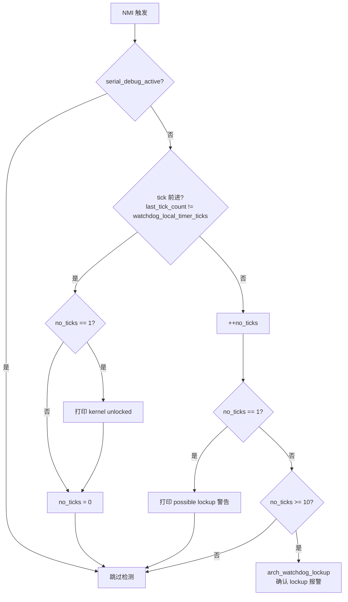

# 26-watchdog: NMI Watchdog（WONTFIX 文档化）

> **分类**: 调试基础设施
> **源码**: `minix3/minix/kernel/watchdog.c`, `minix3/minix/kernel/watchdog.h`
> **关联 Rust**: 无（WONTFIX — 见 §3 设计决策）
> **前置**: [15-clock-timer.md](15-clock-timer.md), [25-misc-unported.md](25-misc-unported.md)
> **C 总行数**: ~112 行（watchdog.c）+ 50 行（watchdog.h）

---

## Ch1: 概念

**核心问题**: 内核如何回答"自己是否还在运行"？用户态进程卡死可以由内核检测并杀死，但内核自身卡死时谁来拉响警报？NMI Watchdog 是 Minix3 对这个问题的回答——一种利用不可屏蔽中断的内核 lockup 检测机制。

### 1.1 什么是 NMI Watchdog

- **NMI (Non-Maskable Interrupt)** 是不可屏蔽中断：即使内核执行 `cli` 关闭了普通中断，NMI 仍能触发。这让 NMI 成为"内核卡死时仍可送达"的唯一中断源。
- **NMI watchdog** 利用 NMI 周期性检查内核是否还活着：每次 NMI 触发时比较时钟 tick 计数器，若连续若干次 NMI 都看到 tick 未前进，说明内核已 lockup。
- **CPU/OS perspective question**: "内核是否还在运行？"——时钟 tick 前进代表调度器还在转，NMI 是探针。

### 1.2 为什么 64-bit 重写不实现

**理由基于 Minix3 源码事实，而非笼统的"教学研究向不需要"**：

1. **Minix3 自己也只覆盖部分架构**：`find minix3/minix/kernel/arch -name arch_watchdog*` 仅命中 `i386/` 和 `earm/`——aarch64 和 riscv64 在 Minix3 也没有 NMI watchdog 实现。minix-rs 三架构目标（x86_64 + aarch64 + riscv64），强行抽象 NMI watchdog 会扭曲设计（x86 NMI / ARM FIQ / RISC-V NMI 语义差异大，无统一 trait 自然抽象）。

2. **Minix3 默认关闭**：[main.c:455-458](file:///home/xzhao/github/minix-rs/minix3/minix/kernel/main.c) 双重门控——`#ifdef USE_WATCHDOG`（编译时条件）+ `env_get("watchdog")`（运行时 boot 参数）。说明 Minix3 自己也把 NMI watchdog 当"高级调试选项"，不是核心 kernel 功能。

3. **依赖硬件 PMU/MSR（驱动层问题）**：[arch_watchdog.c](file:///home/xzhao/github/minix-rs/minix3/minix/kernel/arch/i386/arch_watchdog.c) 使用 vendor-specific MSR（`INTEL_MSR_PERFMON_CRT0/SEL0` for Intel，AMD 有自己的版本）+ LAPIC LVT PCR（性能计数器溢出 → NMI）。性能计数器是驱动层职责（vendor-specific MSR），不是 kernel 核心路径。

4. **sprofile 已用 timer IRQ 替代 NMI**：Minix3 的 NMI 还兼任统计采样载体（[profile.c:128](file:///home/xzhao/github/minix-rs/minix3/minix/kernel/profile.c) `nmi_sprofile_handler`）。minix-rs 的 [30-kernel-profile.md](30-kernel-profile.md) 用 `profile_clock_handler` + `ack_profile_clock`（基于普通 IRQ 时钟）替代 NMI 采样，三架构统一，无需 NMI 子系统。

5. **NMI 是可选调试特性，非内核正确性必需**：缺失不影响调度、IPC、VM 等核心子系统的正常运行。与 [25-misc-unported.md](25-misc-unported.md) 附录 DEFERRED 清单中 `SPROF PROF_NMI` 的排除说明一致。

### 1.3 redox 对照

不同微内核对 lockup 检测的策略不同：

- **redox**: 无 NMI watchdog——用户态 scheme 模型，内核最简，lockup 检测责任外推到用户态监控 scheme 或硬件 watchdog。
- **Minix3**: 内核内 NMI handler + lockup 检测——`watchdog.c` 提供 arch-independent 检测逻辑，`arch/i386/arch_watchdog.c` 提供 x86 硬件接入。
- **minix-rs**: WONTFIX——当前不实现，未来若需要可通过 arch trait 接入（见 §3.2）。

### 1.4 本章不讲什么

- NMI profiling 的 `do_sprofile` PROF_NMI 路径（见 [25-misc-unported.md](25-misc-unported.md) §2.5/§4.5 + 附录 `SPROF PROF_NMI` 行）——本文档只覆盖 watchdog 机制本身
- 普通中断处理流程（见 [14-exception-interrupt.md](14-exception-interrupt.md)）
- 时钟 tick 机制（见 [15-clock-timer.md](15-clock-timer.md)）

---

## Ch2: C 源码分析

### 2.1 文件清单

| 文件 | 行数 | 核心函数 | 职责 |
|------|------|---------|------|
| `watchdog.c` | 112 | `lockup_check` / `nmi_watchdog_handler` / `nmi_watchdog_start_profiling` / `nmi_watchdog_stop_profiling` | arch-independent 检测逻辑 |
| `watchdog.h` | 50 | `struct arch_watchdog` + 全局变量声明 | 接口契约 |
| `arch/i386/arch_watchdog.c` | ~180 | `arch_watchdog_init` / `arch_watchdog_stop` / `arch_watchdog_lockup` | x86 硬件接入 |

**全局状态**（watchdog.c:10-12）：

```c
unsigned watchdog_local_timer_ticks = 0U;   // 时钟 tick 是否在前进
struct arch_watchdog *watchdog;             // arch 操作表（init/reinit/profile_init）
int watchdog_enabled;                       // watchdog 是否启用
```

### 2.2 lockup 检测机制

`lockup_check()` 是 arch-independent 的核心检测逻辑（watchdog.c:14-50）：

```c
static void lockup_check(struct nmi_frame * frame)
{
    /* FIXME this should be CPU local */
    static unsigned no_ticks;                            // 连续无 tick 前进的次数
    static unsigned last_tick_count = (unsigned) -1;     // 上次看到的 tick 计数

    // 串口调试时打印耗时巨大，跳过检测避免误报
    if (serial_debug_active)
        return;

    // 路径 A：tick 在前进——内核还活着
    if (last_tick_count != watchdog_local_timer_ticks) {
        if (no_ticks == 1)
            printf("watchdog : kernel unlocked\n");
        no_ticks = 0;
        last_tick_count = watchdog_local_timer_ticks;
        return;
    }

    // 路径 B：tick 未前进——给 10 次机会后报警
    if (++no_ticks < 10) {
        if (no_ticks == 1)
            printf("WARNING watchdog : possible kernel lockup\n");
        return;
    }

    // 连续 10 次 NMI 都无 tick 前进 → 确认 lockup
    arch_watchdog_lockup(frame);
}
```

**检测算法**（Mermaid 流程）：



**关键设计**：
- `no_ticks` 阈值为 **10**（watchdog.c:42）——容忍短暂 stall，只有持续 lockup 才报警
- `last_tick_count` 初始化为 `(unsigned) -1`（watchdog.c:18）——首次调用必走路径 A
- `serial_debug_active` 守卫（watchdog.c:25）——串口调试时 `printf` 本身耗时巨大，会触发假阳性
- `FIXME this should be CPU local`（watchdog.c:16）——C 源码已知缺陷：SMP 下 `no_ticks`/`last_tick_count` 是 static 全局变量，多 CPU 共享会相互干扰

### 2.3 NMI 中断入口

`nmi_watchdog_handler()` 是 NMI 中断的 arch-independent 入口（watchdog.c:52-73）：

```c
void nmi_watchdog_handler(struct nmi_frame * frame)
{
#if SPROFILE
    // profiling 模式下跳过 lockup 检测（高频采样会触发假阳性）
    if (watchdog_enabled && !sprofiling)
        lockup_check(frame);
    if (sprofiling)
        nmi_sprofile_handler(frame);      // 转交 profiling 处理

    if ((watchdog_enabled || sprofiling) && watchdog->reinit)
        watchdog->reinit(cpuid);          // 重新武装 NMI 源
#else
    if (watchdog_enabled) {
        lockup_check(frame);
        if (watchdog->reinit)
            watchdog->reinit(cpuid);
    }
#endif
}
```

**双职责**：watchdog + NMI profiling 共用同一个 NMI 入口——`SPROFILE` 编译选项决定是否支持 profiling。profiling 启用时跳过 lockup 检测（watchdog.c:59），因为高频采样会让 `lockup_check` 误判。

### 2.4 NMI profiling 入口

`nmi_watchdog_start_profiling()` / `nmi_watchdog_stop_profiling()` 控制 NMI 作为采样源（watchdog.c:75-112）：

```c
int nmi_watchdog_start_profiling(const unsigned freq)
{
    // 若 watchdog 未启用，先初始化 NMI 硬件
    if (!watchdog_enabled) {
        if (arch_watchdog_init())
            return ENODEV;
    }

    // 检查 arch 是否支持 profiling
    if (!watchdog->profile_init) {
        printf("WARNING NMI watchdog profiling not supported\n");
        nmi_watchdog_stop_profiling();
        return ENODEV;
    }

    err = watchdog->profile_init(freq);    // arch 特定初始化
    if (err != OK) return err;

    watchdog->resetval = watchdog->profile_resetval;   // 切换到 profiling 频率
    return OK;
}
```

**与 `do_sprofile` 的关系**：`do_sprofile()`（见 [25-misc-unported.md](25-misc-unported.md) §2.5）的 `PROF_NMI` 分支调用 `nmi_watchdog_start_profiling(freq)` 启动 NMI 采样。Rust `dispatch_profile` 对 `PROF_NMI` 返回 `ENOSYS`（[25-misc-unported.md](25-misc-unported.md) §4.5）——本文档补充该返回值背后的 NMI 子系统文档化。

### 2.5 arch 钩子

`struct arch_watchdog`（watchdog.h:19-26）定义运行时方法表：

```c
struct arch_watchdog {
    arch_watchdog_method_t        init;           // 初始设置
    arch_watchdog_method_t        reinit;         // 每次 NMI 后重新武装
    arch_watchdog_profile_init_t  profile_init;   // profiling 初始化
    u64_t                         resetval;       // 当前重装值
    u64_t                         watchdog_resetval;   // watchdog 模式重装值
    u64_t                         profile_resetval;    // profiling 模式重装值
};
```

arch 钩子声明（watchdog.h:31-36）：
- `arch_watchdog_init()` — 初始化 NMI 硬件（x86 实现在 `arch/i386/arch_watchdog.c:53`）
- `arch_watchdog_stop()` — 停止 NMI（`arch/i386/arch_watchdog.c:101`）
- `arch_watchdog_lockup(frame)` — lockup 报警（`arch/i386/arch_watchdog.c:105`，打印 stacktrace + 信息）

> `struct arch_watchdog` 是 C 的"函数指针表"模式——等价于 Rust trait object。x86 实现在 `arch/i386/arch_watchdog.c:178` 通过 `intel_arch_watchdog_init` 等函数填充该表。

---

## Ch3: Rust 设计决策

### 3.1 WONTFIX rationale

| 维度 | 评估 | 证据 |
|------|------|------|
| 是否内核正确性必需 | ❌ 否——NMI watchdog 是调试设施，缺失不影响内核正常运行 | Minix3 `USE_WATCHDOG` 编译时关闭 |
| Minix3 架构覆盖 | ❌ 部分——仅 i386 + earm 实现 | `find minix3/minix/kernel/arch -name arch_watchdog*` 命中 i386/earm |
| Minix3 默认启用 | ❌ 否——编译时 + 运行时双重门控 | [main.c:455-458](file:///home/xzhao/github/minix-rs/minix3/minix/kernel/main.c) `#ifdef USE_WATCHDOG` + `env_get("watchdog")` |
| 是否依赖硬件 PMU | ✅ 是——vendor-specific MSR + LAPIC LVT PCR | [arch_watchdog.c:22-44](file:///home/xzhao/github/minix-rs/minix3/minix/kernel/arch/i386/arch_watchdog.c) Intel/AMD MSR |
| 是否阻塞 sprofile | ❌ 否——minix-rs 已用 timer IRQ 替代 | [30-kernel-profile.md](30-kernel-profile.md) `profile_clock_handler` + `ack_profile_clock` |
| 是否有 Rust 实现 | ❌ 无——WONTFIX | — |
| 是否架构相关 | ✅ 是——x86 NMI / ARM FIQ / RISC-V NMI 语义差异大 | 三架构无统一 trait 自然抽象 |
| 是否阻塞其他子系统 | ❌ 否——`PROF_NMI` 路径已返回 `ENOSYS` | [25-misc-unported.md](25-misc-unported.md) §4.5 |

**结论**：WONTFIX——基于 Minix3 源码事实（部分架构覆盖 + 默认关闭 + 依赖硬件 PMU + sprofile 已替代），文档化 C 实现以保持覆盖率完整性，不计划 Rust 实现。

### 3.2 未来接入路径（若需要）

若未来需要 NMI watchdog，可遵循 minix-rs 现有的 arch trait 模式（如 `ArchSyscall`/`ClockArch`/`CpuContextArch`）：

1. **定义 `ArchNmi` trait**（类似 `ClockArch`）：
   ```rust
   pub trait ArchNmi {
       fn nmi_init(&self) -> Result<(), Errno>;
       fn nmi_stop(&self);
       fn nmi_reinit(&self, cpu: u32);
       fn nmi_lockup(frame: &NmiFrame) -> !;
   }
   ```
2. **注册 `nmi_watchdog_handler`** 为 NMI 中断入口（需扩展 [14-exception-interrupt.md](14-exception-interrupt.md) 的中断分派表）
3. **实现 `lockup_check()` 等价逻辑**——比较 `watchdog_local_timer_ticks` 与 `last_tick_count`，连续 10 次无前进则调用 `ArchNmi::nmi_lockup`
4. **接入 `TimerAction` enum**（[15-clock-timer.md](15-clock-timer.md)）——当前 `KernelCallback` 的 NMI 变体已删除（YAGNI），未来可重新引入

> 这只是设计草图，当前无实现计划。YAGNI 原则——在无具体需求前不引入 NMI 子系统复杂度。

---

## Ch4: 实现

无 Rust 实现。C 等价物全部 WONTFIX。

`PROF_NMI` 路径在 Rust 中的处理见 [25-misc-unported.md](25-misc-unported.md) §4.5：`dispatch_profile` 对 `ProfIntrType::Nmi` 返回 `ENOSYS`（misc.rs 中 `PROF_NMI` 分支），与本文档的 WONTFIX 决策一致。

---

## Ch5: 测试

无 Rust 测试。`PROF_NMI` 的 `ENOSYS` 返回值由 [25-misc-unported.md](25-misc-unported.md) §5.1 的 `dispatch_profile` 测试矩阵覆盖（`unknown intr` → `EINVAL` 分支不覆盖 NMI；`PROF_NMI` 单独返回 `ENOSYS`）。

---

## Ch6: 已知缺口与限制

### 6.1 WONTFIX 清单

| C 符号 | 位置 | 状态 | 理由 |
|--------|------|------|------|
| `lockup_check` | watchdog.c:14-50 | WONTFIX | NMI 子系统未实现 |
| `nmi_watchdog_handler` | watchdog.c:52-73 | WONTFIX | 同上 |
| `nmi_watchdog_start_profiling` | watchdog.c:75-98 | WONTFIX | 依赖 NMI 硬件 |
| `nmi_watchdog_stop_profiling` | watchdog.c:100-112 | WONTFIX | 同上 |
| `arch_watchdog_init` | arch/i386/arch_watchdog.c:53 | WONTFIX | x86 NMI 硬件特定 |
| `arch_watchdog_stop` | arch/i386/arch_watchdog.c:101 | WONTFIX | 同上 |
| `arch_watchdog_lockup` | arch/i386/arch_watchdog.c:105 | WONTFIX | 同上 |
| `watchdog_local_timer_ticks` | watchdog.c:10 | WONTFIX | 全局状态，依赖 NMI handler 更新 |
| `struct arch_watchdog` | watchdog.h:19-26 | WONTFIX | arch 操作表，无 Rust trait 对应 |

### 6.2 与 25-misc-unported 的关系

- [25-misc-unported.md](25-misc-unported.md) 附录 DEFERRED 清单中 `SPROF PROF_NMI` 标注"NMI 子系统超范围（§6.3 排除），返回 `ENOSYS`"——这是从 `do_sprofile` 视角的排除说明
- 本文档补充 NMI watchdog 机制**本身**的文档化（C 分析 + WONTFIX rationale），填补 `watchdog.c` 的覆盖率缺口
- 两者一致：NMI 子系统整体不在 64-bit 重写范围内

### 6.3 已知 C 源码缺陷（不修复）

- `lockup_check` 的 `no_ticks`/`last_tick_count` 是 `static` 全局变量（watchdog.c:17-18），SMP 下多 CPU 共享会相互干扰——C 源码已标注 `FIXME this should be CPU local`（watchdog.c:16）。Rust 若未来实现应使用 per-CPU 状态（参考 `CpuLocal` 模式，见 [16-smp.md](16-smp.md)）。
