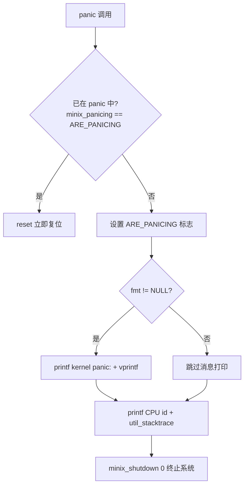

# 27-kernel-utility: 内核工具函数（panic/kputc/_exit）

> **分类**: 内核基础设施
> **源码**: `minix3/minix/kernel/utility.c`, `minix3/minix/kernel/const.h`, `minix3/minix/kernel/system/do_diagctl.c`
> **关联 Rust**: `os/kernel/src/`（`panic!` 宏）, `os/plat/src/early_console.rs`（`EarlyConsole` trait）, `os/libs/minix-rt/src/lib.rs`（`#[panic_handler]`）
> **前置**: [03-kmain-cstart.md](03-kmain-cstart.md), [08-system-init-boot-finish.md](08-system-init-boot-finish.md), [25-misc-unported.md](25-misc-unported.md)
> **C 总行数**: ~93 行（utility.c）

---

## Ch1: 概念

**核心问题**: 内核是不可信代码的最后防线，但内核自身出错时如何报告？用户态进程有 `printf` + `exit`，内核不能 `exit`（它是最后兜底者）。Minix3 用三个工具函数回答"内核如何报告错误状态"——`panic` 不可恢复错误、`kputc` 内核消息缓冲、`_exit` 禁止内核调用。

### 1.1 内核工具函数的职责

- **panic**: 内核不可恢复错误处理——格式化消息 + 打印 stacktrace + 系统复位。一旦触发，内核停止正常执行。
- **kputc**: 内核消息缓冲——将 `printf` 输出的字符累积到 `kmess_buf` 环形缓冲，遇到 `END_OF_KMESS` 标志时通知用户态日志服务。
- **_exit**: 禁止内核调用 `_exit`——内核不是进程，不能"退出"，调用 `_exit` 直接 panic。
- **CPU/OS perspective**: "内核如何报告错误状态？"——panic 是同步致命错误，kputc 是异步消息流，_exit 是契约守卫。

### 1.2 为什么单独文档化

- 散落在多处文档：`panic` 在 [06-proc-init-boot-proc.md](06-proc-init-boot-proc.md) / [14-exception-interrupt.md](14-exception-interrupt.md) / [19-syscall-signal.md](19-syscall-signal.md) 零星提及，`kputc` 在 `syscall.rs` 注释和 [25-misc-unported.md](25-misc-unported.md) `do_diagctl` 路径中提及，但无统一文档。
- C `kmess_buf` 缓冲 → Rust log 框架的**架构演进**未在任何文档中说明。
- `do_diagctl`（[25-misc-unported.md](25-misc-unported.md)）的 `kputc` 路径需要 `kmess` 机制背景才能理解。

### 1.3 redox 对照

不同内核对错误报告与日志的策略不同：

- **redox**: `log` crate + scheme-based 日志——内核用 `log` 宏输出，用户态日志 scheme 接收并持久化；内核不维护消息缓冲。
- **Minix3**: 内核 `kmess_buf` 环形缓冲 + `END_OF_KMESS` 信号通知——内核先缓冲消息，用户态日志服务（如 `init`/`log`）通过 `SIGKMESS` 信号拉取。
- **minix-rs**: `panic!` 宏 + `EarlyConsole::write_str` 直接输出——架构演进：消除 `kmess` 缓冲，boot 期直接写串口；`log` crate 用于 mock 平台测试。

### 1.4 本章不讲什么

- `do_diagctl` 实现（见 [25-misc-unported.md](25-misc-unported.md)）——本文档只覆盖 `kputc` 被调用的机制背景
- boot 期 console 初始化（见 [03-kmain-cstart.md](03-kmain-cstart.md) `EarlyConsole` 初始化部分）
- 普通进程的 `exit` 系统调用（见 [17-syscall-process.md](17-syscall-process.md) `SYS_EXIT`）

---

## Ch2: C 源码分析

### 2.1 文件清单

| 文件 | 行数 | 核心函数 | 职责 |
|------|------|---------|------|
| `utility.c` | 93 | `panic` / `kputc` / `_exit` | 内核工具函数 |
| `const.h` | — | `END_OF_KMESS` 宏 | 消息结束标志 |
| `system/do_diagctl.c` | — | `do_diagctl` 的 `DIAGCTL_CODE_DIAG` 路径 | `kputc` 调用方 |

### 2.2 panic：不可恢复错误处理

`panic()` 是内核致命错误的统一入口（utility.c:22-50）：

```c
#define ARE_PANICING 0xDEADC0FF    // 重入标志魔数（utility.c:17）

void panic(const char *fmt, ...)
{
  va_list arg;
  // 重入保护：若已在 panic 中，直接复位
  if (kinfo.minix_panicing == ARE_PANICING) {
      reset();
  }
  kinfo.minix_panicing = ARE_PANICING;

  // 格式化并打印 panic 消息
  if (fmt != NULL) {
      printf("kernel panic: ");
      va_start(arg, fmt);
      vprintf(fmt, arg);
      va_end(arg);
      printf("\n");
  }

  // 打印当前 CPU + stacktrace
  printf("kernel on CPU %d: ", cpuid);
  util_stacktrace();

  // 终止系统
  minix_shutdown(0);
}
```

**panic 流程**（Mermaid）：



**关键设计**：
- **重入保护**（utility.c:26-28）：`ARE_PANICING` 魔数防止 panic 递归——若 `panic` 内部再次 `panic`（如 `printf` 本身出错），直接 `reset()` 避免无限递归
- **`fmt == NULL` 允许**（utility.c:30）：调用方可只触发 stacktrace 而不打印消息
- **`util_stacktrace()`**（utility.c:39 调用，定义在 `libsys/stacktrace.c:17`）：帧指针链遍历打印返回地址——函数体受 `USE_SYSDEBUG` 条件编译门控（`libsys/Makefile` 中 `USE_SYSDEBUG != "no"` 时启用），默认 release 构建可能为空操作
- **`minix_shutdown(0)`**（utility.c:49）：最终终止——禁用全部中断 + 直接打印停机消息 + `arch_shutdown(how)` 硬件复位（main.c:368-396）。panic 路径无需协商，直接交给硬件层复位

### 2.3 kputc：内核消息缓冲机制

`kputc()` 是内核 `printf` 的底层字符输出（utility.c:55-83）：

```c
void kputc(int c)
{
  if (c != END_OF_KMESS) {
      int maxblpos = sizeof(kmess.kmess_buf) - 2;
      // 串口调试模式：同步输出到串口
      #ifdef DEBUG_SERIAL
      if (kinfo.do_serial_debug) {
          if(c == '\n') ser_putc('\r');
          ser_putc(c);
      }
      #endif
      // 写入环形缓冲 km_buf
      kmess.km_buf[kmess.km_next] = c;
      // 写入线性缓冲 kmess_buf（供用户态拉取）
      kmess.kmess_buf[kmess.blpos] = c;
      if (kmess.km_size < sizeof(kmess.km_buf))
          kmess.km_size += 1;
      kmess.km_next = (kmess.km_next + 1) % _KMESS_BUF_SIZE;
      // 线性缓冲满时整体左移（丢弃最旧字符）
      if(kmess.blpos == maxblpos) {
          memmove(kmess.kmess_buf,
                  kmess.kmess_buf+1, sizeof(kmess.kmess_buf)-1);
      } else kmess.blpos++;
  } else if (!(kinfo.minix_panicing || kinfo.do_serial_debug)) {
      // END_OF_KMESS 标志：通知用户态日志服务
      send_diag_sig();
  }
}
```

**kmess 双缓冲结构**：

| 缓冲 | 字段 | 用途 | 行为 |
|------|------|------|------|
| `km_buf` | `km_next` | 环形消息缓冲（type.h:173 "buffer for messages"） | `% _KMESS_BUF_SIZE` 取模回绕 |
| `kmess_buf` | `blpos` | 线性可打印副本（type.h:174 "printable copy of message buffer"，`80*25` 容量） | 满时 `memmove` 左移丢弃最旧 |
| — | `km_size` | 累计字符数 | 上限 `sizeof(km_buf)` |

**`END_OF_KMESS` 通知机制**：
- `END_OF_KMESS = 0`（const.h:30）——`printf` 在每条消息末尾隐式发送
- 遇到 `END_OF_KMESS` 时调用 `send_diag_sig()`（utility.c:81）——向注册了 `DIAGCTL_CODE_REGISTER` 的用户态进程发送 `SIGKMESS` 信号
- **panic/serial_debug 时跳过通知**（utility.c:80）——panic 期间用户态服务可能已不可用，避免信号递归

**`do_diagctl` 调用路径**（do_diagctl.c:33-41）：

```c
// DIAGCTL_CODE_DIAG：用户态请求内核打印诊断消息
data_copy_vmcheck(caller, caller->p_endpoint, buf, KERNEL, mybuf, len);
for(i = 0; i < len; i++)
    kputc(mybuf[i]);
kputc(END_OF_KMESS);    // 通知日志服务
```

用户态进程通过 `SYS_DIAGCTL` 的 `DIAGCTL_CODE_DIAG` 子请求将消息写入内核 `kmess`，再由内核通过 `SIGKMESS` 通知日志服务拉取。

### 2.4 _exit：禁止内核调用

`_exit()` 是契约守卫（utility.c:88-93）：

```c
void _exit(int e)
{
  panic("_exit called from within the kernel, should not happen. (err %i)", e);
}
```

**设计意图**：内核不是进程，没有"退出"语义。链接器可能将 `_exit` 链入内核（C 库依赖），运行时调用即表明逻辑错误，直接 `panic` 暴露问题而非静默继续。

---

## Ch3: Rust 设计决策

### 3.1 panic: `panic!` 宏 + `#[panic_handler]` 替代

| C | Rust | 架构演进标记 |
|----|------|------------|
| `panic(fmt, ...)` + `vprintf` + `util_stacktrace` + `minix_shutdown` | Rust `panic!()` 宏 + `#[panic_handler]` | **ARCH: Rust panic 机制** |

**演进 rationale**：
- C 需要手动实现 `va_start`/`vprintf` 格式化 + 重入保护 + stacktrace——Rust `panic!` 宏由编译器内建，自动处理格式化与调用点信息
- C 的 `ARE_PANICING` 重入保护由 halt-loop 实现天然保证——handler 内是 `loop { spin_loop }`，不经过格式化/打印路径，重入只是再次进入同一个循环，不会无限递归（C 的 `reset()` 等价物由架构复位替代）
- C 的 `util_stacktrace()` 已实现为 `os/kernel/src/stacktrace.rs::util_stacktrace`（D-47，2026-09-06：x86_64 `current_frame_pointer` asm 原语 + `StacktraceArch::walk_frames_from` 共享循环 + 内核 Direct Map 直读）；panic 路径接线见 D-48
- C 的 `minix_shutdown(0)` 在 Rust 中由 `#[panic_handler]` 的 halt-loop 替代（见 §4.1）

### 3.2 kputc: `EarlyConsole::write_str` + `log` crate 替代

| C | Rust | 架构演进标记 |
|----|------|------------|
| `kputc(c)` + `kmess_buf` + `END_OF_KMESS` + `send_diag_sig` | `EarlyConsole::write_str()` 直接输出 + `log` crate（mock 平台） | **ARCH: log 框架** |

**演进 rationale**：
- C `kmess_buf` 环形缓冲是为**无 log 框架的内核**设计的——内核先缓冲，用户态日志服务定期拉取
- Rust `EarlyConsole` trait（`os/plat/src/early_console.rs:14`）提供跨架构直接输出：boot 期即可用，无需用户态服务
- Rust `log` crate 提供 leveled logging（`error!`/`warn!`/`info!`/`debug!`/`trace!`）+ 后端抽象——mock 平台（`os/plat/src/mock.rs`）用 `log::debug!` 记录操作
- `do_diagctl` 的 `kputc` 路径在 Rust 中由 `EarlyConsole` 直接输出替代（演进方向）——消除 `END_OF_KMESS` + `send_diag_sig` 通知机制（当前实现状态见 §6.4：`DIAGCTL_CODE_DIAG` 返回 ENOSYS）

> **注**: minix-rs 当前未定义 `minix_kernel_log!` 宏；内核直接使用 `EarlyConsole::write_str` 输出字符串，mock 平台用 `log::debug!`。`log` crate 的接入点是 `os/plat/src/mock.rs`。

### 3.3 _exit: `panic!` 语义覆盖

| C | Rust | 架构演进标记 |
|----|------|------------|
| `_exit()` → `panic(...)` | Rust `panic!()` 语义已覆盖 | **ARCH: Rust 类型安全** |

**演进 rationale**：
- C 需要显式定义 `_exit` 防止链接器引入的 C 库 `_exit` 被误调用——Rust `no_std` 内核不链接 C 库，无 `_exit` 符号
- Rust 的类型系统 + `no_std` 约束在编译期排除了"内核调用 `_exit`"的可能——无需运行时守卫

### 3.4 架构演进总结

C `kmess` 缓冲机制被 Rust 拆解为两层：
1. **直接输出层**：`EarlyConsole::write_str`（boot 期、panic 期）——对应 C 的 `ser_putc` 串口路径
2. **结构化日志层**：`log` crate（mock 平台、未来用户态日志服务）——对应 C 的 `kmess_buf` + `SIGKMESS` 通知

`END_OF_KMESS` + `send_diag_sig()` 的"缓冲-通知-拉取"三步机制由 `log` 后端的异步 flush 替代——内核不再维护消息缓冲，直接输出或交由 log 后端。

---

## Ch4: 实现

### 4.1 Rust panic handler

minix-rs 有两个 `#[panic_handler]` 实现：

**1. 内核运行时 panic handler**（`os/libs/minix-rt/src/lib.rs:169`）：

```rust
// 文档注释说明：当前行为是 halt-loop，未来计划格式化消息 + write + exit
#[cfg(all(not(test), not(feature = "std")))]
#[panic_handler]
fn panic(_info: &PanicInfo) -> ! {
    // Halt forever. See doc comment for the roadmap.
    loop {
        core::hint::spin_loop();   // 友好于 hypervisor（QEMU）
    }
}
```

> `os/libs/minix-rt/src/lib.rs`（line 169）
>
> 文档注释（line 148-167）说明未来路线图：格式化 panic 消息 → 调用 `minix_sys::write(STDERR, buf)` → `minix_sys::exit(1)`。当前因 `minix_sys::write` 未落地，halt-loop 是最安全的最小行为。

**2. UEFI boot-shim panic handler**（`os/boot-shim/src/main.rs:56`）：

```rust
#[panic_handler]
fn panic(_info: &PanicInfo) -> ! {
    loop {}
}
```

> `os/boot-shim/src/main.rs`（line 56）

boot-shim 的 panic handler 更简陋——boot 期无任何子系统可用，直接 halt。

**3. 内核 `panic!` 宏调用点**：

内核代码直接使用 `panic!` 宏触发致命错误（对应 C `panic()` 调用）：

| 调用点 | 场景 | C 等价 |
|--------|------|--------|
| `os/kernel/src/syscall.rs:1681` | `SYS_ABORT` 系统调用 | C `SYS_ABORT` → `do_abort`（do_abort.c:16）→ `prepare_shutdown`（main.c:353）→ `minix_shutdown`（main.c:368） |
| `os/kernel/src/proc_table.rs:731` | `notify_scheduler` 内核发送失败 | 内部不变式违反 |
| `os/kernel/src/vm.rs:909` | `kernel_call_resume` 状态非法 | 内部不变式违反 |
| `os/kernel/src/irq_manager.rs:150,154,161,318,342` | IRQ handler/vector 校验失败 | 内部不变式违反 |

> `os/kernel/src/syscall.rs`（line 1681）—— `dispatch_abort` 的 `panic!("MINIX will now be shut down ... (SYS_ABORT from endpoint {:?}...)")`

**与 C `panic` 的差异**（D-48 更新，2026-09-06）：
- C `panic` 打印 `kernel panic:` 前缀 + stacktrace + `minix_shutdown`——Rust `#[panic_handler]`（minix-rt）支持诊断 hook 委托：kernel 经 `register_panic_diagnostic()` 注册 `kernel_panic_diagnostic` 渲染器（`kernel panic: ` + 消息 + `kernel on CPU %d: ` + `util_stacktrace()`，EarlyConsole）；hook 槽位于 `minix-types::diagnostic`（依赖方向 kernel → minix-types ← minix-rt）；未注册回退 stage-1 SpinSink。`minix_shutdown` 仍 DEFERRED（零基础）
- C `ARE_PANICING` 重入保护由 halt-loop 实现天然保证（见 §3.1）
- C `util_stacktrace()` 已实现（D-47，`util_stacktrace()` 内核自回溯），panic 路径接线已由 D-48 完成

### 4.2 Rust kputc / log 接入

**`EarlyConsole` trait**（`os/plat/src/early_console.rs:14`）：

```rust
pub trait EarlyConsole {
    fn init() {}
    fn write_byte(byte: u8);           // 对应 C kputc 的字符输出
    fn write_str(s: &str) {            // 默认方法：\n → \r\n 转换
        for b in s.bytes() {
            if b == b'\n' { Self::write_byte(b'\r'); }
            Self::write_byte(b);
        }
    }
    fn write_hex(val: u64) { ... }     // 默认方法：0x 前缀十六进制
}
```

> `os/plat/src/early_console.rs`（line 14）

**三架构实现**：
- x86_64：COM1 串口（0x3F8）
- arm64：PL011 UART
- riscv64：SBI ecall
- mock：`log::debug!`（`os/plat/src/mock.rs:62`）

**内核调用点**（对应 C `kputc` 经 `printf` 调用）：

```rust
// os/kernel/src/lib.rs:1831 — announce() banner
use minix_plat::{EarlyConsole, CurrentEarlyConsole as Console};
Console::write_str("\nMINIX-RS 0.1.0 (rust rewrite) — scheduling live\n");
```

> `os/kernel/src/lib.rs`（line 1831）

**`log` crate 接入**（mock 平台）：

```rust
// os/plat/src/mock.rs:30 — MockInterruptController 用 log::debug! 记录操作
fn init(&mut self) {
    log::debug!("mock InterruptController::init()");
}
```

> `os/plat/src/mock.rs`（line 30）

> **注**：内核 crate（`os/kernel/src/`）当前未直接使用 `log::` 宏——内核输出走 `EarlyConsole::write_str`。`log` crate 主要用于 mock 平台和测试。未来若引入用户态日志服务，可通过 `log` 后端桥接（替代 C 的 `kmess_buf` + `SIGKMESS` 机制）。

---

## Ch5: 测试

### 5.1 panic 路径测试

`panic!` 路径无单元测试——`panic!` 触发后 halt-loop，无法在 `cargo test` 中断言。`#[panic_handler]` 的行为由 QEMU 集成测试覆盖（见 `os/qemu-tests/`）。

### 5.2 EarlyConsole 测试

`EarlyConsole` trait 的 mock 实现（`MockEarlyConsole`，`os/plat/src/mock.rs:58`）用 `log::debug!` 记录字节输出，可在 `cargo test` 中验证调用序列。

### 5.3 测试缺口

| 缺口 | 原因 | 风险 |
|------|------|------|
| `panic!` 消息格式化 | 当前 `#[panic_handler]` 不打印消息 | 低——panic 已是致命错误，halt 即可 |
| `EarlyConsole` 三架构实现 | 需 QEMU 硬件模拟 | 由 `os/qemu-tests/` 覆盖 |
| `log` 后端桥接 | 未实现 | 低——当前无用户态日志服务 |

---

## Ch6: 已知缺口与限制

### 6.1 已实现（ARCH 演进）

| C 函数 | Rust 等价 | 状态 | 实现位置 |
|--------|----------|------|---------|
| `panic` | `panic!()` 宏 + `#[panic_handler]` | ✅ ARCH 演进 | `os/libs/minix-rt/src/lib.rs:169` |
| `kputc` | `EarlyConsole::write_str()` + `log` crate | ✅ ARCH 演进 | `os/plat/src/early_console.rs:14`, `os/plat/src/mock.rs` |
| `_exit` | `panic!()` 语义覆盖 | ✅ ARCH 演进 | 无需实现（`no_std` 编译期排除） |

### 6.2 kmess 缓冲未实现（ARCH 演进）

| C 机制 | 状态 | 替代方案 |
|--------|------|---------|
| `kmess_buf[]` 环形缓冲 | ❌ 未实现 | `EarlyConsole` 直接输出 + `log` 后端 |
| `km_buf` / `kmess_buf` 双缓冲 | ❌ 未实现 | 单一 `EarlyConsole` 输出路径 |
| `END_OF_KMESS` 标志 | ❌ 未实现 | 无需——直接输出无需消息边界 |
| `send_diag_sig()` 通知 | ❌ 未实现 | `log` 后端异步 flush（未来） |
| `SIGKMESS` 信号 | ❌ 未实现 | 用户态日志 scheme（未来） |
| `DIAGCTL_CODE_REGISTER` | ❌ 未实现 | 用户态 `log` 后端注册（未来） |

### 6.3 panic handler 未实现部分

| C 行为 | Rust 当前状态 | 未来计划 |
|--------|-------------|---------|
| `printf("kernel panic: " + fmt)` | ✅ D-48：hook 注册后由 `kernel_panic_diagnostic` 经 EarlyConsole 打印（未注册回退 stage-1 sink） | — |
| `util_stacktrace()` | ✅ 已实现（D-47：`StacktraceArch::current_frame_pointer` + `walk_frames_from` + 内核 Direct Map 直读；x86_64 only，C 同为 i386 only） | panic handler 接线（D-48） |
| `minix_shutdown(0)` | ❌ halt-loop | 待 shutdown 协议（**DEFERRED**，零 Rust 基础） |
| `printf("kernel on CPU %d: ")` | ✅ D-48（单 CPU = BSP 常量；per-CPU 随 D-40） | — |

### 6.4 与其他文档的关系

- [25-misc-unported.md](25-misc-unported.md) `do_diagctl` 的 `DIAGCTL_CODE_DIAG` 路径在 Rust 中返回 `ENOSYS`（`kputc` 未移植）——本文档说明 `kputc` 的 C 机制与 Rust 演进方向
- [03-kmain-cstart.md](03-kmain-cstart.md) `EarlyConsole` 初始化——本文档说明 `EarlyConsole` 如何替代 `kputc`
- [14-exception-interrupt.md](14-exception-interrupt.md) 异常处理中的 panic 触发——本文档说明 panic 的整体流程
