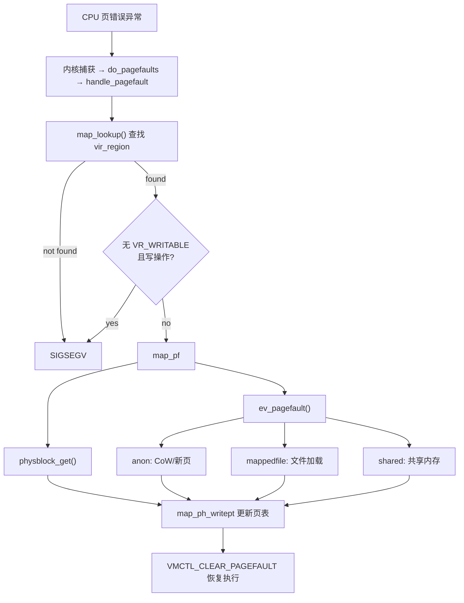

# 15-pagefault: 页错误处理

> **分类**: VM私有  
> **源码**: `minix3/minix/servers/vm/pagefaults.c`  
> **说明**: 处理 CPU 产生的页错误，包括 CoW 触发、按需加载等

---

## 1. 概述

页错误（Page Fault）是 CPU 在访问内存时检测到异常情况而触发的中断。在 Minix3 中，**只有用户进程会触发缺页**，内核和 VM 均不会：

| 进程类型 | 是否缺页 | 内核处理方式 | 原因 |
|---------|---------|------------|------|
| **内核** | ❌ | `inkernel_disaster()` → panic | 内核使用直接物理映射，所有内存分配即映射 |
| **VM 服务器** | ❌ | `panic("pagefault in VM")` | VM 是缺页的唯一处理者，自身缺页会死锁 |
| **用户进程** | ✅ | 转发给 VM 处理 | VM 实现按需分页、CoW 等功能 |

> **VM 不能缺页的根因**：VM 是页错误的唯一处理者——若 VM 自身也按需分页，处理他人缺页时可能触发自身缺页，形成死锁。因此 VM 的内存分配采用 **eager mapping** 策略：`vm_allocpage()` 先 `alloc_mem()` 获取物理页，再 `vm_mappages()` 立即映射到 VM 地址空间（`PTF_PRESENT | PTF_USER | PTF_RW`），不存在"先占虚拟地址、访问时再映射"的延迟分配。内核源码见 `kernel/arch/i386/exception.c:92-108`、`kernel/arch/earm/exception.c:72-96`。

### 1.1 页错误类型

Minix3 定义了两种基本页错误类型（基于 x86-32 架构）：

| 错误类型 | 宏定义 | 触发条件 | 典型场景 |
|---------|--------|---------|---------|
| **不存在错误 (NP)** | `PFERR_NOPAGE(err)` | 页表项 Present 位为 0 | 首次访问、按需加载 |
| **保护错误 (WP)** | `PFERR_PROT(err)` | 页表项 Present 位为 1 但权限不足 | CoW 写保护触发 |

```c
// minix3/minix/servers/vm/arch/i386/pagetable.h:36
#define PFERR_NOPAGE(e)	(!((e) & I386_VM_PFE_P))  // 页不存在
#define PFERR_PROT(e)	(((e) & I386_VM_PFE_P))    // 保护错误
#define PFERR_WRITE(e)	((e) & I386_VM_PFE_W)      // 写操作触发
#define PFERR_READ(e)	(!((e) & I386_VM_PFE_W))    // 读操作触发
```

> **x86-32 vs x86-64 差异**: 上述宏定义位于 `arch/i386/pagetable.h`，是 x86-32 特有的。x86-64 的页错误码增加了 bit 2（保留位违规，`PFE_RSVD`）和 bit 4（取指违规，`PFE_FETCH`/`PFERR_EXECUTE`），支持 NX 位（No-Execute）检测。minix-rs 在 x86-64 上需要扩展 `PageFaultType` 和 `AccessType` 以支持执行权限错误。页表层级从 x86-32 的 2 级（PDE→PTE）变为 x86-64 的 4 级（PML4→PDPT→PD→PT），但此差异已被 `Paging` trait 封装（`map`/`remap`/`unmap` 是硬件无关接口），页错误处理逻辑不直接受 walk 深度影响。

### 1.2 处理流程概览



### 1.3 与 Minix3 源码的对应关系

| 功能 | Minix3 源文件 | 函数/结构 |
|------|--------------|----------|
| 页错误入口 | `pagefaults.c` | `do_pagefaults()`, `handle_pagefault()` |
| 区域查找 | `region.c` | `map_lookup()` |
| 页面处理 | `region.c` | `map_pf()` |
| 内存类型处理 | `mem_anon.c` | `anon_pagefault()` |
| 物理块管理 | `pb.c` | `pb_new()`, `pb_reference()` |
| 页表操作 | `pagetable.c` | `pt_writemap()` |
| 错误码定义 | `arch/i386/pagetable.h` | `PFERR_*` 宏 |

---

## 2. C 源码分析

### 2.1 页错误类型

#### 2.1.1 写保护错误 (WP)

写保护错误（Write Protection Fault）是 CoW 机制的核心触发点。当进程尝试写入一个 PTE 被标记为只读的页面时，CPU 触发此错误。注意：这里的"只读"是 PTE 级别的写保护，而非 `vir_region` 级别的不可写——后者（无 `VR_WRITABLE`）会在 `handle_pagefault()` 中直接 SIGSEGV，不会走到 CoW 路径。

**触发条件**

```c
// 错误码判断
PFERR_PROT(err) == true   // 页表项 Present 位为 1
PFERR_WRITE(err) == true  // 是写操作触发
```

**典型场景：CoW 写时复制**

```
┌─────────────────────────────────────────────────────────────────┐
│                    写保护错误触发 CoW                            │
├─────────────────────────────────────────────────────────────────┤
│                                                                 │
│  fork() 后父子进程共享页面：                                      │
│                                                                 │
│  父进程页表: PTE_R | PTE_PRESENT (只读)                          │
│  子进程页表: PTE_R | PTE_PRESENT (只读)                          │
│  物理页:     refcount = 2                                       │
│                                                                 │
│  ─────────────────────────────────────────────────────────────  │
│                                                                 │
│  父进程尝试写入: *ptr = 42                                       │
│         │                                                       │
│         ▼                                                       │
│  CPU 检测到写只读页 → 触发页错误 (WP)                             │
│         │                                                       │
│         ▼                                                       │
│  VM 处理:                                                        │
│    1. map_lookup() 找到区域                                     │
│    2. map_pf() 调用 anon_pagefault()                            │
│    3. 检查 refcount > 1 && write → 执行 CoW                     │
│    4. mem_cow() 复制页面                                        │
│    5. 更新页表为可写                                             │
│         │                                                       │
│         ▼                                                       │
│  写保护错误处理后：                                               │
│                                                                 │
│  父进程页表: PTE_W | PTE_PRESENT (可写) ← 新物理页               │
│  子进程页表: PTE_R | PTE_PRESENT (只读) ← 原物理页               │
│  原物理页:  refcount = 1 (子进程)                                │
│  新物理页:  refcount = 1 (父进程)                                │
│                                                                 │
└─────────────────────────────────────────────────────────────────┘
```

> **子进程后续写入原物理页时会发生什么？** 此时原物理页 `refcount=1`（仅子进程持有），但子进程的 PTE 仍为只读。当子进程写入该页时，再次触发 WP 缺页。在 `map_pf()` 中，`anon_writable(ph)` 检查 `refcount == 1` 返回 true，因此跳过 `ev_pagefault()`（不执行 CoW），直接进入 `map_ph_writept()`。`pr_writable()` 判定 `VR_WRITABLE && refcount==1` 为 true，将 PTE 升级为 `PTE_W | PTE_PRESENT`。**本质是一次"伪 CoW"——只升级 PTE 权限，不复制页面。**

**Minix3 源码分析**

```c
// minix3/minix/servers/vm/mem_anon.c:64 - anon_pagefault()
static int anon_pagefault(struct vmproc *vmp, struct vir_region *region,
    struct phys_region *ph, int write, vfs_callback_t cb, void *state,
    int len, int *io)
{
    phys_bytes new_page, new_page_cl;
    u32_t allocflags;

    allocflags = vrallocflags(region->flags);
    assert(ph->ph->refcount > 0);

    // 分配新页面
    if((new_page_cl = alloc_mem(1, allocflags)) == NO_MEM) {
        printf("anon_pagefault: out of memory\n");
        return ENOMEM;
    }
    new_page = CLICK2ABS(new_page_cl);

    // 情况1: 物理块尚未分配（首次访问）
    if(ph->ph->phys == MAP_NONE) {
        ph->ph->phys = new_page;
        return OK;
    }

    // 情况2: 不需要 CoW（只有一个引用或只是读操作）
    // ⚠️ Minix3 内存泄漏：预分配的 new_page_cl 未释放，直接 return OK
    if(ph->ph->refcount < 2 || !write) {
        return OK;  // 内存已就绪（但 new_page_cl 泄漏）
    }

    // 情况3: 执行 CoW
    assert(region->flags & VR_WRITABLE);
    return mem_cow(region, ph, new_page_cl, new_page);
}
```

**判断是否需要 CoW**

```c
// minix3/minix/servers/vm/mem_anon.c:105 - anon_writable()
static int anon_writable(struct phys_region *pr)
{
    assert(pr->ph->refcount > 0);
    
    // 物理页未分配，不可写
    if(pr->ph->phys == MAP_NONE)
        return 0;
    
    // 有 remaps（共享内存引用），可写且不走 CoW
    // 共享内存语义是"所有修改可见"，若返回 0 会导致反复触发页错误
    if(pr->parent->remaps > 0)
        return 1;
    
    // 只有当引用计数为 1 时才真正可写
    return pr->ph->refcount == 1;
}
```

**关键点**

| 条件 | 行为 |
|------|------|
| `phys == MAP_NONE` | 首次访问，分配新页并清零 |
| `refcount == 1` | 单一引用，无需 CoW |
| `refcount > 1 && write` | 多引用写操作，执行 CoW |
| `refcount > 1 && !write` | 多引用读操作，直接返回 |

#### 2.1.2 不存在错误 (NP)

不存在错误（Not Present Fault）发生在访问的页面不在物理内存中时。这是按需分页（Demand Paging）和栈扩展的基础。

**触发条件**

```c
// 错误码判断
PFERR_NOPAGE(err) == true  // 页表项 Present 位为 0
```

**典型场景**

| 场景 | 说明 | 处理方式 |
|------|------|---------|
| **首次访问** | 进程首次访问已分配但未映射的内存 | 分配新页并清零 |
| **栈扩展** | 访问栈区域超出当前已映射范围 | 自动扩展栈 |
| **按需加载** | 文件映射区域首次访问 | 从文件加载内容 |
| **交换换入** | 访问被换出到磁盘的页面 | 从交换区加载 |

**首次访问流程**

```
┌─────────────────────────────────────────────────────────────────┐
│                    不存在错误 - 首次访问                          │
├─────────────────────────────────────────────────────────────────┤
│                                                                 │
│  malloc() 分配内存后首次访问:                                     │
│                                                                 │
│  虚拟区域: vaddr=0x10000, length=4096, flags=VR_ANON|VR_WRITABLE │
│  页表项:   Present=0 (未映射)                                    │
│  phys_block: phys=MAP_NONE, refcount=1                          │
│                                                                 │
│  ─────────────────────────────────────────────────────────────  │
│                                                                 │
│  进程访问: *ptr = 42                                             │
│         │                                                       │
│         ▼                                                       │
│  CPU 检测到页不存在 → 触发页错误 (NP)                             │
│         │                                                       │
│         ▼                                                       │
│  VM 处理:                                                        │
│    1. map_lookup() 找到区域 ✓                                   │
│    2. 权限检查: VR_WRITABLE ✓                                   │
│    3. map_pf() → physblock_get() → 创建 phys_region             │
│    4. anon_pagefault():                                         │
│       - phys == MAP_NONE → 分配新页                             │
│       - 设置 ph->ph->phys = new_page                            │
│    5. map_ph_writept() 更新页表                                 │
│         │                                                       │
│         ▼                                                       │
│  处理后状态:                                                     │
│                                                                 │
│  页表项:   Present=1, Writable=1                                │
│  phys_block: phys=0xABC000, refcount=1                          │
│  页面内容: 已清零                                                │
│                                                                 │
└─────────────────────────────────────────────────────────────────┘
```

**栈扩展**

Minix3 中栈区域的增长由 `do_brk()` 系统调用处理（见 [17-vm-brk.md](17-vm-brk.md)），而非在页错误处理中自动扩展。页错误处理中不包含栈自动增长逻辑——如果访问的地址不在任何已映射区域内，直接发送 SIGSEGV。

> **注意**: Minix3 没有 `VR_GROWSDOWN` 或 `VR_GROWSUP` 标志。栈和数据段的增长由 `do_brk()` 管理，不是通过页错误触发的自动增长机制。

**按需加载（文件映射）**

```c
// minix3/minix/servers/vm/mem_file.c:84
static int mappedfile_pagefault(struct vmproc *vmp, struct vir_region *region,
    struct phys_region *ph, int write, vfs_callback_t cb,
    void *state, int statelen, int *io)
{
    u32_t allocflags;
    int procfd = region->param.file.fdref->fd;

    allocflags = vrallocflags(region->flags);
    assert(ph->ph->refcount > 0);
    assert(region->param.file.inited);

    // 情况1: 物理块未分配 → 从文件加载或使用缓存
    if(ph->ph->phys == MAP_NONE) {
        struct cached_page *cp;
        u64_t referenced_offset =
            region->param.file.offset + ph->offset;

        // 先查找 VM 页面缓存
        // ... (缓存查找逻辑)
        // PBF_INCACHE 标志（region.h:35）标记物理块是否在 VM 页面缓存中：
        //   - find_cached_page_byino / find_cached_page_bydev 查找缓存
        //   - 命中时直接复用缓存页（pb->flags |= PBF_INCACHE）
        //   - 缓存淘汰时清除标志（pb->flags &= ~PBF_INCACHE）
        // PFN model 下 PageFrames 管理 refcount，无需 PBF_INCACHE 标志

        // 缓存未命中且无回调 → 返回错误
        if(!cb) return EFAULT;

        // 异步请求 VFS 从文件加载
        if(vfs_request(VMVFSREQ_FDIO, procfd, vmp, referenced_offset,
            VM_PAGE_SIZE, cb, NULL, state, statelen) != OK) {
            printf("VM: mappedfile_pagefault: vfs_request failed\n");
            return ENOMEM;
        }
        *io = 1;
        return SUSPEND;
    }

    // 情况2: 读操作，页面已存在
    if(!write) return OK;

    // 情况3: 写操作 → 执行 CoW
    return cow_block(vmp, region, ph, 0);
}
```

**cow_block — 文件映射 CoW 入口**

`cow_block()` 是文件映射内存写操作的 CoW 入口，封装了 `mem_cow` + memtype 切换 + clearend 处理：

```c
// minix3/minix/servers/vm/mem_file.c:59
static int cow_block(struct vmproc *vmp, struct vir_region *region,
    struct phys_region *ph, u16_t clearend)
{
    int r;

    // 1. 执行 CoW（分配新页 + 复制内容 + 更新引用）
    if((r=mem_cow(region, ph, MAP_NONE, MAP_NONE)) != OK) {
        printf("mappedfile_pagefault: COW failed\n");
        return r;
    }

    // 2. CoW 后切换为匿名内存（关键：文件映射页变为私有匿名页）
    ph->memtype = &mem_type_anon;

    // 3. clearend 处理：清零页尾未对齐部分
    //    文件映射的最后一页可能只部分包含文件数据，
    //    clearend 指定页尾需要清零的字节数
    if(clearend) {
        phys_bytes phaddr = ph->ph->phys, po = VM_PAGE_SIZE-clearend;
        assert(clearend < VM_PAGE_SIZE);
        phaddr += po;
        if(sys_memset(NONE, 0, phaddr, clearend) != OK) {
            panic("cow_block: clearend failed\n");
        }
    }

    return OK;
}
```

> **cow_block vs mem_cow 的区别**：`mem_cow` 是通用的 CoW 实现（分配+复制+引用更新），`cow_block` 在其基础上增加了两个文件映射特有的操作：(1) memtype 切换为匿名内存，(2) clearend 清零。在 minix-rs 中，`cow_resolve_core` 已包含 memtype 切换（`map_page(frames, offset, new_pfn, &MEM_TYPE_ANON)`），clearend 逻辑需在 MappedFile 实现中补充。

> **注意**: `mappedfile_writable()` 始终返回 0，即文件映射内存从不直接可写，写操作总是触发 CoW。

**Minix3 源码分析**

```c
// minix3/minix/servers/vm/region.c:664
int map_pf(struct vmproc *vmp,
    struct vir_region *region,
    vir_bytes offset,
    int write,
    vfs_callback_t pf_callback,
    void *state,
    int len,
    int *io)
{
    struct phys_region *ph;
    int r = OK;

    offset -= offset % VM_PAGE_SIZE;
    assert(offset < region->length);

    // 获取或创建 phys_region
    if(!(ph = physblock_get(region, offset))) {
        struct phys_block *pb;

        // 创建新的物理块
        if(!(pb = pb_new(MAP_NONE))) {
            printf("map_pf: pb_new failed\n");
            return ENOMEM;
        }

        // 引用物理块
        if(!(ph = pb_reference(pb, offset, region, region->def_memtype))) {
            printf("map_pf: pb_reference failed\n");
            pb_free(pb);
            return ENOMEM;
        }
    }

    // 调用内存类型的 pagefault 处理器
    if(!write || !ph->memtype->writable(ph)) {
        if((r = ph->memtype->ev_pagefault(vmp, region, ph, write,
            pf_callback, state, len, io)) == SUSPEND) {
            return SUSPEND;
        }
        // ...
    }

    // 更新页表
    if((r = map_ph_writept(vmp, region, ph)) != OK) {
        printf("map_pf: writept failed\n");
        return r;
    }

    return r;
}
```

**缺页统计**

```c
// minix3/minix/servers/vm/pagefaults.c:135
if (io)
    vmp->vm_major_page_fault++;  // 需要 I/O（文件映射首次访问，从磁盘加载）
else
    vmp->vm_minor_page_fault++;  // 不需要 I/O（匿名内存首次访问/CoW 等）
```

> **major vs minor 的关键区分是内存类型，而非"首次访问"**：匿名内存（anon）首次访问时 `phys == MAP_NONE`，只需 `alloc_mem` 分配新页并清零，无需 I/O，属于 minor fault；文件映射（mappedfile）首次访问时需要通过 `vfs_request` 从文件系统读取数据，`*io = 1`，属于 major fault。CoW 是在内存中复制已有页面，也属于 minor fault。

### 2.2 页错误处理入口

#### 2.2.0 do_pagefaults - 消息入口

`do_pagefaults()` 是 VM 消息循环调用的入口函数，从内核消息中提取页错误信息。

```c
// minix3/minix/servers/vm/pagefaults.c:240
void do_pagefaults(message *m)
{
    handle_pagefault(m->m_source, m->VPF_ADDR, m->VPF_FLAGS, 0);
}
```

消息字段 `VPF_ADDR` 和 `VPF_FLAGS` 由内核在捕获页错误异常时填充。

#### 2.2.1 handle_pagefault - 主处理函数

`handle_pagefault()` 是页错误处理的核心函数，负责解析错误信息、查找区域、执行处理。

**函数原型**

```c
// minix3/minix/servers/vm/pagefaults.c:76
static void handle_pagefault(endpoint_t ep, vir_bytes addr, 
                             u32_t err, int retry);
```

**参数说明**

| 参数 | 类型 | 说明 |
|------|------|------|
| `ep` | `endpoint_t` | 触发页错误的进程端点 |
| `addr` | `vir_bytes` | 触发错误的虚拟地址 |
| `err` | `u32_t` | CPU 提供的错误码 |
| `retry` | `int` | 是否是重试（异步回调后） |

**处理流程**

```c
static void handle_pagefault(endpoint_t ep, vir_bytes addr, u32_t err, int retry)
{
    struct vmproc *vmp;
    int s, result;
    struct vir_region *region;
    vir_bytes offset;
    int p, wr = PFERR_WRITE(err);  // 是否是写操作
    int io = 0;

    // 1. 验证进程端点
    if(vm_isokendpt(ep, &p) != OK)
        panic("handle_pagefault: endpoint wrong: %d", ep);

    vmp = &vmproc[p];
    assert(vmp->vm_flags & VMF_INUSE);

    // 2. 查找虚拟区域
    if(!(region = map_lookup(vmp, addr, NULL))) {
        // 区域不存在，发送 SIGSEGV
        if(PFERR_PROT(err)) {
            printf("VM: pagefault: SIGSEGV %d protected addr 0x%lx; %s\n",
                ep, addr, pf_errstr(err));
        } else {
            assert(PFERR_NOPAGE(err));
            printf("VM: pagefault: SIGSEGV %d bad addr 0x%lx; %s\n",
                    ep, addr, pf_errstr(err));
            sys_diagctl_stacktrace(ep);  // 打印调用栈
        }
        sys_kill(vmp->vm_endpoint, SIGSEGV);
        sys_vmctl(ep, VMCTL_CLEAR_PAGEFAULT, 0);
        return;
    }

    // 3. 权限检查：写操作需要可写区域
    if(!(region->flags & VR_WRITABLE) && wr) {
        printf("VM: pagefault: SIGSEGV %d ro map 0x%lx %s\n",
                ep, addr, pf_errstr(err));
        sys_kill(vmp->vm_endpoint, SIGSEGV);
        sys_vmctl(ep, VMCTL_CLEAR_PAGEFAULT, 0);
        return;
    }

    // 4. 计算区域内的偏移
    assert(addr >= region->vaddr);
    offset = addr - region->vaddr;

    // 5. 调用 map_pf 处理页面
    if(retry) {
        // 重试路径（异步操作完成后）
        result = map_pf(vmp, region, offset, wr, NULL, NULL, 0, &io);
        assert(result != SUSPEND);
    } else {
        // 首次处理
        struct pf_state state;
        state.ep = ep;
        state.vaddr = addr;
        state.err = err;
        result = map_pf(vmp, region, offset, wr, pf_cont,
            &state, sizeof(state), &io);
    }

    // 6. 更新缺页统计
    if (io)
        vmp->vm_major_page_fault++;
    else
        vmp->vm_minor_page_fault++;

    // 7. 处理 SUSPEND（等待异步操作）
    if(result == SUSPEND) {
        return;  // 等待回调
    }

    // 8. 处理失败
    if(result != OK) {
        printf("VM: pagefault: SIGSEGV %d pagefault not handled\n", ep);
        sys_kill(ep, SIGSEGV);
        sys_vmctl(ep, VMCTL_CLEAR_PAGEFAULT, 0);
        return;
    }

    // 9. 清除页错误状态，恢复进程执行
    pt_clearmapcache();
    sys_vmctl(ep, VMCTL_CLEAR_PAGEFAULT, 0);
}
```

**错误码解析函数**

```c
char *pf_errstr(u32_t err)
{
    static char buf[100];

    snprintf(buf, sizeof(buf), "err 0x%lx ", (long)err);
    if(PFERR_NOPAGE(err)) strcat(buf, "nopage ");
    if(PFERR_PROT(err))   strcat(buf, "protection ");
    if(PFERR_WRITE(err))  strcat(buf, "write");
    if(PFERR_READ(err))   strcat(buf, "read");

    return buf;
}
```

**异步回调机制**

```c
// 异步操作完成后的回调
static void pf_cont(struct vmproc *vmp, message *m, void *arg, void *statearg)
{
    struct pf_state *state = statearg;
    int p;
    
    // 验证进程仍然有效
    if(vm_isokendpt(state->ep, &p) != OK) return;
    
    // 重试页错误处理
    handle_pagefault(state->ep, state->vaddr, state->err, 1);
}
```

**流程图**

**处理流程**（概览见 §1.2 mermaid 图，以下为详细步骤）

1. `vm_isokendpt(ep)` 验证端点 → 失败 → panic
2. `map_lookup(vmp, addr, NULL)` 查找区域 → 未找到 → SIGSEGV
3. 权限检查：`!(region->flags & VR_WRITABLE) && write` → SIGSEGV
4. `map_pf(vmp, region, offset, wr, pf_cont, ...)` 处理页错误 → SUSPEND → 等待回调
5. 更新缺页统计（`vm_minor_page_fault` / `vm_major_page_fault`）
6. 错误 → SIGSEGV；OK → `sys_vmctl(VMCTL_CLEAR_PAGEFAULT)` 恢复进程

#### 2.2.2 handle_memory_start - 主动内存访问保障

> **为什么在页错误文档中？** `handle_memory_start` 与页错误是两个不同的入口，但它们共享底层 `map_pf`/`map_handle_memory`，且同在 `pagefaults.c` 中实现。页错误是**被动触发**（CPU 异常），而 `handle_memory_start` 是**主动调用**（内核/进程请求 VM 确保某段内存可访问）。两者的核心逻辑一致：查找 `vir_region` → 确保物理页映射 → 更新页表。

`handle_memory_start()` 用于处理内核或其他进程请求的内存操作，如 `sys_vircopy` 跨进程内存复制。内核在执行跨地址空间 memcpy 前，先让 VM 确保目标页面已映射，避免在内核态触发缺页。

**函数原型**

```c
// minix3/minix/servers/vm/pagefaults.c:254
int handle_memory_start(struct vmproc *vmp, vir_bytes mem, vir_bytes len,
    int wrflag, endpoint_t caller, endpoint_t requestor, int transid,
    int vfs_avail);
```

**参数说明**

| 参数 | 类型 | 说明 |
|------|------|------|
| `vmp` | `struct vmproc *` | 目标进程的 VM 进程结构 |
| `mem` | `vir_bytes` | 起始虚拟地址 |
| `len` | `vir_bytes` | 内存区域长度 |
| `wrflag` | `int` | 是否需要写权限 |
| `caller` | `endpoint_t` | 调用者端点（KERNEL 或进程） |
| `requestor` | `endpoint_t` | 请求发起者 |
| `transid` | `int` | VFS 事务 ID |
| `vfs_avail` | `int` | 是否可以调用 VFS |

**处理流程**

```c
int handle_memory_start(struct vmproc *vmp, vir_bytes mem, vir_bytes len,
    int wrflag, endpoint_t caller, endpoint_t requestor, int transid,
    int vfs_avail)
{
    int r;
    struct hm_state state;
    vir_bytes o;

    // 1. 页对齐地址和长度
    if((o = mem % PAGE_SIZE)) {
        mem -= o;
        len += o;
    }
    len = roundup(len, PAGE_SIZE);

    // 2. 初始化状态结构
    state.vmp = vmp;
    state.mem = mem;
    state.len = len;
    state.wrflag = wrflag;
    state.requestor = requestor;
    state.caller = caller;
    state.transid = transid;
    state.valid = VALID;
    state.vfs_avail = vfs_avail;

    // 3. 执行内存处理步骤
    r = handle_memory_step(&state, FALSE /*retry*/);

    // 4. 处理结果
    if(r == SUSPEND) {
        assert(caller != NONE);
        assert(vfs_avail);
    } else {
        handle_memory_final(&state, r);
    }

    return r;
}
```

**同步版本**

```c
// 同步处理，不等待异步操作
int handle_memory_once(struct vmproc *vmp, vir_bytes mem, vir_bytes len,
    int wrflag)
{
    int r;
    r = handle_memory_start(vmp, mem, len, wrflag, NONE, NONE, 0, 0);
    assert(r != SUSPEND);
    return r;
}
```

**handle_memory_start 使用场景**:

1. **内核请求内存访问 (VMPTYPE_CHECK)**: `sys_vircopy`/`sys_physcopy` 跨进程内存复制，内核需要访问用户空间内存
2. **VFS 请求内存操作**: 文件读写需要访问用户缓冲区，异步操作需要事务 ID 跟踪
3. **进程间内存共享检查**: 共享内存区域验证和权限检查

**内核内存请求处理**

```c
// minix3/minix/servers/vm/pagefaults.c:294 - do_memory()
void do_memory(void)
{
    endpoint_t who, who_s, requestor;
    vir_bytes mem, mem_s;
    vir_bytes len;
    int wrflag;

    while(1) {
        int p, r = OK;
        struct vmproc *vmp;

        // 从内核获取内存请求
        r = sys_vmctl_get_memreq(&who, &mem, &len, &wrflag, &who_s,
            &mem_s, &requestor);

        switch(r) {
        case VMPTYPE_CHECK:
        {
            int transid = 0;
            int vfs_avail;

            if(vm_isokendpt(who, &p) != OK)
                panic("do_memory: bad endpoint: %d", who);
            vmp = &vmproc[p];

            // 检查 VFS 是否被阻塞
            if(requestor == VFS_PROC_NR) vfs_avail = 0;
            else vfs_avail = 1;

            // 处理内存请求
            handle_memory_start(vmp, mem, len, wrflag,
                KERNEL, requestor, transid, vfs_avail);
            break;
        }

        default:
            return;
        }
    }
}
```

**异步回调处理**

```c
static void handle_memory_continue(struct vmproc *vmp, message *m,
    void *arg, void *statearg)
{
    int r;
    struct hm_state *state = statearg;
    
    assert(state);
    assert(state->caller != NONE);
    assert(state->valid == VALID);

    // VFS 请求失败
    if(m->VMV_RESULT != OK) {
        printf("VM: handle_memory_continue: vfs request failed\n");
        handle_memory_final(state, m->VMV_RESULT);
        return;
    }

    // 重试处理步骤
    r = handle_memory_step(state, TRUE /*retry*/);

    if(r == SUSPEND) {
        return;  // 继续等待
    }

    handle_memory_final(state, r);
}
```

**最终处理**

```c
static void handle_memory_final(struct hm_state *state, int result)
{
    int r, flag;

    assert(state);
    assert(state->valid == VALID);

    if(state->caller == KERNEL) {
        // 回复内核
        if((r=sys_vmctl(state->requestor, VMCTL_MEMREQ_REPLY, result)) != OK)
            panic("handle_memory_continue: sys_vmctl failed: %d", r);
    } else if(state->caller != NONE) {
        // 发送回复消息给进程
        message msg;
        memset(&msg, 0, sizeof(msg));
        msg.m_type = result;

        if(IS_VFS_FS_TRANSID(state->transid)) {
            assert(state->caller == VFS_PROC_NR);
            msg.m_type = TRNS_ADD_ID(msg.m_type, state->transid);
            flag = AMF_NOREPLY;
        } else
            flag = 0;

        if(asynsend3(state->caller, &msg, flag) != OK) {
            panic("handle_memory_final: asynsend3 failed");
        }

        // 清除状态
        memset(state, 0, sizeof(*state));
    }
}
```

**handle_memory_step — 逐页内存保障核心循环**

`handle_memory_step()` 是 `handle_memory_start` 的核心实现，逐页遍历目标内存范围，对每一页调用 `map_handle_memory`（内部调用 `map_pf`）确保物理页映射就绪：

```c
// minix3/minix/servers/vm/pagefaults.c:336
static int handle_memory_step(struct hm_state *hmstate, int retry)
{
    struct vir_region *region;
    vir_bytes offset, length, sublen;
    int r;

    while(hmstate->len > 0) {
        // 1. 查找区域 + 权限检查
        if(!(region = map_lookup(hmstate->vmp, hmstate->mem, NULL))) {
            return EFAULT;
        } else if(!(region->flags & VR_WRITABLE) && hmstate->wrflag) {
            return EFAULT;
        }

        // 2. 计算当前区域内的偏移和长度
        offset = hmstate->mem - region->vaddr;
        length = hmstate->len;
        if (offset + length > region->length)
            length = region->length - offset;

        // 3. 逐页处理（每次一页，避免重复检查已处理页面）
        while (length > 0) {
            sublen = VM_PAGE_SIZE;

            // 重试时或 VFS 不可用时，不允许异步回调
            if((region->def_memtype == &mem_type_mappedfile &&
                (!hmstate->vfs_avail || retry)) ||
                hmstate->caller == NONE) {
                r = map_handle_memory(hmstate->vmp, region,
                    offset, sublen, hmstate->wrflag, NULL, NULL, 0);
                assert(r != SUSPEND);
            } else {
                r = map_handle_memory(hmstate->vmp, region,
                    offset, sublen, hmstate->wrflag,
                    handle_memory_continue, hmstate, sizeof(*hmstate));
            }

            if(r != OK) return r;

            hmstate->len -= sublen;
            hmstate->mem += sublen;
            offset += sublen;
            length -= sublen;
            retry = FALSE;
        }
    }

    return OK;
}
```

> **关键设计**：逐页处理而非批量处理——虽然批量处理看似更高效，但 `map_handle_memory` 内部本身逐页处理，批量传入会导致已处理页面被重复检查。此外，重试（retry）语义要求精确知道当前重试的是哪一页，逐页处理天然满足此需求。

### 2.3 处理流程

#### 2.3.1 验证地址

地址验证是页错误处理的第一步，确保访问的地址在合法范围内。

**验证步骤**

```c
// 1. 验证进程端点
if(vm_isokendpt(ep, &p) != OK)
    panic("handle_pagefault: endpoint wrong: %d", ep);

// 2. 验证进程状态
vmp = &vmproc[p];
assert(vmp->vm_flags & VMF_INUSE);

// 3. 查找虚拟区域
if(!(region = map_lookup(vmp, addr, NULL))) {
    // 地址不在任何已分配区域内
    // 发送 SIGSEGV
}
```

**地址合法性检查**

进程地址空间布局（从低到高）：代码段 → 数据段 → BSS 段 → 堆区域（向上增长）→ ... → 栈区域（向下增长）→ 内核空间（用户态不可访问）。

非法地址示例：
- NULL (0x0)
- 超出进程地址空间范围
- 未映射的间隙区域
- 内核空间地址（用户态）

**map_lookup 实现**

```c
// minix3/minix/servers/vm/region.c:616
struct vir_region *map_lookup(struct vmproc *vmp,
    vir_bytes offset, struct phys_region **physr)
{
    struct vir_region *r;

    // 使用 AVL 树快速查找
    if((r = region_search(&vmp->vm_regions_avl, offset, AVL_LESS_EQUAL))) {
        vir_bytes ph;
        // 检查地址是否在区域内
        if(offset >= r->vaddr && offset < r->vaddr + r->length) {
            ph = offset - r->vaddr;
            if(physr) {
                *physr = physblock_get(r, ph);
                if(*physr) assert((*physr)->offset == ph);
            }
            return r;
        }
    }

    return NULL;  // 未找到
}
```

**错误处理**

```c
// 地址非法时的处理
if(!(region = map_lookup(vmp, addr, NULL))) {
    if(PFERR_PROT(err)) {
        // 保护错误但区域不存在（异常情况）
        printf("VM: pagefault: SIGSEGV %d protected addr 0x%lx; %s\n",
            ep, addr, pf_errstr(err));
    } else {
        // 页不存在且区域不存在
        assert(PFERR_NOPAGE(err));
        printf("VM: pagefault: SIGSEGV %d bad addr 0x%lx; %s\n",
                ep, addr, pf_errstr(err));
        sys_diagctl_stacktrace(ep);  // 打印调用栈帮助调试
    }
    // 发送段错误信号
    sys_kill(vmp->vm_endpoint, SIGSEGV);
    // 清除页错误状态
    sys_vmctl(ep, VMCTL_CLEAR_PAGEFAULT, 0);
    return;
}
```

**常见非法访问原因**

| 原因 | 说明 | 典型地址 |
|------|------|---------|
| 空指针解引用 | `*NULL = 0` | 0x0 |
| 野指针 | 使用未初始化的指针 | 随机值 |
| 越界访问 | 数组越界、缓冲区溢出 | 栈/堆附近 |
| 释放后使用 | 访问已 free 的内存 | 堆区域 |
| 栈溢出 | 递归太深或局部变量太大 | 栈边界附近 |

#### 2.3.2 查找区域

区域查找使用 AVL 树实现 O(log n) 的时间复杂度，是页错误处理的关键步骤。

**AVL 树查找原理**

进程的虚拟区域按起始地址组织成 AVL 树，`region_search` 使用 `AVL_LESS_EQUAL` 搜索策略：返回 `vaddr <= addr` 的最大区域，再验证 `addr` 是否在该区域内。

示例：查找 `addr=0x15000`
1. 比较 `0x15000 < 0x400000` → 向左子树
2. 比较 `0x15000 >= 0x10000` 且 `< 0x20000` → 找到区域 `[0x10000, 0x20000)`

**region_search 实现**

Minix3 的 `region_search` 由通用 AVL 库（CAVL）通过宏生成，不是手写实现。其函数签名通过宏展开为：

```c
// 由 cavl_if.h + regionavl_defs.h 宏展开生成
// 函数名: region_search (AVL_UNIQUE(id) = region_ ## id)
region_t *region_search(region_avl *tree, vir_bytes k, avl_search_type st);
```

CAVL 库定义了搜索类型枚举：

```c
// minix3/minix/servers/vm/cavl_if.h:24
typedef enum {
    AVL_EQUAL = 1,
    AVL_LESS = 2,
    AVL_GREATER = 4,
    AVL_LESS_EQUAL = AVL_EQUAL | AVL_LESS,    // = 3
    AVL_GREATER_EQUAL = AVL_EQUAL | AVL_GREATER  // = 5
} avl_search_type;
```

AVL 树的节点比较基于 `vaddr` 字段：

```c
// minix3/minix/servers/vm/regionavl_defs.h
#define AVL_COMPARE_KEY_NODE(k, h) AVL_COMPARE_KEY_KEY((k), (h)->vaddr)
#define AVL_COMPARE_NODE_NODE(h1, h2) AVL_COMPARE_KEY_KEY((h1)->vaddr, (h2)->vaddr)
```

`map_lookup` 使用 `AVL_LESS_EQUAL` 搜索：先找到 `vaddr <= addr` 的最大区域，再验证 `addr` 是否确实在该区域内。

**查找标志**

| 标志 | 说明 |
|------|------|
| `AVL_EQUAL` | 精确匹配 |
| `AVL_LESS_EQUAL` | 返回 vaddr <= addr 的最大区域 |
| `AVL_GREATER_EQUAL` | 返回 vaddr >= addr 的最小区域 |

**map_lookup 完整实现**

```c
// minix3/minix/servers/vm/region.c:616
struct vir_region *map_lookup(struct vmproc *vmp,
    vir_bytes offset, struct phys_region **physr)
{
    struct vir_region *r;

    SANITYCHECK(SCL_FUNCTIONS);

#if SANITYCHECKS
    if(!region_search_root(&vmp->vm_regions_avl))
        panic("process has no regions: %d", vmp->vm_endpoint);
#endif

    // 使用 AVL_LESS_EQUAL 查找
    if((r = region_search(&vmp->vm_regions_avl, offset, AVL_LESS_EQUAL))) {
        vir_bytes ph;
        // 二次验证：确保地址确实在区域内
        if(offset >= r->vaddr && offset < r->vaddr + r->length) {
            ph = offset - r->vaddr;
            if(physr) {
                // 获取物理区域
                *physr = physblock_get(r, ph);
                if(*physr) assert((*physr)->offset == ph);
            }
            return r;
        }
    }

    SANITYCHECK(SCL_FUNCTIONS);

    return NULL;
}
```

**physblock_get 实现**

```c
// minix3/minix/servers/vm/region.c:60
struct phys_region *physblock_get(struct vir_region *region, vir_bytes offset)
{
    int i;
    struct phys_region *foundregion;
    assert(!(offset % VM_PAGE_SIZE));
    assert(offset < region->length);
    i = offset/VM_PAGE_SIZE;
    if((foundregion = region->physblocks[i]))
        assert(foundregion->offset == offset);
    return foundregion;
}
```

> **注意**: Minix3 的 `physblock_get` 使用数组索引（`region->physblocks[i]`）而非链表遍历，时间复杂度为 O(1)。`physblocks` 是一个按页偏移索引的指针数组，每个槽位指向对应的 `phys_region` 或 NULL。

**查找流程**

1. `region_search` AVL 树查找 → `AVL_LESS_EQUAL` 找到 `vaddr <= addr` 的候选区域
   - 未找到 → 返回 NULL
2. 验证 `addr >= r->vaddr && addr < r->vaddr + r->length`
   - 不在区域内 → 返回 NULL
3. 计算偏移 `offset = addr - r->vaddr`
4. `physblock_get(r, offset)` 获取物理区域（可选）
5. 返回 `struct vir_region *`

**性能分析**

| 操作 | 时间复杂度 | 说明 |
|------|-----------|------|
| AVL 树查找 | O(log n) | n 为区域数量 |
| 物理区域查找 | O(1) | 数组索引（见 L1040 说明） |
| 总体 | O(log n) | 物理区域查找已为 O(1) |

**优化策略**

1. **缓存最近访问区域**：进程通常有局部性
2. **物理区域使用更高效结构**：大区域可考虑红黑树
3. **批量处理**：连续页错误可合并处理

#### 2.3.3 检查权限

权限检查确保进程对访问的内存区域有足够的访问权限。

**权限检查代码**

```c
// minix3/minix/servers/vm/pagefaults.c:82
int wr = PFERR_WRITE(err);  // 是否是写操作

// 检查区域是否可写
if(!(region->flags & VR_WRITABLE) && wr) {
    printf("VM: pagefault: SIGSEGV %d ro map 0x%lx %s\n",
            ep, addr, pf_errstr(err));
    sys_kill(vmp->vm_endpoint, SIGSEGV);
    sys_vmctl(ep, VMCTL_CLEAR_PAGEFAULT, 0);
    return;
}
```

**区域权限标志**

```c
// minix3/minix/servers/vm/region.h:69
#define VR_WRITABLE      0x001   // 可写
#define VR_PHYS64K       0x004   // 物理内存必须 64K 对齐
#define VR_LOWER16MB     0x008   // 物理内存限制在低 16MB
#define VR_LOWER1MB      0x010   // 物理内存限制在低 1MB
#define VR_SHARED        0x040   // 共享内存
#define VR_UNINITIALIZED 0x080   // 分配后不清零
#define VR_ANON          0x100   // 匿名内存（需清零和分配）
#define VR_DIRECT        0x200   // 直接映射（不由 VM 管理）
#define VR_PREALLOC_MAP  0x400   // 预分配映射
```

> **注意**: Minix3 没有 `VR_READABLE`、`VR_EXECUTABLE`、`VR_GROWSDOWN`、`VR_GROWSUP` 标志。可读是默认的（不可写即只读），执行权限不由 VM 区域标志管理。栈增长由内核和 VM 的其他机制处理，不通过区域标志。

**权限检查矩阵**

| 区域权限 | 读操作 | 写操作 | 执行操作 |
|---------|--------|--------|---------|
| VR_WRITABLE | ✓ | ✓ | ✗ (SIGSEGV) |
| 无 VR_WRITABLE | ✓ | ✗ (SIGSEGV) | ✗ (SIGSEGV) |

> **注意**: Minix3 没有 `VR_READABLE` 或 `VR_EXECUTABLE` 标志。可读是默认行为，执行权限不在 VM 层面检查。

**CoW 特殊处理**

对于 CoW 页面，权限检查有特殊逻辑：

```c
// 区域标记为可写，但页面可能是只读的（等待 CoW）
if(region->flags & VR_WRITABLE) {
    // 区域本身可写
    // 但如果 phys_block.refcount > 1，页面被标记为只读
    // 写操作会触发 CoW
}
```

**权限检查流程**

1. `PFERR_WRITE(err)` 判断是否写操作
   - 读操作 → 可读是默认行为，继续处理
   - 写操作 → 继续检查
2. `region->flags & VR_WRITABLE` 检查区域是否可写
   - 否 → SIGSEGV（写只读区域）
   - 是 → 继续检查
3. 检查 CoW 状态：`phys_block.refcount`
   - `refcount == 1` → 直接写入
   - `refcount > 1` → 触发 CoW

**执行权限检查**

Minix3 的 VM 不在页错误处理中检查执行权限。x86-32 的页错误码不包含执行权限位（该位在 x86-64 中才引入，即 bit 4 `PFERR_FETCH`）。执行权限违规由内核的段保护机制处理，不经过 VM 的页错误处理路径。

**共享内存权限**

```c
// 共享内存权限由创建时的标志决定
// shm_open() 或 mmap() 时指定
int prot = PROT_READ | PROT_WRITE;  // 用户请求的权限

// VM 检查
if((prot & PROT_WRITE) && !(region->flags & VR_WRITABLE)) {
    return EACCES;  // 权限被拒绝
}
```

**权限继承**

fork() 时子进程继承父进程的内存权限：

```c
// fork 时复制区域
new_region->flags = old_region->flags;  // 继承权限标志

// 但如果区域可写，需要设置 CoW
if(new_region->flags & VR_WRITABLE) {
    // 页面暂时标记为只读，等待 CoW
}
```

#### 2.3.4 执行处理

执行处理是页错误的核心，根据不同情况执行 CoW 或分配新页。

**处理入口**

```c
// minix3/minix/servers/vm/pagefaults.c:120
// 计算区域内的偏移
offset = addr - region->vaddr;

// 调用 map_pf 处理
result = map_pf(vmp, region, offset, wr, pf_cont, &state, sizeof(state), &io);
```

**map_pf 处理逻辑**

`map_pf()` 的完整源码见 §2.1.2（L366-416）。以下为处理决策流程摘要：

**处理决策流程**

1. `physblock_get()` 获取物理区域
   - 未找到 → `pb_new(MAP_NONE)` + `pb_reference()` 创建新物理块
   - 找到 → 继续检查
2. 检查是否需要处理：`!write || !writable(pr)` → 跳过处理
3. `memtype->ev_pagefault()` 调用内存类型处理器
   - SUSPEND → 等待异步操作
   - 错误 → `pb_unreferenced`，返回错误
   - OK → 继续
4. `map_ph_writept()` 更新页表
5. 返回 OK

**不同内存类型的处理**

| 内存类型 | 处理函数 | 行为 |
|---------|---------|------|
| 匿名内存 | `anon_pagefault()` | CoW 或分配新页 |
| 文件映射 | `mappedfile_pagefault()` | 从文件加载 |
| 共享内存 | `shared_pagefault()` | 从源区域获取物理块并链接 |
| 直接物理 | `phys_pagefault()` | 直接计算物理地址（`param.phys + offset`），不分配/释放物理页 |
| 缓存内存 | `cache_pagefault()` | VM 页面缓存（`mem_cache.c`），与 mappedfile 共享缓存机制 |
| 连续匿名 | `anon_contig_pagefault()` | 物理连续匿名内存（`mem_anon_contig.c`），需 64K 对齐等约束 |

> **缓存内存与连续匿名**：`mem_type_cache`（`mem_cache.c`）和 `mem_type_anon_contig`（`mem_anon_contig.c`）是 Minix3 中两个较少使用的 memtype。`mem_type_cache` 用于 VM 页面缓存管理，与 `mappedfile_pagefault` 的缓存查找逻辑紧密关联；`mem_type_anon_contig` 用于需要物理连续内存的场景（如 DMA），分配时需满足 `VR_PHYS64K` 等对齐约束。当前 minix-rs 未实现这两种 memtype——PFN model 下 `PageFrames` 可扩展支持连续分配约束，缓存机制待 VFS 就绪后设计。

**mem_type 结构体完整字段**（定义在 `memtype.h:12`）

| 字段 | 签名 | 说明 | 页错误相关 |
|------|------|------|-----------|
| `name` | `const char *` | 人类可读名称 | - |
| `ev_new` | `int (*)(vir_region *)` | 创建区域时调用 | - |
| `ev_delete` | `void (*)(vir_region *)` | 删除区域时调用 | - |
| `ev_reference` | `int (*)(phys_region *, phys_region *)` | fork 引用物理块 | 间接（fork 后 CoW） |
| `ev_unreference` | `int (*)(phys_region *)` | 释放物理块引用 | 间接（CoW 后旧页释放） |
| `ev_pagefault` | `int (*)(vmp *, vir_region *, phys_region *, int, ...)` | **页错误处理核心** | **直接** |
| `ev_resize` | `int (*)(vmp *, vir_region *, vir_bytes)` | 区域大小变更 | - |
| `ev_split` | `void (*)(vmp *, vir_region *, vir_region *, vir_region *)` | 区域分割 | - |
| `writable` | `int (*)(phys_region *)` | **判断是否可写** | **直接**（CoW 判定） |
| `ev_sanitycheck` | `int (*)(phys_region *, const char *, int)` | 一致性检查（debug） | - |
| `ev_copy` | `int (*)(vir_region *, vir_region *)` | 区域复制（fork） | 间接 |
| `ev_lowshrink` | `int (*)(vir_region *, vir_bytes)` | 低内存收缩 | - |
| `regionid` | `u32_t (*)(vir_region *)` | 区域 ID | - |
| `refcount` | `int (*)(vir_region *)` | 引用计数查询 | 间接 |
| `pt_flags` | `int (*)(vir_region *)` | **页表附加标志** | **直接**（如 NO_CACHE） |

> **页错误处理涉及 4 个字段**：`ev_pagefault`（核心分发）、`writable`（CoW 判定）、`pt_flags`（页表标志）、`ev_unreference`（CoW 后旧页释放）。其余字段与区域生命周期管理相关，在 12-memtype.md 中详述。

**CoW 处理详解**

`anon_pagefault` 的完整源码见 §2.1.1。CoW 核心逻辑摘要：

1. `alloc_mem()` 预分配新页 → 失败返回 `ENOMEM`
2. `ph->ph->phys == MAP_NONE` → 首次访问，直接使用新页
3. `refcount < 2 || !write` → 无需 CoW（⚠️ 预分配页泄漏）
4. `refcount >= 2 && write` → 调用 `mem_cow()` 执行 CoW

**mem_cow 实现**

```c
// minix3/minix/servers/vm/pb.c:136
int mem_cow(struct vir_region *region,
    struct phys_region *ph, phys_bytes new_page_cl, phys_bytes new_page)
{
    struct phys_block *pb;

    if(new_page == MAP_NONE) {
        u32_t allocflags;
        allocflags = vrallocflags(region->flags);

        if((new_page_cl = alloc_mem(1, allocflags)) == NO_MEM)
            return ENOMEM;

        new_page = CLICK2ABS(new_page_cl);
    }

    assert(ph->ph->phys != MAP_NONE);

    // 1. 复制原页面内容到新页面（使用内核系统调用）
    if(sys_abscopy(ph->ph->phys, new_page, VM_PAGE_SIZE) != OK) {
        panic("VM: abscopy failed\n");
        return EFAULT;
    }

    // 2. 创建新物理块
    if(!(pb = pb_new(new_page))) {
        free_mem(new_page_cl, 1);
        return ENOMEM;
    }

    // 3. 解除原物理块引用，链接新物理块
    pb_unreferenced(region, ph, 0);
    pb_link(ph, pb, ph->offset, region);

    // 4. CoW 后内存类型变为匿名
    ph->memtype = &mem_type_anon;

    return OK;
}
```

> **关键差异**: Minix3 的 `mem_cow` 不是简单的 `memcpy` + `refcount--`。它使用 `sys_abscopy`（内核系统调用）复制页面，通过 `pb_unreferenced`/`pb_link` 管理物理块引用关系，并将内存类型切换为匿名内存。

> **Direct Map 补充**：`sys_abscopy` 在 Direct Map 下被 `vm_phys_to_virt() + copy_nonoverlapping()` 替代。页错误处理是 direct map 统一性的"压力测试"——它同时涉及 CoW 复制、页表写入、物理页分配，是所有机制的交汇点。在 Direct Map 方案中，这三个操作都通过 `vm_phys_to_virt()` 统一完成：
> - CoW 复制：`copy_nonoverlapping(vm_phys_to_virt(old), vm_phys_to_virt(new), PAGE_SIZE)`
> - 页表写入：`*(vm_phys_to_virt(pt_phys) + offset) = pte_value`
> - 物理页分配：`alloc_phys() → vm_phys_to_virt()` 获取 VA
>
> 三个操作共享同一个 `vm_phys_to_virt()` 入口——这是 direct map 统一性的集中体现。

**页表更新**

```c
// minix3/minix/servers/vm/region.c:257
int map_ph_writept(struct vmproc *vmp, struct vir_region *vr,
    struct phys_region *pr)
{
    int flags = PTF_PRESENT | PTF_USER;
    struct phys_block *pb = pr->ph;

    assert(vr);
    assert(pr);
    assert(pb);
    assert(!(vr->vaddr % VM_PAGE_SIZE));
    assert(!(pr->offset % VM_PAGE_SIZE));
    assert(pb->refcount > 0);

    // 通过 pr_writable() 判断是否可写
    if(pr_writable(vr, pr))
        flags |= PTF_WRITE;
    else
        flags |= PTF_READ;

    // 内存类型附加标志
    if(vr->def_memtype->pt_flags)
        flags |= vr->def_memtype->pt_flags(vr);

    // 更新页表映射
    if(pt_writemap(vmp, &vmp->vm_pt, vr->vaddr + pr->offset,
            pb->phys, VM_PAGE_SIZE, flags,
#if SANITYCHECKS
            !pr->written ? 0 :
#endif
            WMF_OVERWRITE) != OK) {
        printf("VM: map_writept: pt_writemap failed\n");
        return ENOMEM;
    }

    return OK;
}
```

其中 `pr_writable()` 是辅助函数：

```c
// minix3/minix/servers/vm/region.c:130
static int pr_writable(struct vir_region *vr, struct phys_region *pr)
{
    assert(pr->memtype->writable);
    return ((vr->flags & VR_WRITABLE) && pr->memtype->writable(pr));
}
```

### 2.4 错误处理

#### 2.4.1 非法访问

当检测到非法内存访问时，VM 向进程发送 SIGSEGV 信号终止进程。

**非法访问类型**

| 类型 | 条件 | 错误信息 |
|------|------|---------|
| 地址无效 | `map_lookup()` 返回 NULL | "bad addr" |
| 写只读区域 | `!(region->flags & VR_WRITABLE) && write` | "ro map" |
| 保护错误 | `PFERR_PROT(err)` 且区域不存在 | "protected addr" |
| 处理失败 | `map_pf()` 返回非 OK | "pagefault not handled" |

**错误处理代码**

```c
// minix3/minix/servers/vm/pagefaults.c:92-151

// 情况1: 地址不在任何区域内
if(!(region = map_lookup(vmp, addr, NULL))) {
    if(PFERR_PROT(err)) {
        printf("VM: pagefault: SIGSEGV %d protected addr 0x%lx; %s\n",
            ep, addr, pf_errstr(err));
    } else {
        assert(PFERR_NOPAGE(err));
        printf("VM: pagefault: SIGSEGV %d bad addr 0x%lx; %s\n",
                ep, addr, pf_errstr(err));
        sys_diagctl_stacktrace(ep);  // 打印调用栈帮助调试
    }
    sys_kill(vmp->vm_endpoint, SIGSEGV);
    sys_vmctl(ep, VMCTL_CLEAR_PAGEFAULT, 0);
    return;
}

// 情况2: 写只读区域
if(!(region->flags & VR_WRITABLE) && wr) {
    printf("VM: pagefault: SIGSEGV %d ro map 0x%lx %s\n",
            ep, addr, pf_errstr(err));
    sys_kill(vmp->vm_endpoint, SIGSEGV);
    sys_vmctl(ep, VMCTL_CLEAR_PAGEFAULT, 0);
    return;
}

// 情况3: 页错误处理失败
if(result != OK) {
    printf("VM: pagefault: SIGSEGV %d pagefault not handled\n", ep);
    sys_kill(ep, SIGSEGV);
    sys_vmctl(ep, VMCTL_CLEAR_PAGEFAULT, 0);
    return;
}
```

**SIGSEGV 信号处理流程**

1. VM 检测到非法访问 → 打印错误信息（可选 `sys_diagctl_stacktrace(ep)` 打印调用栈）
2. `sys_kill(vmp->vm_endpoint, SIGSEGV)` → 发送段错误信号
3. `sys_vmctl(ep, VMCTL_CLEAR_PAGEFAULT, 0)` → 清除页错误状态
4. 内核接收 SIGSEGV → 检查进程信号处理器
   - 有处理器 → 执行用户定义处理器
   - 无处理器 → 终止进程，生成 core dump

**调试信息输出**

```c
// 错误码字符串化
char *pf_errstr(u32_t err)
{
    static char buf[100];

    snprintf(buf, sizeof(buf), "err 0x%lx ", (long)err);
    if(PFERR_NOPAGE(err)) strcat(buf, "nopage ");
    if(PFERR_PROT(err))   strcat(buf, "protection ");
    if(PFERR_WRITE(err))  strcat(buf, "write");
    if(PFERR_READ(err))   strcat(buf, "read");

    return buf;
}

// 示例输出:
// VM: pagefault: SIGSEGV 1234 bad addr 0x0; err 0x4 nopage read
// VM: pagefault: SIGSEGV 1234 ro map 0x400000 err 0x6 protection write
```

**常见非法访问示例**

```c
// 1. 空指针解引用
int *ptr = NULL;
*ptr = 42;  // SIGSEGV: bad addr 0x0

// 2. 写只读内存
const char *str = "hello";
str[0] = 'H';  // SIGSEGV: ro map (写只读代码段)

// 3. 越界访问
int arr[10];
arr[1000000] = 42;  // SIGSEGV: bad addr (超出映射区域)

// 4. 栈溢出
void recursive() {
    char buf[1024];
    recursive();  // SIGSEGV: bad addr (栈溢出)
}
```

**sys_kill 实现**

```c
// VM 调用内核发送信号
int sys_kill(endpoint_t ep, int signo)
{
    message m;

    memset(&m, 0, sizeof(m));
    m.m_source = VM_PROC_NR;
    m.m_type = SYS_KILL;
    m.KS_ENDPOINT = ep;
    m.KS_SIGNO = signo;

    return _taskcall(SYSTASK, &m);
}
```

**VMCTL_CLEAR_PAGEFAULT**

```c
// 清除页错误状态，允许进程继续执行（或被信号终止）
int sys_vmctl(endpoint_t ep, int request, int value)
{
    message m;

    memset(&m, 0, sizeof(m));
    m.m_source = VM_PROC_NR;
    m.m_type = request;
    m.VMCTL_ENDPT = ep;
    m.VMCTL_VALUE = value;

    return _taskcall(SYSTASK, &m);
}
```

#### 2.4.2 内存不足

当物理内存耗尽时，页错误处理会失败，VM 需要妥善处理 OOM（Out of Memory）情况。

**内存不足场景**

| 场景 | 函数 | 返回值 |
|------|------|--------|
| 分配新页面 | `alloc_mem()` | `NO_MEM` |
| 创建物理块 | `pb_new()` | `NULL` |
| 引用物理块 | `pb_reference()` | `NULL` |
| CoW 复制 | `mem_cow()` | `ENOMEM` |

**错误处理代码**

`anon_pagefault` 的错误路径（完整源码见 §2.1.1）：

- `alloc_mem()` 返回 `NO_MEM` → `anon_pagefault` 返回 `ENOMEM`
- `map_pf` 中 `pb_new(MAP_NONE)` 失败 → 返回 `ENOMEM`
- `pb_reference()` 失败 → `pb_unreferenced` 清理，返回 `ENOMEM`

```c
// minix3/minix/servers/vm/region.c:664
int map_pf(struct vmproc *vmp, ...)
{
    // 创建新的物理块
    if(!(pb = pb_new(MAP_NONE))) {
        printf("map_pf: pb_new failed\n");
        return ENOMEM;
    }

    // 引用物理块
    if(!(ph = pb_reference(pb, offset, region, region->def_memtype))) {
        printf("map_pf: pb_reference failed\n");
        pb_free(pb);
        return ENOMEM;
    }
    // ...
}
```

**OOM 处理流程**

1. 页错误处理中分配内存失败 → 返回 ENOMEM
2. `handle_pagefault` 检查 `result != OK` → 打印 "pagefault not handled"
3. `sys_kill(ep, SIGSEGV)` → 发送段错误信号
4. 进程被终止

**Minix3 的 OOM 策略**

Minix3 采用简单策略：内存不足时终止触发页错误的进程。

```c
// minix3/minix/servers/vm/pagefaults.c:144
if(result != OK) {
    printf("VM: pagefault: SIGSEGV %d pagefault not handled\n", ep);
    sys_kill(ep, SIGSEGV);
    sys_vmctl(ep, VMCTL_CLEAR_PAGEFAULT, 0);
    return;
}
```

**可能的改进策略**

1. **页面回收 (Page Reclamation)**: 释放最近最少使用的页面，丢弃干净的文件映射页
2. **交换 (Swapping)**: 将页面换出到磁盘释放物理内存，需要时再换入
3. **OOM Killer (Linux 风格)**: 选择一个进程终止，优先选择内存占用大的进程，保护关键系统进程
4. **内存压缩 (Memory Compaction)**: 整理内存碎片，合并空闲页面

**内存压力检测**

Minix3 没有独立的内存压力检测函数。内存不足时 `alloc_mem()` 返回 `NO_MEM`，由上层处理。

**预留内存**

Minix3 通过 `SPAREPAGES` 机制为关键操作预留内存，而非通过单独的函数。参见 [05-vm-allocpage.md](05-vm-allocpage.md)。

**错误传播**

```c
// 错误从底层向上传播
anon_pagefault() → ENOMEM
       ↓
map_pf() → ENOMEM
       ↓
handle_pagefault() → result != OK
       ↓
sys_kill(ep, SIGSEGV)
```

**日志记录**

Minix3 在页错误处理失败时直接 `printf` 输出错误信息，没有独立的 OOM 日志函数。

---

## 3. Rust 设计决策

### 3.1 安全封装

Rust 的类型系统为内核态页错误处理提供了安全保障，避免 C 代码中常见的内存安全问题。

**C 代码的安全问题**

```c
// C 代码中的潜在问题
void handle_pagefault(endpoint_t ep, vir_bytes addr, u32_t err) {
    struct vmproc *vmp = &vmproc[p];  // 可能越界
    struct vir_region *region = map_lookup(vmp, addr, NULL);
    
    // region 可能为 NULL，但后续代码可能忘记检查
    offset = addr - region->vaddr;  // 如果 region == NULL，崩溃
    
    // 物理地址可能被错误计算
    phys_bytes phys = ph->ph->phys;  // 可能是 MAP_NONE
    memcpy((void *)phys, ...);  // 如果 phys 无效，崩溃
}
```

**Rust 安全封装设计**

页错误处理分为两层：`MemType::ev_pagefault`（返回 `PagefaultResult`）和 `handle_pagefault`（转换为 `PagefaultAction` 并执行动作）。完整实现见 §4.1。

**PagefaultResult** (memtype 层，定义在 `os/servers/vm/src/memtype.rs`)

```rust
/// memtype 的 ev_pagefault 返回结果
#[derive(Debug, Clone, Copy, PartialEq, Eq)]
pub enum PagefaultResult {
    Handled,         // 页面已就绪
    NeedNewPage,     // 需要分配新物理页
    NeedCow,         // 需要执行 CoW
    AccessViolation, // 访问违规
}
```

**PagefaultAction** (调用者层，定义在 `os/servers/vm/src/cow_exec_pf.rs`)

```rust
/// handle_pagefault 的返回值
#[derive(Debug, Clone, Copy, PartialEq, Eq)]
pub enum PagefaultAction {
    Handled,
    MappedNewPage,
    CowResolved,
    AccessViolation,
}
```

> **注意**: 当前实现暂无 `Suspend` 变体——异步 I/O 回调机制（对应 Minix3 的 `pf_cont` / `handle_memory_continue`）尚未实现。`SUSPEND` 在 Minix3 中仅由 `mappedfile_pagefault` 返回（需要 VFS 从磁盘加载文件页），匿名内存（`anon_pagefault`）始终同步完成。因此，VFS 未就绪前无需此机制，不属于实现缺口。TODO: VFS 就绪后需实现 `Suspend` 变体及异步回调。

**关键安全改进**

| C 代码问题 | Rust 安全封装 |
|-----------|-------------|
| `vmproc[p]` 可能越界 | `ActiveProc` 通过生命周期保证有效性 |
| `region` 可能为 NULL | `VirRegion` 是引用类型，编译器保证非空 |
| `ph->ph->phys` 可能是 `MAP_NONE` | `PageSlot.is_mapped()` + `PageFrames.get(pfn)` 返回 Option |
| `memcpy((void*)phys, ...)` 物理地址直接操作 | `vm_phys_to_virt()` + `copy_nonoverlapping()` 有类型保证 |
| `refcount` 溢出无检测 | `u16` + debug 构建下 saturating_add 断言 |
| 物理页分配失败直接 panic | `PfnAllocator::alloc_pfn()` 返回 Result，显式错误处理 |

**Direct Map 视角：页表写入的终极简化**

> **Direct Map 标注**：Direct Map 方案下，`pt_writemap()` 内部的页表项写入通过 `vm_phys_to_virt()` 直接操作，无需 `createpde` 临时映射窗口。

页错误处理是 direct map 统一性的"压力测试"——它同时涉及 CoW 复制、页表写入、物理页分配，是所有机制的交汇点。其中**页表写入**是最关键的操作：

**Minix3 的页表写入**需要 `createpde` 临时映射窗口——VM 无法直接访问页表页（它们是物理页），必须请求内核在 VM 的地址空间中临时映射一个物理页，写入页表项后再释放：

```
1. createpde(pt_phys) → 在 VM 地址空间临时映射页表页
2. 通过临时映射写入页表项
3. 释放临时映射
```

**Direct Map 的页表写入**只需一步：

```
1. vm_phys_to_virt(pt_phys) → 直接获取页表页 VA → 写入页表项
```

**两种方案的对比**：

| 方案 | 页表写入方式 | 复杂度来源 |
|------|------------|-----------|
| Minix3（createpde） | 建临时映射 → 写入 → 释放临时映射 | VM 无法直接访问物理页 |
| Direct Map | `vm_phys_to_virt()` → 直接写入 | 物理页天然有 VA |

读者应感受到：**页错误处理中"写入页表项"是 direct map 统一性的关键验证**——如果这个最复杂的操作都能被 `vm_phys_to_virt()` 一步解决，那么 direct map 的统一性就是经得起考验的。这与 16-vm-fork.md §2.8.5 的 fork 页表创建简化是同一个模式——`createpde` 的消失不是"去掉了临时映射步骤"，而是"VM 不再需要内核作为物理页访问的中介"。

### 3.2 与 memtype 的集成

页错误处理通过 MemoryType trait 与不同内存类型实现解耦，实现多态处理。

**MemType Trait 设计**

```rust
/// 内存类型 trait - 页错误处理相关方法（完整定义见 12-memtype.md）
pub trait MemType: Send + Sync {
    fn name(&self) -> &'static str;

    fn ev_pagefault(
        &self,
        _proc: &ActiveProc<'_>,
        _region: &mut VirRegion,
        _frames: &mut PageFrames,
        _offset: VirBytes,
        _write: bool,
    ) -> Result<PagefaultResult, MemTypeError>;

    fn writable(
        &self,
        _frames: &PageFrames,
        _slot: PageSlot,
        _region: &VirRegion,
    ) -> bool;

    // --- 以下为与页错误处理间接相关的方法（完整签名见 12-memtype.md）---

    /// CoW 释放时通知 memtype（对应 Minix3 ev_unreference）
    /// PFN model 下默认 no-op，PfnAllocator 负责释放物理页
    fn ev_unreference(&self, _frames: &mut PageFrames, _pfn: u32) {}

    /// fork 引用时通知 memtype（对应 Minix3 ev_reference）
    /// PFN model 下默认 no-op，PageFrames 管理 refcount
    fn ev_reference(&self, _frames: &mut PageFrames, _slot: PageSlot) -> Result<(), MemTypeError> {
        Ok(())
    }

    /// 返回页表附加标志（对应 Minix3 pt_flags）
    /// DirectPhysical 等返回 NO_CACHE，默认 empty
    fn pt_flags(&self, _region: &VirRegion) -> PageFlags {
        PageFlags::empty()
    }

    // 其他方法：ev_new, ev_delete, ev_resize, ev_split, ev_sanitycheck,
    // ev_copy, ev_low_shrink, region_id, ref_count
    // 均有默认实现，详见 12-memtype.md
}
```

**两阶段解耦**: `ev_pagefault` 返回 `PagefaultResult`（memtype 层的语义），`handle_pagefault` 将其转换为 `PagefaultAction`（调用者层的执行结果）。这种设计使 `handle_pagefault` 统一处理 `alloc_and_map` / `cow_resolve` 等动作，各 memtype 实现无需关心分配和映射细节。

**与 Minix3 的对比**: Minix3 的 `mem_type` 结构体包含函数指针（`ev_pagefault`、`writable`、`ev_unreference` 等），各 memtype 实现直接操作 `PhysBlock`。当前实现通过 `PagefaultResult` 枚举将"决策"与"执行"分离——memtype 只返回决策（NeedNewPage/NeedCow/Handled/AccessViolation），执行由 `handle_pagefault` 统一完成。这避免了每个 memtype 实现重复分配逻辑。

各 memtype 的完整实现见 §4.5。

**各 memtype 的页错误设计考量**

| MemType | ev_pagefault 行为 | writable 语义 | 设计要点 |
|---------|-------------------|--------------|---------|
| `AnonymousMemory` | 首次访问→NeedNewPage；CoW→NeedCow；否则→Handled | `refcount==1 \|\| remaps>0` | 最常见路径，CoW 判定依赖 refcount |
| `MappedFile` | 未映射→NeedNewPage（+VFS 异步加载）；已映射+写→NeedCow（cow_block） | 始终 false（写必 CoW） | CoW 后切换为匿名内存；VFS 异步加载需 SUSPEND 机制 |
| `SharedMemory` | 未映射→从共享段获取物理页；已映射→Handled | `slot.is_mapped()` | 不支持 CoW，写直接修改共享页 |
| `DirectPhysical` | 直接计算物理地址（`param.phys + offset`） | `slot.is_mapped()` | 不分配/释放物理页，设备内存映射 |

> **MappedFile 的 SUSPEND 问题**：Minix3 的 `mappedfile_pagefault` 在物理页未缓存时返回 `SUSPEND`，等待 VFS 从磁盘加载。当前 Rust 实现中 VFS 层未就绪，`MappedFile::ev_pagefault` 暂仅返回 `NeedNewPage`（覆盖首次访问场景），缺失 VFS 异步加载和 cow_block CoW 路径。VFS 就绪后需：(1) 增加 `PagefaultResult::Suspend` 变体；(2) 实现 `cow_block` 逻辑（CoW + memtype 切换 + clearend）。

> **SharedMemory 的首次映射问题**：Minix3 的 `shared_pagefault` 从共享段获取物理页并直接映射，不经过 `alloc_and_map`。当前 Rust 实现返回 `Handled` 对未映射页是错误的，需实现从共享段获取物理页的逻辑。


### 3.3 错误传播

Rust 的 Result 类型提供了清晰的错误传播机制，比 C 的错误码更安全。

**C 的错误传播问题**

```c
// C 代码中错误容易被忽略
int result = map_pf(vmp, region, offset, wr, ...);
// 如果忘记检查 result，程序继续执行可能导致崩溃

// 错误信息丢失
if(result != OK) {
    printf("error: %d\n", result);  // 只有数字，缺乏上下文
}
```

**Rust 错误类型设计**

```rust
/// handle_pagefault 的错误类型
#[derive(Debug)]
pub(crate) enum CowError {
    NoMemory,       // PFN 分配失败（对应 Minix3 ENOMEM）
    PageNotMapped,  // 页面未映射
    NoMemType,      // 区域无 memtype 关联
    MemType(MemTypeError), // memtype 操作失败（如文件映射 CoW 失败）
}

/// cow_resolve_core 的错误类型
#[derive(Debug)]
pub(crate) enum CowCoreError {
    NoMemory,
    PageNotMapped,
}

/// memtype 操作的错误类型
#[derive(Debug)]
pub(crate) enum MemTypeError {
    NoMemory,      // 内存分配失败
    InvalidParam,  // 无效参数
    NotSupported,  // 操作不支持（如 ev_split 对不支持分割的 memtype）
    IoError,       // I/O 错误（文件映射加载失败）
    CopyFailed,    // 页面复制失败（CoW 时 copy_nonoverlapping 错误）
}
```

> **设计要点**: Minix3 使用整型错误码（`ENOMEM`, `EFAULT`, `EACCES`, `SUSPEND`），Rust 通过两层机制替代：
> 1. **错误类型枚举** (`CowError`, `CowCoreError`): 对真正的失败（如内存不足）使用 `Result::Err`
> 2. **结果枚举** (`PagefaultResult`, `PagefaultAction`): 对非错误的处理路径（如 NeedCow, Handled）使用 `Result::Ok` 内的枚举变体，避免将正常控制流当作错误传播

**与 Minix3 错误码的对应**

| Minix3 错误码 | Rust 处理方式 | 说明 |
|--------------|-------------|------|
| `ENOMEM` (alloc_mem 失败) | `CowError::NoMemory` | PFN 分配失败，通过 `?` 向上传播 |
| `EFAULT` (map_lookup 返回 NULL) | 调用者通过 `ActiveProc` 查找 region，返回 `Option` | 不存在的区域直接 SIGSEGV |
| `EACCES` (写只读区域) | `PagefaultResult::AccessViolation` | 权限违规作为处理结果，非错误 |
| `SUSPEND` (mappedfile_pagefault) | `PagefaultResult::Suspend`（待实现） | 见下方 SUSPEND 设计方案 |

**关键简化**: PFN index model 消除了 `PhysBlock` 的独立分配/引用操作——`PhysBlock` 的分配失败（`pb_new` → `ENOMEM`）、引用失败（`pb_reference` → `ENOMEM`）合并为 PFN 分配器的 `alloc_pfn()` → `CowError::NoMemory` 一条路径。

**错误恢复策略**

| PagefaultAction | 调用者动作 | 对应 Minix3 行为 |
|----------------|-----------|----------------|
| `Handled` / `MappedNewPage` / `CowResolved` | 更新页表（`pt_writemap`），恢复进程执行 | `map_ph_writept` + 返回 OK |
| `AccessViolation` | 发送 SIGSEGV | `sys_kill(ep, SIGSEGV)` |
| `Err(CowError::NoMemory)` | 发送 SIGSEGV（Minix3 无 OOM killer） | `sys_kill(ep, SIGSEGV)` |

**SUSPEND 设计方案**（VFS 就绪后实施）

Minix3 的 SUSPEND 机制用于文件映射页错误的异步 I/O：当 `mappedfile_pagefault` 发现物理页未缓存时，向 VFS 发起异步读请求并返回 `SUSPEND`，VM 事件循环继续处理其他消息，VFS 完成后回调 `pf_cont` 恢复处理。

Rust 实现方案：

```rust
// PagefaultResult 增加变体
pub enum PagefaultResult {
    Handled,
    NeedNewPage,
    NeedCow,
    AccessViolation,
    Suspend,  // VFS 就绪后添加
}

// handle_pagefault 处理 Suspend
fn handle_pagefault(...) -> Result<PagefaultAction, CowError> {
    let result = region.memtype.ev_pagefault(...)?;
    match result {
        // ... 其他分支 ...
        PagefaultResult::Suspend => {
            // 1. 保存当前处理状态到 SuspendState
            // 2. 返回 Ok(PagefaultAction::Suspended)
            // 3. VFS 回调时恢复：从 SuspendState 恢复 → 重新调用 ev_pagefault
        }
    }
}
```

> **SUSPEND 与 Minix3 的对应**：Minix3 通过 `vfs_callback_t` 函数指针 + `hm_state` 结构体传递异步状态。Rust 中可用闭包或 `SuspendState` 结构体替代，但核心语义不变——VM 事件循环不阻塞，VFS 完成后恢复页错误处理。

---

## 4. 实现详解

### 4.1 页错误入口

**内核到 VM 的消息格式**

> **注意**: 以下 `PageFaultMessage` 为 IPC 层定义的消息格式，当前 Rust 实现中 IPC 层尚未完成。实际消息格式将与此一致。

```rust
/// 页错误消息（从内核接收）
#[repr(C)]
pub struct PageFaultMessage {
    /// 消息类型
    pub m_type: i32,
    /// 触发页错误的进程端点
    pub m_source: Endpoint,
    /// 触发错误的虚拟地址
    pub vpf_addr: VirtAddr,
    /// CPU 错误码
    pub vpf_flags: u32,
}
```

**页错误处理入口**

```rust
/// VM page fault handler entry point.
///
/// Dispatches to the region's `MemType::ev_pagefault`, then acts on the
/// returned `PagefaultResult`: allocate a new page, resolve CoW, or report
/// an access violation.
pub(crate) fn handle_pagefault(
    proc: &ActiveProc<'_>,
    region: &mut VirRegion,
    frames: &mut PageFrames,
    alloc: &mut dyn PfnAllocator,
    fault_addr: VirBytes,
    write: bool,
) -> Result<PagefaultAction, CowError> {
    let offset = VirBytes(fault_addr.0 - region.vaddr.0);

    let memtype = region.def_memtype
        .ok_or(CowError::NoMemType)?;

    let result = memtype.ev_pagefault(proc, region, frames, offset, write)?;

    match result {
        PagefaultResult::Handled => Ok(PagefaultAction::Handled),
        PagefaultResult::NeedNewPage => {
            alloc_and_map(region, frames, alloc, offset, memtype)?;
            Ok(PagefaultAction::MappedNewPage)
        }
        PagefaultResult::NeedCow => {
            cow_resolve(region, frames, alloc, offset)?;
            Ok(PagefaultAction::CowResolved)
        }
        PagefaultResult::AccessViolation => {
            Ok(PagefaultAction::AccessViolation)
        }
    }
}
```

**关键设计决策**: `handle_pagefault` 不包含页表更新（`pt_writemap`）。页表写入由调用者负责，因为 `handle_pagefault` 接收 `&ActiveProc`（不可变借用），而页表写入需要 `&mut VmProc`（可变借用）。调用者根据 `PagefaultAction` 变体决定是否执行页表更新：

| PagefaultAction | 调用者动作 |
|----------------|-----------|
| `Handled` | 页面已就绪，可能不需要页表更新（memtype 内部已处理）|
| `MappedNewPage` | 执行 `pt_writemap` 将新 PFN 写入页表 |
| `CowResolved` | 执行 `pt_writemap` 将新 PFN 写入页表 |
| `AccessViolation` | 发送 SIGSEGV |

> **与 Minix3 的差异**: Minix3 的 `handle_pagefault` 内部隐式调用 `map_ph_writept`（通过 `map_pf` → 末尾的 `map_ph_writept`）。当前实现将此步骤推迟到调用者，实现了页表操作的延迟和借用模型的清晰化。

**alloc_and_map 辅助函数**

```rust
pub(crate) fn alloc_and_map(
    region: &mut VirRegion,
    frames: &mut PageFrames,
    alloc: &mut dyn PfnAllocator,
    offset: VirBytes,
    memtype: &'static dyn MemType,
) -> Result<u32, CowError> {
    let pfn = alloc.alloc_pfn()
        .map_err(|_| CowError::NoMemory)?;
    region.map_page(frames, offset, pfn, memtype);
    Ok(pfn)
}
```

**与 Minix3 的关键差异**

| Minix3 | minix-rs | 说明 |
|--------|----------|------|
| `pb_new(MAP_NONE)` + `pb_reference()` | `region.map_page(frames, offset, pfn, mt)` | 直接映射，无需分配 PhysBlock |
| `ph->memtype->ev_pagefault(vmp, region, ph, ...)` | `memtype.ev_pagefault(proc, region, frames, offset, write)` | PageSlot + PageFrames 替代 PhysRegion |
| `pb_unreferenced(region, ph, 0)` + `pb_link(ph, pb, ...)` | `region.unmap_page` → `ev_unreference` + `free_pfn` | 两阶段释放，无侵入式链表 |
| `sys_abscopy(old, new, PAGE_SIZE)` | `copy_nonoverlapping(vm_phys_to_virt(old), vm_phys_to_virt(new), PAGE_SIZE)` | Direct Map 替代内核系统调用 |
| `map_ph_writept(vmp, vr, pr)` | 调用者负责 `pt_writemap` | 页表更新推迟到调用者 |

> **异步回调**: Minix3 的 `pf_cont` / `handle_memory_continue` 异步回调机制尚未实现。当前 `PagefaultAction` 不包含 `Suspend` 变体。VFS 就绪后需实现（见 [19-cow-exec-pagefault.md](19-cow-exec-pagefault.md)）。

**消息循环集成**（调用者示例）

```rust
// VM 服务器主循环中处理页错误：
match msg.m_type {
    VM_PAGEFAULT => {
        let ep = msg.m_source;
        if let Some(vmp) = self.proc_table.get_mut(ep) {
            let region = vmp.lookup_region_mut(msg.vpf_addr);
            let action = handle_pagefault(
                vmp.as_active(), region, &mut self.frames,
                &mut self.buddy, msg.vpf_addr,
                (msg.vpf_flags & PFE_WRITE) != 0,
            );
            match action {
                Ok(PagefaultAction::MappedNewPage | PagefaultAction::CowResolved) => {
                    pt_writemap(vmp, ...)?;
                }
                Ok(PagefaultAction::AccessViolation) => {
                    sys_kill(ep, SIGSEGV);
                }
                _ => {}
            }
            kernel::vmctl_clear_pagefault(ep);
        }
    }
    _ => {}
}
```

### 4.2 地址解析

地址解析将虚拟地址转换为对应的虚拟区域和 PageSlot。

**地址解析**

当前实现中，地址解析由 `RegionMap::find()` + `VirRegion::get_slot()` 两步完成，无需独立的 `AddressResolution` 封装结构：

```rust
// 对应 Minix3 map_lookup + physblock_get，分两步：
// 1. RegionMap::find() — BTreeMap range 查找，O(log n)
let region = proc.regions.find(vaddr)?;

// 2. VirRegion::get_slot() — Vec 索引，O(1)
let offset = VirBytes(vaddr.align_down(PAGE_SIZE) - region.vaddr);
let slot = region.get_slot(offset);
```

> **设计说明**：Minix3 的 `map_lookup` 返回 `vir_region*`，`physblock_get` 返回 `phys_region*`，两者分开调用。Rust 实现保持同样的两步模式，不引入额外的 `AddressResolution` 封装——因为 `handle_pagefault` 需要对 region 和 slot 分别做不同的操作（权限检查 vs CoW 处理），合并为一个结构反而增加了解构负担。

**PageSlot 查找**

```rust
impl VirRegion {
    /// 获取指定偏移处的 PageSlot（对应 Minix3 physblock_get）
    ///
    /// Minix3 使用 region->physblocks[i] 指针数组索引，当前实现使用 Vec<Option<PageSlot>> 索引。
    /// 两者都是 O(1) 操作，但 PageSlot 是 Copy 类型，无需堆分配。
    pub fn get_slot(&self, offset: VirBytes) -> Option<PageSlot> {
        let page_idx = (offset.get() / PAGE_SIZE) as usize;
        self.physblocks.get(page_idx).copied().flatten()
    }

    /// 获取或创建懒映射 PageSlot（对应 Minix3 physblock_get + pb_new + pb_reference）
    pub fn get_or_create_slot(&mut self, offset: VirBytes) -> Option<PageSlot> {
        let page_idx = (offset.get() / PAGE_SIZE) as usize;
        if self.physblocks[page_idx].is_none() {
            self.map_lazy(offset);
        }
        self.physblocks[page_idx]
    }
}
```

**地址解析流程**

1. `RegionMap::find()` — BTreeMap `range(..=addr).next_back()` → 找到 `vaddr <= addr` 的候选区域
   - 未找到 → 返回 None
2. 验证 `addr` 是否在候选区域内（`region.contains_addr(addr)`）
   - 不在区域内 → 返回 None
3. 计算偏移 `offset = vaddr - region.vaddr`
4. `Vec` 索引查找 PageSlot → `region.get_slot(offset)`
   - 找到 → 返回 `AddressResolution { region, offset, slot: Some(..) }`
   - 未找到 → 返回 `AddressResolution { region, offset, slot: None }`

**与 Minix3 的对比**

| Minix3 | minix-rs | 说明 |
|--------|----------|------|
| `region->physblocks[i]` (指针数组) | `region.physblocks[page_idx]` (Vec) | O(1) 索引，但 PageSlot 是 Copy 类型 |
| `physblock_get()` 返回 `phys_region*` | `get_slot()` 返回 `Option<PageSlot>` | 无裸指针，Option 强制空检查 |
| `pb_new(MAP_NONE)` + `pb_reference()` | `map_lazy(offset)` | 懒映射无需堆分配 |

**地址范围检查**

```rust
impl VmProc {
    /// 检查地址范围是否有效（对应 Minix3 handle_memory_start）
    pub fn check_address_range(
        &self,
        start: VirtAddr,
        len: usize,
        write: bool,
    ) -> Result<(), PageFaultError> {
        let mut current = start;
        let end = start + len;

        while current < end {
            let region = self.lookup_region(current)
                .ok_or(PageFaultError::InvalidAddress(current))?;

            if write && !region.flags.contains(VrFlags::WRITABLE) {
                return Err(PageFaultError::PermissionDenied {
                    addr: current,
                    access: AccessType::Write,
                });
            }

            current = region.vaddr + region.length;
        }

        Ok(())
    }
}
```

### 4.3 CoW 处理路径

CoW 处理路径负责处理写保护错误，实现写时复制。

**CoW 处理流程**

**cow_resolve_core — 核心 CoW 解析**

```rust
/// Core CoW resolution: allocate a new physical page, copy content from the
/// shared page, unmap the old slot and map the new one as `MEM_TYPE_ANON`.
///
/// If `refcount <= 1` the page is already private and no copy is needed.
pub(crate) fn cow_resolve_core(
    region: &mut VirRegion,
    frames: &mut PageFrames,
    alloc: &mut dyn PfnAllocator,
    offset: VirBytes,
) -> Result<u32, CowCoreError> {
    // 1. 获取当前 PageSlot
    let slot = region.get_slot(offset)
        .ok_or(CowCoreError::PageNotMapped)?;

    if !slot.is_mapped() {
        return Err(CowCoreError::PageNotMapped);
    }

    let old_pfn = slot.pfn;
    let refcount = frames.get(old_pfn)
        .map(|s| s.refcount)
        .unwrap_or(0);

    // 2. 快速路径: refcount <= 1，页面已是私有，无需 CoW
    if refcount <= 1 {
        return Ok(old_pfn);
    }

    // 3. 分配新物理页（通过 PfnAllocator，对应 Minix3 alloc_mem）
    let new_pfn = alloc.alloc_pfn()
        .map_err(|_| CowCoreError::NoMemory)?;

    // 4. 复制页面内容（Direct Map + copy_nonoverlapping，替代 sys_abscopy）
    copy_page_content(frames, old_pfn, new_pfn);

    // 5. unmap 旧页面，递减 refcount
    let pending = region.unmap_page(frames, offset);

    // 6. map 新页面为匿名内存（对应 Minix3 ph->memtype = &mem_type_anon）
    region.map_page(frames, offset, new_pfn, &MEM_TYPE_ANON);

    // 7. 如果旧页 refcount 降为 0 且非缓存页，释放物理页
    //    （对应 Minix3 pb_unreferenced 后的释放逻辑）
    if let Some((pfn, mt)) = pending {
        mt.ev_unreference(frames, pfn);
        alloc.free_pfn(pfn);
    }

    // 8. Debug 构建：验证 CoW 后一致性
    #[cfg(debug_assertions)]
    verify_cow_consistency(frames, old_pfn, new_pfn, region, offset);

    Ok(new_pfn)
}
```

**copy_page_content — 页面复制**（对应 Minix3 `sys_abscopy(ph->ph->phys, new_page, VM_PAGE_SIZE)`）

```rust
#[cfg(not(test))]
fn copy_page_content(frames: &PageFrames, src_pfn: u32, dst_pfn: u32) {
    // SAFETY: pfn_to_phys 返回页对齐的物理地址（PAGE_SIZE 的倍数）。
    // AlignedPhysBytes::new_unchecked 要求参数页对齐，
    // 由 PageFrames 不变式保证所有 PFN 映射到页对齐的物理地址。
    let src_phys = AlignedPhysBytes::new_unchecked(frames.pfn_to_phys(src_pfn).0);
    let dst_phys = AlignedPhysBytes::new_unchecked(frames.pfn_to_phys(dst_pfn).0);
    let src_ptr = vm_phys_to_virt(src_phys).0 as *const u8;
    let dst_ptr = vm_phys_to_virt(dst_phys).0 as *mut u8;
    // SAFETY: src_ptr 和 dst_ptr 指向不同的物理页（调用者保证 src_pfn != dst_pfn），
    // 因此内存区域不重叠。两个页面均通过 direct map 区域映射且可访问。
    unsafe {
        core::ptr::copy_nonoverlapping(src_ptr, dst_ptr, PAGE_SIZE as usize);
    }
}
```

> **与 19-cow-exec-pagefault.md §5.2 "CoW 复制 → Direct Map 方案" 对应**：`copy_page_content` 的 Direct Map 实现是当前方案的典型应用——Minix3 需要 `createpde` 临时映射窗口调用 `sys_abscopy`，Direct Map 只需 `vm_phys_to_virt()` + `copy_nonoverlapping`。

**verify_cow_consistency — Debug 一致性验证**

```rust
/// Debug-only CoW consistency verification.
///
/// After CoW resolution, asserts that refcounts and slot mappings are correct:
/// - old_pfn: refcount should be decremented (was shared, now private to other owner)
/// - new_pfn: refcount should be 1 (newly allocated, owned by this region)
/// - region's slot at `offset` should point to new_pfn
#[cfg(debug_assertions)]
fn verify_cow_consistency(
    frames: &PageFrames,
    old_pfn: u32,
    new_pfn: u32,
    region: &VirRegion,
    offset: VirBytes,
) {
    if let Some(old_state) = frames.get(old_pfn) {
        assert!(
            old_state.refcount >= 1,
            "old_pfn {} refcount should be >= 1 after CoW, got {}",
            old_pfn, old_state.refcount
        );
    }

    if let Some(new_state) = frames.get(new_pfn) {
        assert_eq!(
            new_state.refcount, 1,
            "new_pfn {} refcount should be 1 after CoW, got {}",
            new_pfn, new_state.refcount
        );
    }

    if let Some(slot) = region.get_slot(offset) {
        assert!(
            slot.is_mapped(),
            "slot at offset {:?} should be mapped after CoW",
            offset
        );
        assert_eq!(
            slot.pfn, new_pfn,
            "slot at offset {:?} should point to new_pfn {}, got {}",
            offset, new_pfn, slot.pfn
        );
    }
}
```

**CowCoreError — CoW 核心错误类型**

```rust
#[derive(Debug, Clone, Copy, PartialEq, Eq)]
pub(crate) enum CowCoreError {
    NoMemory,         // PfnAllocator::alloc_pfn 失败
    PageNotMapped,    // 页面未映射（get_slot 返回 None 或 slot.is_mapped() == false）
}
```

**cow_resolve_region — 批量 CoW 解析**

```rust
/// Resolve CoW for all pages in a region that need it.
///
/// Iterates over every page slot; if `needs_cow` is true, performs
/// `cow_resolve` on that page. Returns the number of pages resolved.
pub(crate) fn cow_resolve_region(
    region: &mut VirRegion,
    frames: &mut PageFrames,
    alloc: &mut dyn PfnAllocator,
) -> Result<usize, CowError> {
    let num_pages = region.physblocks.len();
    let mut resolved = 0;

    for i in 0..num_pages {
        let offset = VirBytes((i as u64) * PAGE_SIZE);
        if region.needs_cow(frames, offset) {
            cow_resolve(region, frames, alloc, offset)?;
            resolved += 1;
        }
    }

    Ok(resolved)
}
```

**与 Minix3 mem_cow 的完整对应**

| Minix3 步骤 | minix-rs 步骤 | 说明 |
|------------|-----------|------|
| `alloc_mem(1, allocflags)` | `alloc.alloc_pfn()` | 通过 PfnAllocator trait 分配 PFN |
| `sys_abscopy(ph->ph->phys, new_page, PAGE_SIZE)` | `copy_page_content(frames, old_pfn, new_pfn)` | Direct Map + copy_nonoverlapping |
| `pb_new(new_page)` | 不需要 | PageFrames 全局数组，无需创建 PhysBlock |
| `pb_unreferenced(region, ph, 0)` | `region.unmap_page(frames, offset)` | 递减 refcount 并返回待释放信息 |
| `pb_link(ph, pb, ph->offset, region)` | `region.map_page(frames, offset, new_pfn, &MEM_TYPE_ANON)` | 直接映射，memtype 切换为匿名 |
| `ph->memtype = &mem_type_anon` | `&MEM_TYPE_ANON` 作为 map_page 参数 | CoW 后切换为匿名内存 |
| `pb_unreferenced` 后 refcount=0 的释放 | `ev_unreference` + `alloc.free_pfn` | 两阶段释放：通知 memtype → 释放 PFN |
| — | `verify_cow_consistency` | 新增：debug 构建下的完整性断言 |
| — | `cow_resolve_region` 批量 CoW | 新增：遍历整个区域执行 CoW |

**关键简化**: Minix3 的 `mem_cow` 需要 5 步（分配 → 复制 → 创建 PhysBlock → 解除旧引用 → 链接新引用），当前实现的核心路径只需 3 步（分配 → 复制 → unmap+map），因为 `PageFrames` 全局数组无需创建/销毁 `PhysBlock` 对象。此外 `refcount <= 1` 快速路径避免了不必要的分配和复制。

> **Direct Map 统一性**: `vm_phys_to_virt()` 使物理页直接可操作。Minix3 中 `sys_abscopy` 是内核系统调用（VM 无法直接访问物理页）；当前实现中 `vm_phys_to_virt()` 将物理地址转换为虚拟地址，复制变成一行 `copy_nonoverlapping`。这与 [14-cow-mechanism.md](14-cow-mechanism.md) 的 `mem_cow()` 简化是同一个范式转变。

### 4.4 按需加载路径

按需加载路径处理首次访问未映射页面的情况。按需加载通过 `MemType::ev_pagefault` 返回 `NeedNewPage`，由 `handle_pagefault` 统一调用 `alloc_and_map`（§4.1）完成。

**按需加载触发路径**

```
handle_pagefault()
  → memtype.ev_pagefault(...)
    → 返回 NeedNewPage
      → alloc_and_map(region, frames, alloc, offset, memtype)
        → alloc.alloc_pfn()      // 分配物理页
        → region.map_page(...)   // 更新 PageSlot + refcount
      → 返回 MappedNewPage
    → 调用者执行 pt_writemap    // 写入页表
```

> **与 Minix3 的对应**: Minix3 的 `map_pf` 中 `phys == MAP_NONE` 分支由各 `mem_type.ev_pagefault` 处理。当前实现将"分配+映射"分离为 `alloc_and_map`，使 `handle_pagefault` 统一处理所有内存类型的分配，避免每个 memtype 实现重复分配逻辑。

**匿名内存按需加载**

匿名内存（`AnonymousMemory`）的 `ev_pagefault` 在 slot 为空时返回 `NeedNewPage`（§3.2）。`alloc_and_map` 分配物理页并映射后，页面内容在 Direct Map 下已隐式清零（物理分配器保证），无需显式 `write_bytes`。

**文件映射按需加载**

文件映射（`MappedFile`）的按需加载尚未完全实现。Minix3 的 `mappedfile_pagefault` 在 `phys == MAP_NONE` 时通过 `vfs_request(VMVFSREQ_FDIO, ...)` 发起异步 I/O 从磁盘读取文件内容，返回 `SUSPEND`。当前 `MappedFile::ev_pagefault` 简化地返回 `NeedNewPage` 处理 slot 为空的情况，异步 VFS 回调机制（对应 Minix3 的 `pf_cont` / `handle_memory_continue`）留待后续实现。

### 4.5 MemType 实现

**匿名内存实现**

> **设计决策**（详见 §3.2）：`ev_pagefault` 返回 `PagefaultResult` 决策，`handle_pagefault` 统一执行动作——memtype 不直接操作 PFN 分配/映射，避免各实现重复分配逻辑。`writable` 判定逻辑（§3.2 表格）：`refcount==1 || remaps>0`。

```rust
/// 匿名内存类型
pub struct AnonymousMemory;

impl MemType for AnonymousMemory {
    fn name(&self) -> &'static str {
        "anonymous memory"
    }

    fn writable(&self, frames: &PageFrames, slot: PageSlot, region: &VirRegion) -> bool {
        if !slot.is_mapped() {
            return false;
        }
        if region.remaps > 0 {
            return true;
        }
        frames.get(slot.pfn)
            .map(|s| s.refcount == 1)
            .unwrap_or(false)
    }

    fn ev_pagefault(
        &self,
        _proc: &ActiveProc<'_>,
        region: &mut VirRegion,
        frames: &mut PageFrames,
        offset: VirBytes,
        write: bool,
    ) -> Result<PagefaultResult, MemTypeError> {
        let slot = region.get_slot(offset);

        match slot {
            None => return Ok(PagefaultResult::NeedNewPage),
            Some(s) if !s.is_mapped() => return Ok(PagefaultResult::NeedNewPage),
            _ => {}
        }

        let slot = slot.unwrap();
        let refcount = frames.get(slot.pfn)
            .map(|s| s.refcount)
            .unwrap_or(0);

        if refcount < 2 || !write {
            return Ok(PagefaultResult::Handled);
        }

        if !region.is_writable() {
            return Ok(PagefaultResult::AccessViolation);
        }

        Ok(PagefaultResult::NeedCow)
    }

    fn region_id(&self, region: &VirRegion) -> u32 {
        region.id as u32
    }

    fn ref_count(&self, region: &VirRegion) -> i32 {
        1 + region.remaps
    }
}
```

> **与 Minix3 的对应**: 上述实现对应 `mem_anon.c:64` 的 `anon_pagefault()`。关键差异是引入了 `region.is_writable()` 检查（对应 `VR_WRITABLE` 标志）和 `region.remaps > 0` 的快速可写路径。

**文件映射内存实现**

```rust
pub struct MappedFile;

impl MemType for MappedFile {
    fn name(&self) -> &'static str {
        "mapped file"
    }

    fn writable(&self, _frames: &PageFrames, _slot: PageSlot, _region: &VirRegion) -> bool {
        false
    }

    fn ev_pagefault(
        &self,
        _proc: &ActiveProc<'_>,
        _region: &mut VirRegion,
        _frames: &mut PageFrames,
        offset: VirBytes,
        write: bool,
    ) -> Result<PagefaultResult, MemTypeError> {
        // TODO(P0): Minix3's mappedfile_pagefault implements CoW for file-mapped pages
        // (cow_block path): when refcount > 1 and write=true, it calls cow_block()
        // to create a private anonymous copy. Currently we only return NeedNewPage
        // for unmapped pages, missing the CoW case for shared file-mapped pages.
        //
        // Minix3 的 mappedfile_pagefault 有两种情况:
        //   phys == MAP_NONE → 从 VM cache 查找或异步请求 VFS 加载 → SUSPEND
        //   phys != MAP_NONE && write → cow_block() → 写时复制为匿名页
        //
        // 当前实现仅返回 NeedNewPage（覆盖首次访问），
        // 缺失: VFS 异步加载 和 CoW cow_block 路径。
        Ok(PagefaultResult::NeedNewPage)
    }
}
```

> **与 Minix3 的对应**: `mappedfile_writable()` 始终返回 0（`mem_file.c:173`），即文件映射内存从不直接可写，写操作总是触发 CoW。CoW 后 memtype 切换为 `MEM_TYPE_ANON`，与 Minix3 的 `ph->memtype = &mem_type_anon` 语义一致。

**共享内存实现**

```rust
pub struct SharedMemory;

impl MemType for SharedMemory {
    fn name(&self) -> &'static str {
        "shared memory"
    }

    fn writable(&self, _frames: &PageFrames, slot: PageSlot, _region: &VirRegion) -> bool {
        slot.is_mapped()
    }

    fn ev_pagefault(
        &self,
        _proc: &ActiveProc<'_>,
        _region: &mut VirRegion,
        _frames: &mut PageFrames,
        _offset: VirBytes,
        _write: bool,
    ) -> Result<PagefaultResult, MemTypeError> {
        // TODO(P0): Minix3's shared_pagefault maps the shared segment's physical page
        // into the faulting process's address space. Shared memory never triggers
        // CoW — writes go to the shared page directly. Current default (Handled)
        // is incorrect for unmapped shared pages; should map the shared page on
        // first access (similar to DirectPhysical's ev_pagefault).
        //
        // Minix3 的 mem_shared.c shared_pagefault():
        //   phys == MAP_NONE → 从共享段获取物理页并映射 → return OK
        //   phys != MAP_NONE → 页面已映射 → return OK
        //
        // 当前实现返回 Handled（默认），对于未映射的共享页是错误行为。
        Ok(PagefaultResult::Handled)
    }
}
```

> **与 Minix3 的对应**: 共享内存不支持 CoW（`mem_shared.c`）。写操作直接修改共享物理页，所有共享进程可见。当前实现为占位（stub），待实现。

### 4.6 栈扩展

> **Redesign 参考**：以下快速路径思路供后续 redesign 阶段参考，rewrite 阶段暂不实施。

**Minix3 现状**

Minix3 不支持栈自动扩展。访问不在已映射区域内的地址会直接触发 SIGSEGV。栈和数据段的增长由 `do_brk()` 系统调用管理（见 [17-vm-brk.md](17-vm-brk.md)）。进程的栈大小在 exec 时由 PM 确定，VM 通过 `map_page_region` 分配固定大小的栈区域，之后不会自动增长。

**改进思路**

Linux 支持栈自动扩展（`VM_GROWSDOWN` 标志）：当访问栈区域下方的地址时，内核自动扩展栈区域的 `vaddr` 和 `length`，而无需系统调用。minix-rs 可考虑实现类似机制：

1. **标记栈区域**：在 `VirRegion` 的 `VrFlags` 中增加 `GROWSDOWN` 标志，标识该区域可向下扩展
2. **页错误时检测**：当 `lookup_region()` 未找到区域时，检查地址是否紧邻栈区域下方且在允许的扩展范围内（`addr >= stack_low_limit`）
3. **扩展区域**：调整 `VirRegion` 的 `vaddr`（向下移动）和 `length`（增大），分配新的物理页
4. **保护页**：在栈底设置 guard page，访问 guard page 触发 SIGSEGV 而非继续扩展，防止栈溢出破坏其他区域
5. **限制**：设置 `max_stack_size`，扩展不超过此限制

**好处**

- 无需应用程序显式调用 `sbrk`/`brk` 来扩展栈，简化编程模型
- 防止固定栈大小不足导致的段错误（常见于递归深度较大的场景）
- 与 Linux 行为对齐，提升兼容性

### 4.7 快速路径

> **Redesign 参考**：以下快速路径思路供后续 redesign 阶段参考，rewrite 阶段暂不实施。

**Minix3 现状**

Minix3 的 `map_pf`（[region.c:664](../../minix3/minix/servers/vm/region.c)）没有快速路径。所有页错误统一走 `physblock_get` → `ev_pagefault` 分发流程：先查找 `phys_region`，若不存在则创建空的 `phys_block`；然后无条件调用 `ph->memtype->ev_pagefault`，由各 memtype 实现决定具体操作。即使是匿名内存首次访问（只需分配+清零）或 CoW（只需拷贝+更新引用计数），也要经过完整的 memtype 虚函数分发。这种统一分发模型代码简洁，但每次页错误都多了一层间接调用和分支判断。

**改进思路**

页错误处理中，绝大多数情况是匿名内存首次访问和 CoW 两种。可以将这两种情况提取为快速路径，在进入 memtype 分发之前提前处理，减少函数调用层级和分支判断：

1. **首次访问快速路径**：`PageSlot` 为 `None` → 直接分配物理页、清零、映射，跳过 `ev_pagefault` 分发
2. **CoW 快速路径**：`refcount > 1` 且写操作 → 直接分配新页、拷贝、更新引用计数，跳过 `ev_pagefault` 分发
3. **页面重用快速路径**：`refcount == 1` 且写操作 → 直接修改 PTE 权限为可写，无需分配或拷贝
4. **NoOp 路径**：已映射且不需要 CoW → 直接返回，不做任何操作
5. **慢速路径**：文件映射、共享内存等需要 memtype 回调的情况 → 走完整的 `ev_pagefault` 流程

**好处**

- **减少热路径延迟**：匿名内存首次访问和 CoW 是页错误中最频繁的两种情况（fork 后子进程的写操作几乎全部命中 CoW 路径），快速路径跳过 memtype 虚函数分发，减少 1-2 层函数调用开销
- **页面重用避免无谓拷贝**：`refcount == 1` 时页面已是进程私有，只需修改 PTE 权限即可，无需分配新页和拷贝 4KB 数据。Linux 的 `do_wp_page` 中 `wp_page_reuse` 就是此优化
- **数据结构优势**：`Vec<Option<PageSlot>>` 索引是 O(1)，比 Minix3 的指针数组索引更紧凑（PageSlot 是 Copy 类型，省去了 PhysBlock 堆分配开销）

**其他操作系统的实践**

- **Linux**：`handle_pte_fault()` 本身就是分发器，根据 PTE 状态直接路由到不同处理函数——PTE 为零且匿名走 `do_anonymous_page`、PTE 为零且文件映射走 `do_fault`、PTE 存在但写只读走 `do_wp_page`、swap 入口走 `do_swap_page`。这本质上是按 PTE 状态分流的快速路径设计。特别是 `do_wp_page` 中，当 `page_mapcount(page) == 1` 时直接调用 `wp_page_reuse` 修改 PTE 权限，不做物理页拷贝
- **Redox**：微内核架构中页错误在内核内直接处理，没有用户态 VM 服务器的 memtype 分发机制，天然是快速路径

**批处理优化**：当多个页错误同时到达时（如 fork 后子进程批量写入），可按 `VirRegion` 分组处理，减少区域查找开销。

---

## 5. 测试与验证

> **现有测试**: `cow_exec_pf.rs` 中已有 `test_alloc_and_map`、`test_cow_resolve`、`test_cow_resolve_no_sharing`、`test_cow_resolve_region`、`test_cow_resolve_core_refcount_one` 等单元测试，`memtype.rs` 中有 `test_anon_writable`、`test_mapped_file_copy`。以下为补充测试要点。

### 5.1 CoW 触发测试

- **CoW 触发**: 共享页面（refcount=2）写操作 → 触发 CoW，refcount 降为 1，物理地址改变
- **CoW 不触发（单引用快速路径）**: 私有页面（refcount<=1）写操作 → `cow_resolve_core` 快速路径直接返回原 PFN，物理地址不变
- **CoW 不触发（读操作）**: 共享页面读操作 → `ev_pagefault` 返回 `Handled`，refcount 不变
- **CoW 内容复制**: CoW 后新页面内容与原页面一致
- **CoW 一致性验证**: `#[cfg(debug_assertions)]` 下 `verify_cow_consistency` 校验 refcount 和新旧 PFN

### 5.2 非法访问测试

- **空指针访问**: vaddr=0 → 调用者发送 SIGSEGV
- **写只读区域**: 无 VR_WRITABLE 区域写操作 → `PagefaultResult::AccessViolation` + SIGSEGV
- **越界访问**: 超出进程地址空间 → 调用者发送 SIGSEGV
- **栈溢出检测**: 超出最大栈限制 → SIGSEGV

### 5.3 栈扩展测试

> **Redesign 参考**：Minix3 不支持栈自动扩展，§4.6 的栈扩展设计为 redesign 阶段参考，以下测试要点同样供 redesign 阶段使用。rewrite 阶段不实施栈自动扩展，访问栈区域外地址直接 SIGSEGV（与 Minix3 行为一致）。

- **栈正常扩展**: 访问栈底以下地址 → 栈区域增长，页面分配
- **栈多次扩展**: 连续多次触发 → 栈区域持续增长
- **保护页**: 访问保护页地址 → InvalidAddress
- **栈扩展后页面清零**: 新分配页面内容全为零

### 5.4 缺页统计 (vm_minor_page_fault / vm_major_page_fault)

**统计字段**

`vmproc` 结构中有两个字段用于统计缺页中断：

| 字段 | 类型 | 说明 |
|------|------|------|
| `vm_minor_page_fault` | `u64_t` | 次缺页计数（无需磁盘 I/O） |
| `vm_major_page_fault` | `u64_t` | 主缺页计数（需要磁盘 I/O） |

**Minor Page Fault（次缺页）**

**触发条件**:
- 页表项存在但权限不足（如 CoW 写保护触发）
- 页面在内存中，但需要额外的处理

**处理流程**:
```
CPU 写入只读页 → 触发页错误 → VM 处理 CoW → 分配新页 → 恢复执行
```

**特点**:
- 无需磁盘 I/O，处理速度快
- 通常由 CoW 机制触发
- Minor fault 增加表示 CoW 正在工作

**Major Page Fault（主缺页）**

**触发条件**:
- 页面不在物理内存中
- 需要从磁盘加载（如可执行文件代码段、交换区换入）

**处理流程**:
```
CPU 访问未加载页 → 触发页错误 → VM 请求磁盘 I/O → 等待加载 → 恢复执行
```

**特点**:
- 需要磁盘 I/O，处理速度慢
- 影响程序性能
- Major fault 过多表示内存压力大

**统计时机**:

```c
// handle_pagefault() 中
if (need_disk_io) {
    vm_major_page_fault++;
    // 执行磁盘 I/O
} else {
    vm_minor_page_fault++;
    // 直接处理（如 CoW）
}
```

**性能分析价值**:

| 指标组合 | 含义 | 建议 |
|----------|------|------|
| Minor 高, Major 低 | CoW 工作正常，内存充足 | 系统健康 |
| Minor 高, Major 高 | 频繁缺页，可能有内存压力 | 考虑增加物理内存 |
| Minor 低, Major 高 | 大量磁盘 I/O，严重内存不足 | 急需内存优化或扩容 |
| 两者都低 | 工作集完全在内存中 | 理想状态 |

**fork 时的处理**:
- 子进程的 `vm_minor_page_fault` 和 `vm_major_page_fault` 都初始化为 0
- 子进程独立统计自己的缺页情况
- 父进程的统计不受影响

**使用场景**:
- **性能监控**: 通过 `/proc` 或调试接口暴露统计信息
- **系统调优**: 根据 Major fault 频率调整内存分配策略
- **问题诊断**: 高 Major fault 可能预示内存泄漏或配置不当

> **注意**: 这两个统计字段帮助理解进程的内存访问模式，对系统调优和问题诊断很有价值。

---

## 7. 参见

- [14-cow-mechanism.md](14-cow-mechanism.md) - CoW 实现（mem_cow 详解）
- [16-vm-fork.md](16-vm-fork.md) - fork 后的首次写入
- [11-region-mapping.md](11-region-mapping.md) - 区域查找与页映射（map_lookup 详解，替代原 vir_region + phys_region）
- [13-region-avl.md](13-region-avl.md) - AVL 树实现（region_search 详解）
- [10-phys-pagestate.md](10-phys-pagestate.md) - 物理页状态管理（PageState.refcount，替代原 pb_new/pb_link/pb_unreferenced）
- [12-memtype.md](12-memtype.md) - 内存类型（mem_type 及 ev_pagefault 分派）
- [05-vm-allocpage.md](05-vm-allocpage.md) - 物理内存分配（alloc_mem/SPAREPAGES）
- [17-vm-brk.md](17-vm-brk.md) - 栈和数据段增长（do_brk）

---

*分类: VM私有*
